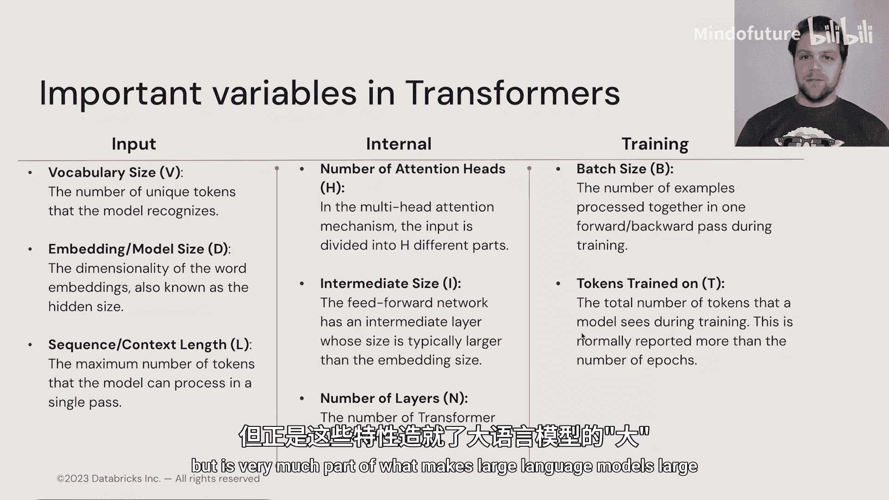

# 005：Transformer架构

在本节课中，我们将学习Transformer模型的不同架构类型。到目前为止，我们对Transformer可以采用的架构类型讨论得比较宽泛，主要聚焦于Transformer块是什么以及它们由什么组成。然而，通过组织这些Transformer块的方式，我们可以构建出许多不同类型的Transformer。

在本节中，我们将探讨Transformer常见的不同架构类型，以及它们各自的应用场景和所需的创新。

如果我们看一下当前Transformer家族树的状态，会发现它相当庞大且复杂。但我们可以将其分为三个不同的类别：左侧是**仅编码器模型**，我们稍后会解释用Transformer进行“编码”的含义；最右侧是**仅解码器模型**，你会看到一些熟悉的名字，如Claude或GPT；中间则是**编码器-解码器模型**。仔细观察，你会发现中间部分有一个非常熟悉的字母“G”代表谷歌，谷歌在编码器-解码器模型领域占据主导地位，这有很好的原因。

😊 在名为《Attention is All You Need》的原始Transformer论文中，谷歌的研究人员提出了一种基于编码器-解码器方法的架构。原因是他们想进行英语和德语之间的机器翻译。目标是输入一个英语词元序列，最终输出一个翻译后的德语序列。

他们实现这一目标的方式是采用一系列编码器块（即我们目前所见的常规Transformer块），输入英语词元，按照上一节介绍的方式进行转换和准备。然后，在Transformer块的末端，经过这些块处理后产生的不同序列向量输出，实际上被用于解码器部分的注意力机制中，称为**交叉注意力**。

其工作原理是：模型首先查看解码器部分已生成的单词，当需要交叉注意力时，它会比较其Transformer块中间位置的单词，并查看来自编码器端的交叉注意力向量。我们稍后会详细讨论注意力机制如何结合这些不同类型的向量，但你可以这样理解：首先，编码器接收英语并将其转换为某种丰富的向量表示；然后，它利用这些丰富的向量，学习德语单词与待翻译英语单词之间的关系。

因此，编码器-解码器模型通常将一种语言任务转换为另一种语言任务。这可以是翻译或转换，也可能是介于两者之间的任务，例如将英语或某种自然语言输入转换为代码语言，或将一种编程语言转换为另一种编程语言，或者进行文本摘要。编码器-解码器模型有多种不同的应用场景，它们都基于**交叉注意力**的概念。我们将在后续详细讨论注意力机制时，深入探讨交叉注意力是什么以及如何使用它。

本质上，编码器为解码器提供了额外的信号源，使其能够完成给定的任务，并且在反向传播过程中，解码器学会依赖来自编码器的信号来实现其目标。

Transformer架构家族的下一部分是**仅编码器模型**。在原始Transformer发布几年后，谷歌也提出了第二种Transformer架构，即**BERT**。

BERT引入了几项创新：一是**片段嵌入**，你可以输入一个句子，用`[SEP]`分隔符隔开，然后输入第二个序列或句子，BERT能够将两个句子一起进行比较。BERT的训练方式也不同，它会故意遮蔽句子中的不同单词。它还允许你进行**下一句预测**，即判断它看到的第二个句子是否紧跟在第一个句子之后，并给出真或假的判断。

BERT非常擅长微调，至今仍在许多自然语言处理任务的最新技术中占据主导地位。BERT非常适用于问答、命名实体识别等更传统的自然语言处理任务。它至今仍在使用，并且比我们通常在新闻中看到的某些大型模型要轻量得多。

说到这些模型，基于Transformer架构产生的第三种架构被称为**仅解码器模型**。其中最流行和广为人知的版本是**GPT**。GPT（生成式预训练Transformer）顾名思义，是一种生成新单词的Transformer。你可能听说过“生成式AI”这个流行词，GPT正是这个词流行的原因。

仅解码器模型的全部目标，是尝试基于当前正在处理的序列来预测下一个单词。在GPT中，它会接收所有正在处理和丰富的向量，并使用Transformer块末端的分类Softmax层来尝试预测下一个词元或单词。

我们已经看到了大量基于这些GPT或解码器模型的应用，你可能熟悉ChatGPT，还有Claude、Llama、MPT等等。本课程将重点介绍GPT，但仅编码器模型和编码器-解码器模型同样非常有价值，值得花时间熟悉。

现在我们已经回顾了Transformer是什么以及如何构建它们，同样重要的是要考虑一些我们将反复听到的重要变量。

让我们从输入方面开始：
*   **词表大小**：Transformer训练时使用的词元数量，这定义了它的“词汇”范围，使其能够组合词元来创建新词。
*   **嵌入维度或模型大小**：这是Transformer中一个非常重要的变量，通常与模型将占用的空间大小有关。我们稍后会讨论参数数量，但决定模型参数数量的最重要变量之一就是嵌入维度或模型大小。这些是我们使用的词嵌入的维度。Transformer块内部的许多矩阵和神经网络的大小都与模型大小或嵌入维度直接相关。
*   **序列长度或上下文长度**：这对Transformer所需的计算量至关重要，虽然与参数数量关系较小。我们已经看到上下文长度从原始GPT模型的512，一路发展到像Claude这样的新模型的数十万。

如果我们查看内部变量，还需要关注：
*   **注意力头数量**：我们将在下一节详细讨论注意力，多头注意力中的头数量也是一个需要跟踪的重要部分。
*   **中间或内部前馈网络大小**：这与位置级前馈神经网络的中间或内部隐藏层有关。这些位置级前馈神经网络约占Transformer中所有学习参数的66%。
*   **层数**：这同样至关重要，因为它决定了Transformer拥有的Transformer块的数量。

当我们讨论训练时：
*   **批次大小**：对于所有这些模型，批次大小也非常重要。事实上，虽然Transformer本质上是深度学习实体，但你会注意到许多方面相当不同。对于这类模型，看到**周期数仅为1**或**批次大小仅为1或2**的情况并不少见。
*   **训练词元数量**：此外，Transformer训练所用的词元数量达到了数百万、数十亿甚至数万亿。这是我们在之前的深度学习中未曾见过的，但正是这一点使得大语言模型变得“大”。

**总结**
本节课中，我们一起学习了Transformer的三种主要架构类型：编码器-解码器模型（如原始Transformer，用于翻译等任务）、仅编码器模型（如BERT，擅长分类和问答）以及仅解码器模型（如GPT，用于文本生成）。我们还了解了构建和描述Transformer模型时需要关注的关键变量，包括词表大小、嵌入维度、上下文长度、注意力头数量、层数以及训练相关的批次大小和训练词元数量。理解这些架构和变量是掌握大语言模型工作原理的基础。