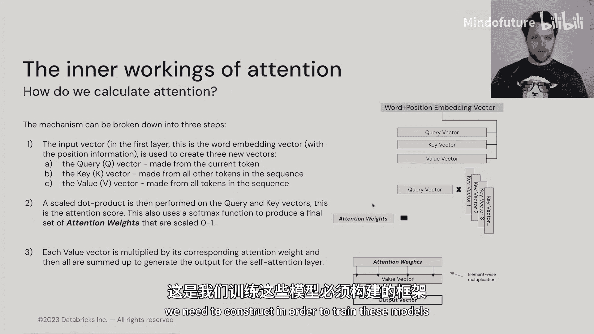

# 006：模块_1-Transformer-1.5_注意力机制 🧠

在本节课中，我们将要学习Transformer模型的核心组件之一：注意力机制。理解注意力是构建和训练我们自己的基础Transformer模型的关键一步。

## 概述

上一节我们介绍了Transformer模型的一些重要变量。本节中，我们来看看注意力机制的具体工作原理。注意力机制是Transformer中最重要但也可能较为复杂的组件之一，特别是如果你之前没有接触过类似概念的话。

## 注意力机制详解

首先，让我们思考如何处理我们正在处理的向量。这个向量代表我们当前正在查看的标记。我们假设现在处于模型的第一层，这样我们可以直接将输入的词嵌入向量与注意力机制中将要讨论的向量关联起来。

注意力机制由三个向量族构成：查询向量、键向量和值向量。实际上，我们只有一个查询向量，它与序列中我们当前正在查看的标记相关。我们将拥有多个键向量，它们来自序列中的所有向量。我们还将拥有一系列值向量。

我们将使用一个矩阵乘法，用词向量（或者你喜欢的话，称为“丰富后的嵌入向量”）乘以这个查询矩阵，来得到我们的查询向量。所有的矩阵——查询矩阵、键矩阵和值矩阵——都由在反向传播过程中学习的权重构成。

注意力背后的思想是，我们使用一个单一的查询向量，并与我们从序列中生成的所有其他键向量进行“对话”。我们实际上是在问：“键向量，你与查询向量（也就是我）有多相关？” 我们为序列中的所有标记并行执行这个计算。

因此，每次我们进行注意力计算时，我们都聚焦于我们的查询向量，并将查询向量“广播”给所有的键。这里的“对话”指的是，我们正在评估这个键向量对于查询向量有多相似、多重要。

## 注意力计算步骤

以下是计算注意力的具体步骤。

第一步，我们获取输入向量（如果在第一层，就是带有位置信息的词嵌入向量），并创建三种新类型的向量：查询向量、键向量和值向量。如前所述，查询向量仅由当前标记构建。

第二步，我们使用缩放点积，将查询向量与所有的键向量相乘。这为我们提供了注意力分数。我们将为当前查询向量与每个键向量的每一对组合得到一个注意力分数，最终得到一个注意力分数向量。这个向量的长度与查询向量相同，也与我们从标记得到的词嵌入长度相同。这也是我们构建的模型的维度（即模型大小）非常重要的另一个原因。这些向量的大小就是模型的维度。

第三步，查询向量乘以键向量得到注意力权重，这些权重被缩放到0到1之间。然后我们进行一种特殊类型的乘法。对于向量中的每个位置，注意力权重会乘以值向量在对应索引处的值。从索引0到嵌入大小，我们将索引0处的注意力权重分数与索引0处的值向量分数进行简单的缩放点积，并对每个索引都执行此操作。

这最终为我们提供了一个完整的输出向量，代表了该特定标记在整个序列上的注意力分数。

## 注意力机制的直观理解

让我们再花点时间思考一下，因为注意力机制可能有些复杂。

实际上，你可以将其视为一种文件柜和查找系统。我们有一个来自当前标记的查询，然后我们翻阅文件（这些是键向量），查看每个不同的文件（键向量）拥有我们所需信息（即值向量）的程度如何。

一旦我们精确计算出每个键向量应该为查询向量贡献多少（这就是注意力权重），我们就把它们全部组合起来，从而得到一个完整的图景。这就是我们的输出向量，它完整地描绘了我们应该对序列中其他每个标记给予多少关注。

因此，“注意力”这个概念就来源于此：输出向量每个部分的值，告诉我们相对于当前关注的标记，我们应该对序列中其他每个标记给予多少注意力。

## 总结

本节课中，我们一起学习了Transformer的注意力机制。我们了解了它如何通过查询、键和值三个向量族，计算出一个标记与序列中所有其他标记的相关性，并生成一个加权的输出向量。这构成了模型理解上下文关系的基础。

在下一节中，我们将结合注意力机制和前馈神经网络，探讨如何实际构建我们自己的基础模型，了解训练这些模型所需的、超越注意力本身的更大架构。