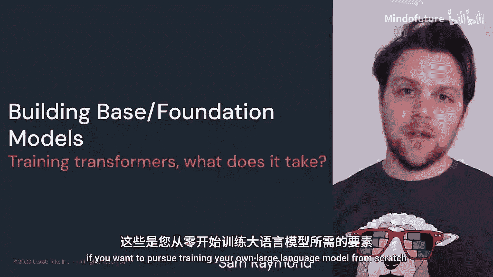
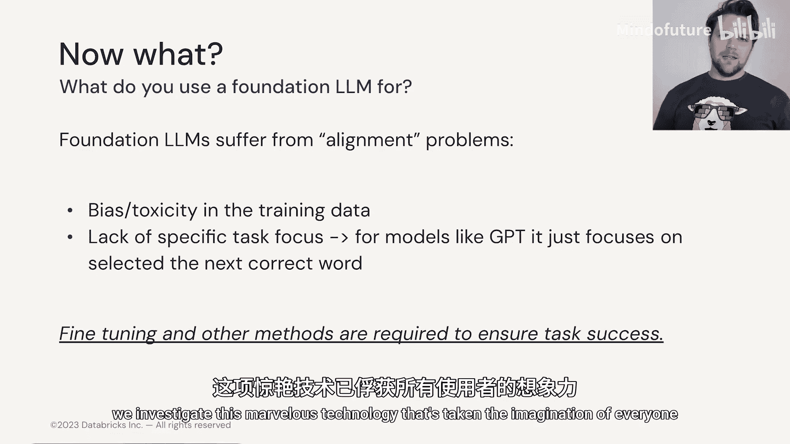

# 007：模块1-Transformer-1.6_基础模型 🧱

在本节课中，我们将要学习如何将Transformer的各个构建模块组合起来，构建一个有用的大型语言模型。我们将探讨构建、训练模型所需的完整流程，包括数据、算力和训练程序等关键组成部分。

## 概述

上一节我们介绍了Transformer的各个核心组件。本节中，我们来看看如何将这些组件整合起来，从头开始构建和训练一个真正有用的大型语言模型。

我们已经了解了构建Transformer大型语言模型所需的所有不同基础模块。你可能会想知道，我们如何构建一个真正有用的模型？如何训练和构建它？以及我们需要哪些部分才能让一切正常运行？在本节中，我们将介绍所有不同的组成部分，包括数据、算力和训练流程。如果你想从头开始训练自己的大型语言模型，就需要遵循这些步骤。

## 基础模型与微调

现在需要记住一点，在本课程和更广泛的文献中，你可能会听到“基础模型”或“基座模型”这两个术语交替使用。它们指的是从随机初始化的权重开始训练，仅用于预测下一个词的**大型语言模型**。

你有时会发现基础模型的行为方式可能与你期望的不同。这是因为当我们训练一个基础模型时，它从根本上是在理解语言的**语法**和潜在的**语义**。例如，你问一个基础模型“法国的首都是哪里？”，它可能不会给出你期望的答案，而是反问“德国的首都是哪里？”。这是因为在训练数据集中，它更常见到的是问题列表，而非问答对。

我们稍后会讨论不同类型的训练集。但请记住，对于**特定任务**的性能，你几乎总是需要对模型进行**微调**。这只需要**少得多的训练数据**，并且通常是大多数人的推荐做法：他们会采用一个经过预训练的基础模型，然后在其基础上进行微调。

然而，对于那些有足够勇气开始训练自己基础模型的人，让我们看看你需要经历的一些不同选项。

## 构建基础模型的考量因素

以下是构建基础模型时需要考虑的关键因素：

*   **模型架构**：需要考虑是选择**解码器**、**编码器**还是两者的**组合**架构。
*   **目标任务**：需要考虑你希望微调后的模型执行**何种任务**。这将影响你对模型结构以及数据类型的一些决策。
*   **模型规模**：需要考虑你希望模型有多大，希望它对语言的表征有多丰富，这涉及到**嵌入维度**、**块的数量**等。
*   **数据**：**数据的类型、可用性以及数据整理**将是你需要克服的最困难的事情之一。
*   **算力资源**：实际上，获取算力资源，包括**训练模型所分配的时间**和**可用的硬件**，是至关重要的。如今这并非理所当然，因为GPU相当紧缺，尤其是训练基础模型所需的那些。

## 架构选择与数据准备

让我们思考一下不同类型的架构。我们已经见过谷歌在《Attention Is All You Need》论文中提出的**编码器-解码器模型**，以及其后出现的不同代际模型，如**BERT**、**GPT**和**T5**。

根据你想要的任务类型，可以进行选择：
*   如果是**分类**任务，你可能会选择像BERT这样的模型。
*   如果是**生成**任务，你可能会想要像GPT这样的模型。
*   如果是**翻译**任务，你可能会想要像T5这样的编码器-解码器模型。

你还需要考虑**层的数量**以及你能处理的**上下文长度**。

最重要的是，**数据**是你必须努力争取的。有一些公开可用的数据集，例如著名的**Pile数据集**，它是不同公开文本资源的组合。然而，如果你在相同的数据上训练别人已经训练过的相同模型，很可能不会获得太多优势，直接下载该模型的权重会更好。

你至少可以从像Pile这样的数据集开始，以很好地理解（至少在这种情况下）英语乃至一般语言。然后，你可能拥有自己专有的或精心策划的、更具体的数据集，可能包括转录文本、数字化文本、代码示例以及其他你认为对训练此基础模型有价值的来源。

## 模型训练

一旦你准备好了所有的数据、架构和算力，那么你可以松一口气了，因为现在你又回到了训练一个常规的深度学习模型。

大型语言模型的训练方式或多或少与其他深度学习模型类似，除了它们规模巨大，需要数周甚至数月的时间才能训练到一个合理的状态，并且通常需要数百个GPU来完成。然而，它们通常依赖于相当典型的损失函数（如**交叉熵**）和优化器（如**AdamW**），尽管社区每天都在研究和开发新的优化器。

## 对齐问题与后续步骤

现在你的模型已经训练完成，你可能会想接下来该做什么？很可能，当你开始与你的大型语言模型交互时，你会发现它存在**对齐问题**。

如果你不熟悉大型语言模型中的对齐问题，其本质可以归结为几个方面：
*   **准确性**：模型是否准确？
*   **行为**：模型的行为是否符合我们的期望？它是否有毒？是否表现出负面偏见或任何会削弱我们期望性能的偏见？
*   **幻觉**：当我们要求它尽可能符合事实时，它是否会编造情境和例子？或者，也许你希望它尽可能有创意，而它在这方面也不擅长。

无论如何，对齐问题仍然是一个持续研究的领域，人们正在探索不同类型的工具和程序。

在构建好基础模型之后，你真正想做的是研究**微调方法**。在我们完成模块2之后，我们将讨论**参数高效微调模型**，这是一个新的发展领域，可以让你以非常高效的计算方式在不同任务上微调模型。

## GPT发展简史

现在，让我们稍微换个方向，在探索这项吸引了所有使用者想象力的非凡技术时，谈谈GPT从第一代到第四代的发展历史。

## 总结

本节课中我们一起学习了构建大型语言基础模型的完整流程。我们从基础模型与微调的区别讲起，探讨了构建模型时在架构、目标任务、规模、数据和算力等方面的关键考量。接着，我们了解了如何根据任务选择架构、准备数据，并回顾了模型训练的基本过程。最后，我们指出了训练后模型可能面临的对齐问题，并简要介绍了后续的微调方向以及GPT系列模型的发展历程。