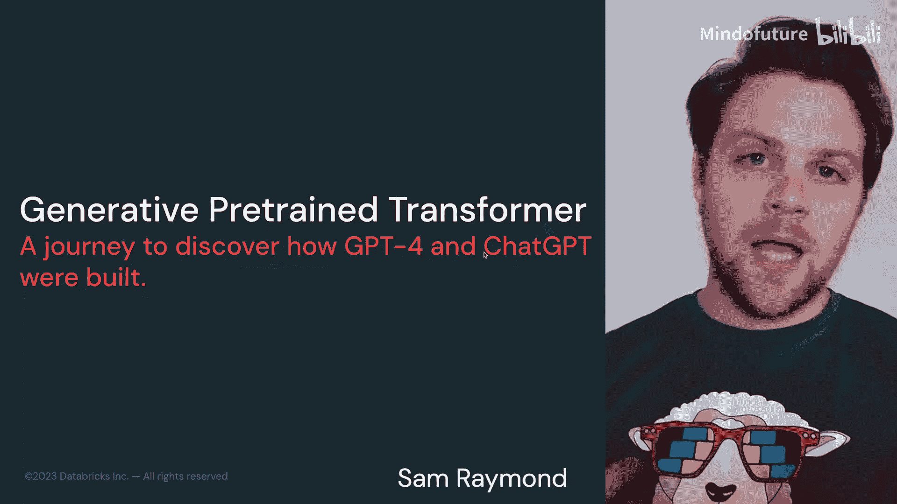
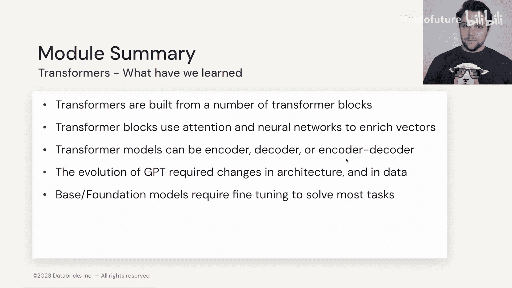

# 008：Transformer-1.7 生成式预训练 Transformer (GPT) 🧠

在本节中，我们将聚焦于一个特定且广为人知的Transformer家族——OpenAI的GPT（生成式预训练Transformer）。我们将回顾GPT从第一代到第四代的发展历程，探讨其架构演变、数据变化以及规模扩大的原因，并理解ChatGPT如何在此基础上构建。

---

## GPT的起源与发展

上一节我们介绍了Transformer的不同架构类型。本节中，我们来看看其中最著名的生成式模型系列——GPT。

ChatGPT于2022年11月发布，它是GPT-3或GPT-3.5的微调版本。作为首批基于大语言模型的聊天机器人之一，ChatGPT获得了广泛赞誉和使用，成为了历史上普及最快的技术之一。其本质是一个基于解码器的Transformer模型应用。

生成式预训练Transformer（GPT）家族是在2018年Google发布“Attention Is All You Need”论文后，被研究和发布给更广泛社区的模型系列。

*   **GPT-1** 审视了原始Transformer的编码器-解码器架构，但决定只专注于**解码器模型**，即架构的右侧部分。
*   后续的GPT-2、3和4家族**基本依赖于相同的架构**，只是规模变得更大，并在更多数据上进行了训练。
*   虽然存在一些重要的创新和巧妙的改动使得模型扩展成为可能，但**核心的基础设施和架构**与我们讨论过的内容一致。

以下是GPT系列的关键参数演变：

| 模型 | 发布时间 | 核心数据源 | 参数量 | 关键特点 |
| :--- | :--- | :--- | :--- | :--- |
| **GPT-1** | 2018 | Book Corpus | 1.17 亿 | 12个Transformer块，解码器架构起点 |
| **GPT-2** | 2019 | WebText | 最大15亿 | 词嵌入维度增至1024，Transformer块增至48个 |
| **GPT-3** | 2020 | WebText2 | 1750亿 | Transformer块与模型嵌入尺寸再次翻倍，擅长少样本/零样本学习 |
| **GPT-4** | 2023 | 未公开 | 传闻约1万亿（混合专家模型） | 具体细节未公开，性能与能力大幅提升 |

关于GPT-4，OpenAI尚未公布其结构信息。有推测认为它采用了**混合专家（Mixture of Experts）** 方法，由多个较小的模型（如2200亿参数）组合而成。我们将在模块3中详细探讨混合专家技术。

---

## 深入GPT架构：为何模型越来越大？

我们观察到GPT-1、2、3、4的规模持续增长。这主要是因为**层数（Transformer块的数量）** 不断增加。虽然模型维度（如词嵌入大小）也在增大，但其缩放速度不如层数显著。

增加更多层数的原因在于，这能让注意力机制与位置前馈神经网络协同工作，使模型能够“看到”文本中越来越多层面的信息。

我们可以类比卷积神经网络（CNN）：
*   **浅层**：关注边缘等基础特征。在Transformer中，早期的注意力层可能关注词序、词性、基本句子结构。
*   **中层**：关注复合特征。在Transformer中，模型开始关注文本中不同短语之间的意义和关系，而不仅仅是单个句子内部。
*   **深层**：关注高级、抽象的概念。在Transformer中，最后的注意力层可以关注语篇结构、情感和复杂的长期依赖关系。

随着当今模型**上下文长度**不断增加，也需要更多的层数来关注和理解更长的文本序列中丰富的信息。因此，GPT-4参数量可能达到万亿级别，这源于层数、模型维度和注意力头数的共同增长。

模型总参数量受多个因素影响，可用以下公式概念化理解：
`总参数量 ≈ (层数 × 每层参数量) + 词嵌入参数量`
其中，每层参数量主要由**注意力矩阵**和**前馈神经网络**的权重构成。

---

## GPT的训练与数据演进

现在，让我们更具体地谈谈GPT的训练，特别是其数据演变。

以下是各代GPT使用的关键数据集：

1.  **GPT-1：Book Corpus**
    *   包含约7000本未出版书籍，涵盖多种体裁。
    *   约有8亿单词，主题和风格多样。
    *   如果你运行GPT-1，会发现其输出带有一定的“文学风格”，但整体能力有限。

2.  **GPT-2：WebText**
    *   首次在大语言模型中使用公开爬取的网络数据集。
    *   数据量远超Book Corpus，涵盖了人们在互联网上讨论的广泛内容。
    *   数据规模达45TB，这要求团队进行大量**去重**和**过滤低质量网页**的工作。数据清洗至今仍是构建高质量模型的关键挑战。

3.  **GPT-3：WebText2**
    *   比WebText更大、更多样化。
    *   即使参数量相同，更好的数据也使得GPT-3在各项任务上的性能显著超越GPT-2。

展望未来，随着大语言模型的发展，我们需要寻找新的数据来源，例如视频转录文本或其他合成数据源。

---

## 模块总结与架构选择

至此，我们已经了解了GPT从第一代到第三代的发展历程及所需的各项创新与改变。现在，让我们整体回顾一下在Transformer架构学习上的收获。

在本模块中，我们深入探讨了Transformer及其构成各种大语言模型的基本构建块。

我们学习了：
*   Transformer块如何结合**注意力机制**和**位置前馈神经网络**来丰富输入向量的信息。
*   Transformer可以构建成**编码器模型**（如BERT）、**解码器模型**（如GPT）或**编码器-解码器模型**（如T5）。
*   GPT从一代发展到四代，需要在架构上做出细微调整，并在**数据**方面进行巨大变革。

需要记住的是，虽然我们希望将这些模型作为基础或基石模型进行训练，但若想针对手头的具体任务发挥其最大效能，通常需要进行某种形式的**微调**，以达到最先进的性能。

不同的Transformer架构各有优劣。选择哪种模型取决于你的具体任务和可用资源。

以下是主要架构类型的简要对比：

*   **编码器模型（如BERT）**：
    *   **优点**：擅长理解任务（如文本分类、情感分析、命名实体识别）。通常计算效率较高。
    *   **缺点**：不直接用于生成文本。
*   **解码器模型（如GPT）**：
    *   **优点**：擅长生成连贯的文本（如对话、创作、代码生成）。
    *   **缺点**：在需要深度理解输入文本的任务上可能不如编码器模型。
*   **编码器-解码器模型（如T5）**：
    *   **优点**：适用于需要同时理解和生成的任务（如翻译、摘要、问答）。
    *   **缺点**：架构相对复杂，训练和推理成本可能更高。

如果你的目标是情感分析或需要严格控制数据，且计算资源有限，那么使用BERT或T5可能比直接调用庞大的GPT-4/5更合适。建议你花时间研究不同框架的优缺点，以选择最适合自己需求的模型。

---

**本节课中，我们一起学习了：**
1.  GPT（生成式预训练Transformer）系列模型的发展历史与关键参数。
2.  GPT模型规模（尤其是层数）增大的原因及其对模型理解能力的影响。
3.  各代GPT训练所使用的核心数据集及其演进过程。
4.  不同类型的Transformer架构（编码器、解码器、编码器-解码器）的优缺点及适用场景。

现在，让我们进入实践环节，在Notebook中探索如何从零开始构建我们自己的微型Transformer模型。🚀