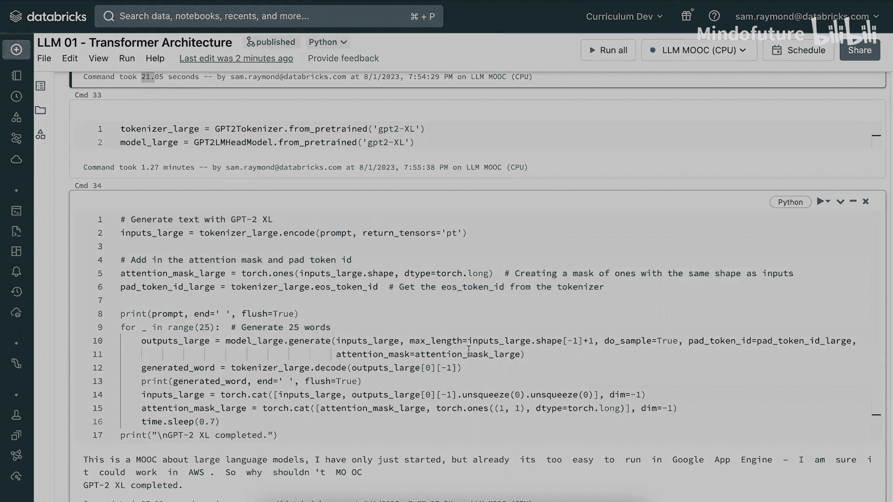

# 009：模块 1-Transformer-1.8 笔记本 📓

在本课程的第一个笔记本中，我们将深入学习如何构建自己的Transformer模型。我们将从输入文本如何从普通英文格式化为词嵌入开始，然后添加位置编码。接着，我们将构建一个简单的单层解码器Transformer块，并逐步构建一个能够解码文本的多层Transformer。最后，我们将查看Hugging Face上预训练的GPT2模型，并学习如何用它生成一些结果。

让我们开始吧。首先，确保集群正在运行，然后点击命令单元格运行课堂设置。请确保在本课程的所有笔记本中都首先运行此设置，以确保所有配置正确。

在运行设置的同时，让我们看看将要导入的一些库。我们将使用PyTorch及其神经网络功能，还会用到math、time、numpy以及几个绘图库。设置完成后，现在导入我们的Python库。

## 从文本到词嵌入 🧱

首先，我们来看如何将自然语言编码成Transformer所需的正确格式。

让我们从一个简单的句子开始：`the quick brown fox jumps over the lazy dog`。

第一步是将句子分割成单个单词。我们这里假设每个单词代表一个唯一的标记。实际上，大多数标记化方法（如字节对编码）使用子词作为单个标记，但这里使用单个单词，所有学习原理是相同的。

我们将分割每个单词，并将其存储在`word_to_id`字典中。在打印之前，我们还需要将文本转换为每个单词的索引。这将构建我们Transformer输入的上下文向量。

我们将使用PyTorch构建一个张量，并利用`word_to_id`字典，首先遍历所有创建的单词，将ID存储到`input_ids`中。

现在，我们将使用PyTorch的神经网络嵌入函数创建词嵌入，并稍后设置嵌入大小。我们将通过一个简单的函数返回嵌入。要了解更多信息，请查看PyTorch的嵌入函数。

现在设置一些变量：嵌入大小（模型的维度）设为16。然后，使用第9行定义的`get_word_embeddings`函数创建所有词嵌入。接着打印这些词嵌入。

运行此单元格，查看所有输出内容。

首先，输出的是句子分割后的对象，每个单词对应一个索引。然后可以看到我们设置的PyTorch张量，它标记了每个单词（不一定按顺序）。实际上，这是为我们定义的顺序。接着，可以看到张量按照我们需要的顺序排列，例如索引8对应大写的“the”，下一个索引3对应“quick”，依此类推，构建出之前的句子。

下一个输出是词嵌入张量。由于我们将词嵌入维度设为16，这意味着句子中的每个标记或单词都有16个标量变量。例如，这里高亮的第一个向量就是对应单词“the”的词嵌入。可以看到，对于句子中的每个单词，我们都有一个对应的词嵌入向量。

## 添加位置编码 🧭

现在我们有了词嵌入，接下来定义位置编码。我们将使用《Attention Is All You Need》论文中提出的正弦位置嵌入函数。

我们将创建一个位置编码向量，其长度等于我们将要找到的最大序列长度。我们还需要为此特定项设置所有其他组件，包括一个除数项（指数除以模型维度）。然后定义位置编码向量，首先将其初始化为零，然后为每一项添加正弦和余弦版本。

为了更好地理解，我们可以绘制位置编码的作用。Transformer架构本身不像LSTM或RNN那样知道输入标记的顺序，位置编码的作用就是区分每个标记，让模型对标记的相对位置有感知（不一定是绝对位置）。

我们可以绘制位置编码的热图。在输出中，Y轴是标记，X轴是位置编码向量。可以看到，对于标记0，我们得到特定的位置编码向量分布，并且可以看到序列中每个标记的数值如何变化。这些变化为注意力和神经网络提供了理解标记在序列中位置的信息。这个位置编码信号告诉Transformer的不同部分，它正在查看的标记在序列中的位置。

通过阅读此处提供的信息，可以了解更多关于位置编码图的信息及其生成方式。计算序列中位置`p`、给定嵌入空间维度`i`的位置编码值的方法如下（记住我们将其设为16，因此最终得到16个不同的位置编码变量）。

## 组合词嵌入与位置编码 ➕

下一步是将我们创建的词嵌入与刚刚展示的位置编码结合起来。这将得到最终的嵌入向量，以便我们开始将其输入到Transformer块中。

现在，在将嵌入向量输入注意力机制之前，我们得到了其最终状态。在下一步中，我们将从头开始构建解码器，构建一个单层Transformer（仅用于演示目的，性能不会特别好）。然而，通过从头构建，你将能很好地了解实际构建一个Transformer需要什么。

## 构建单层解码器块 🔨

让我们使用PyTorch构建一个解码器块。我们将定义解码器块，它是Transformer的内部组件。Transformer还需要处理解码器块的输入和输出，但让我们从构建解码器块开始，这在讲座中也见过。

如今，在PyTorch中定义神经网络Transformer有一种相当标准的形式。我们将从定义`__init__`开始，它接受一些输入变量：模型维度、注意力头数量、神经网络隐藏层维度大小以及是否使用dropout及其比率。

对于解码器块，我们将使用来自PyTorch库的多头注意力，并为其提供模型维度、头数和dropout值。我们还将有一个归一化层、一个dropout层，然后在这里设置两个全连接神经网络层。这将是我们的位置前馈神经网络，输入是模型维度，然后是一个内部隐藏层维度大小（通常是模型维度的四倍左右）。接着是第二个线性全连接层，将维度降低回模型维度。然后是我们的归一化层和最终的dropout。这就是我们定义解码器块初始化的方式。

下一步是定义`forward`方法，即我们如何获取模型并进行推理。`forward`方法将接收两个输入：`x`（输入张量，即所有词嵌入的向量或序列）和`target_mask`（我们稍后会讨论掩码的作用）。

查看`forward`函数，首先调用自注意力，传入三个`x`的副本以创建查询、键和值向量，并设置注意力掩码。然后，将注意力的输出加入dropout，并将结果存储到向量的新版本中。接着，将向量通过归一化层，然后将归一化的输出传递给我们多层感知机的第一个线性层。再将该输出作为第二个多层感知机层的输入。这给出了位置前馈神经网络的输出。我们再添加一个dropout，最后对`x`进行归一化并返回`x`。

这段代码代表了Transformer单层（即单个解码器块）中发生的一切。如果是编码器-解码器架构，还需要考虑交叉注意力，但为简单起见，这是解码器模型中解码器块的工作方式。

## 构建位置编码器类 🏗️

现在，让我们继续构建完整Transformer模型所需的另一个组件：使用位置编码器。我们之前看到了如何进行位置编码，但这次我们要将其转换为一个函数和类，以便在Transformer神经网络中向前推进时使用。

我们将大致采用之前的做法，但将其格式化为Transformer可用的形式。我们将创建一个dropout类，并拥有一个位置编码函数（这确实是类本身的名称）。我们将创建位置编码（初始化为零），然后创建之前见过的除数项。接着，我们创建两个维度的向量：正弦和余弦值，这些值将赋予我们的位置编码向量。然后，通过转置我们刚刚定义的函数来返回位置编码。

在`forward`前向传播中，它非常简单，只需接收输入`x`，然后加上我们在第5到50行之间定义的位置编码。

## 构建完整Transformer解码器 🧩

现在我们有了位置编码器设置和解码器块设置，可以构建完整的Transformer了。我们将首先创建一个嵌入层，添加位置编码，然后将编码后的序列发送到Transformer解码器块。接着，将解码器块的输出传递到带有softmax的最终层，以分类要输出的下一个标记。

让我们看看Transformer解码器类。我们将接收多个输入：词汇表（softmax函数需要）、模型维度、注意力头数量、位置前馈神经网络的隐藏层维度大小以及模型的dropout比率。

在这里，我们可以看到嵌入层的构建、位置编码器、Transformer块，然后是输出线性层和softmax层。在`forward`函数中，我们接收`x`（标记化的输入），它通过嵌入层，也通过编码器（即添加到之前的嵌入层）。然后创建目标掩码。接着将目标掩码和编码序列`x`传递给Transformer块。获取输出并通过线性层，再将该输出通过softmax，然后返回它认为合适的词汇表中任何标记的输出。

## 理解掩码的作用 🎭

现在让我们谈谈掩码，因为解码器中几乎其他所有内容我们都讨论过了。

需要记住的是，对于解码器，它不允许看到序列中它之后的任何标记。回想一下，解码器Transformer的目标是预测序列中的下一个标记。对于编码器模型（如BERT），注意力机制可以查看标记在序列中的左右两侧，这使其对序列中包含的内容有很好的理解。然而，对于解码器，根据定义，它不知道下一个单词是什么，它必须生成它。因此，掩码的目标是确保在注意力机制中，未来的信息被屏蔽掉。

让我们看看具体如何操作。回想一下在注意力中，我们使用softmax函数。我们查看softmax计算的相关分数。如果我们创建一个像这里看到的掩码，其中掩码值几乎是无穷大，那么当我们对其应用softmax时，会得到0值。因此，对于当前查看的值之后序列中的任何标记，都不会给予任何注意力。

如果你想了解更多关于不同掩码以及Transformer如何使用掩码进行不同处理的信息，请查看附加资源中提供的一些链接。

## 测试单层Transformer 🧪

现在我们有了掩码、解码器、嵌入和编码，让我们制作第一个完整的Transformer。我们将定义词汇表大小为1000，使用维度512，仅使用单个注意力头（不拆分为多头），为位置前馈神经网络使用2倍的隐藏层维度大小，dropout比率为10%，使用10层，上下文长度为50，批处理大小为1。

创建Transformer解码器。创建一个随机化的输入张量（实际上只是使用一个没有真实词汇表背后的词汇表大小），稍后我们将进行调整，看看是否能将其连接到真实的词汇表。我们将基本上只是将输入张量的信号发送到模型的输出。

运行此单元格。现在，我们得到了输出张量`c`，它包含了预测的单词索引。可以看到我们有一个大小为50的torch张量。这在测试我们可以通过Transformer发送信号的意义上是有用的。然而，你可能注意到我们这里有一个层数的变量，但实际上并没有将其传递给我们的Transformer解码器。这是因为我们创建的是单层解码器。在下一节中，我们将构建一个多层模型，这将允许我们使用这个层数变量。

在此之前，让我们看看这个模型有多少参数。可以看到有300万个参数。

再看看我们从softmax层刚刚创建的输出。在X轴上，我们有1000个标记的单词索引。许多解码器的目标是选择它认为下一个出现概率最高的标记。你可以看到这里在400和100左右有几个选项，这将是下一个标记的良好候选（无论在这个假设情况下是什么）。但也可以看到，许多其他标记也有大约70%的概率。因此，可以说这个模型具有较高的困惑度，它可能对应该选择哪个标记有一定的感知，但不够好。在一个困惑度低的模型中，你会看到一个非常平坦的概率分布，在一两个好的下一个标记处有一个峰值。有时，你可能甚至故意不选择最明显的下一个单词，这就是温度参数的价值，你有时会在与大型语言模型交互时看到这个选项，这意味着通过选择不一定是最明显的下一个标记，赋予它一定的可变性或创造性。

## 构建多层Transformer解码器 🏢

为了引入多层概念，我们实际上可以重用已有的许多代码。在这个新的类定义中，可以看到之前的词汇表大小，以及一个新变量：层数。

要构建多层Transformer，我们将遵循相同的步骤：首先从PyTorch的嵌入开始，然后是之前构建的位置编码器。现在，我们只有一个解码器块列表，我们将根据层数进行复制。所有解码器块在架构上最初是相同的。其思想是，在训练期间，在反向传播过程中，每个Transformer块（每个解码器块）中注意力头和神经网络的权重都会不同，因为它能越来越好地预测正确的下一个单词。

在通过所有不同的解码器块后，输出被送入线性层，然后使用softmax选择最佳的下一个标记。

我们的`forward`方法看起来大致相同。我们有嵌入层，接收`x`，通过嵌入层，再通过位置编码器。然后进入一个完整的循环，获取目标掩码（在选择标记时也需要更新）。然后将`x`通过Transformer块。一旦我们连续完成此操作，并且`x`通过所有块变得越来越丰富，我们便将丰富的向量或向量序列`x`输入线性层，最后通过softmax输出。

运行此单元格以定义新的多层Transformer解码器，然后构建一个新的。我们将设置词汇表大小为10000，模型维度更大，坚持使用单头，定义隐藏层维度为模型维度的四倍，保持10%的dropout，选择10层，上下文长度为100。

像之前一样，创建一个随机化的输入张量，代表一系列词向量。然后使用刚刚构建的类实例化模型，并计算该模型实际拥有的参数数量。我们还将再次查看概率分布，看看这个模型在选择下一个单词方面表现如何。

这将需要一点时间来运行，因为它现在必须构建一个更大的神经网络。可以看到，现在有5亿个可训练参数，而不是几百万。我们可以通过改变词汇表大小、模型维度、层数等来改变这个数字。但请注意，一旦超过10亿左右，计算资源将开始抱怨，因为会遇到内存不足错误。

查看这个特定模型的分布，可以看到它的困惑度实际上低得多，并且对要选择的下一个标记相当确定。这些都是随机变量、随机参数，所以不要对此解读太多。然而，这只是如何为词汇表获得不同输出分布的一个例子。

看看模型本身，看看PyTorch将其存储为什么。可以看到嵌入层和带有dropout的位置编码器。然后是我们所有解码器的模块列表，从解码器块0一直到9（因为我们有10个解码器块，从0开始）。接着是线性层，输入为2048（模型维度），输出为我们词汇表的大小，最后是我们的softmax函数作为最终部分。

## 连接真实词汇表 📚

我们已经用随机向量做了很多工作，现在让我们更进一步，为模型添加一个真实的词汇表。

我们将拥有一个真实的词汇表，因此不会将该值设为一个数字，而是计算词汇表中不同单词的数量。模型维度设得更低，仅为100。保持一些值相同，这次使用更少的层，上下文长度也更小。

现在，我们将通过放入一些真实的词汇来增加一些真实感，添加一些英语中的分词和简单单词。我们将根据这个词汇表创建一个字典。这将允许我们获取一个句子并将其转换为该词汇表的索引。它还允许我们实际选择其中一个单词并将其作为真实输出生成。

像上次一样创建模型。创建一个输入序列，它只是词汇表中的一堆单词。然后根据这个序列创建输入张量，可以看到我们实际上是根据之前定义的`word_to_id`函数创建索引。

然后，我们将使用这个序列作为起点生成一系列单词。我们将运行一个循环。这就是ChatGPT或其他类似模型的工作方式：你从一个起始序列开始，运行一个完整的循环，然后它会预测下一个单词。它会将刚刚预测的单词添加到生成的序列中，然后重复这个过程。

让我们看看是否能让这个模型“说话”。现在可以看到它一个接一个地给我们单词，就像在和我们说话一样。你可能能看出这没有任何意义，很多单词都是无意义的，这是因为我们实际上还没有训练这个模型来了解任何关于语言的知识。事实上，我们给它的序列也是完全无意义的。然而，我们正在逐步构建模型的复杂性，以便你能确切地看到这些模型的行为方式。

## 使用预训练模型：GPT-2 🤖

假设我们能够创建一个大型词汇表，收集了所有需要的计算资源，并通过反向传播使用PyTorch训练了我们的模型。我们可以利用前人已经完成的一些工作，即利用预训练的模型权重。

我们将从Hugging Face获取Transformers库并下载GPT-2。运行此单元格以下载代码，其中包括GPT-2的权重和分词器。这需要一点时间运行。

现在有了这个，我们可以定义一个提示。这类似于之前的序列，但由于我们现在处理的是实际的语言和训练过的模型，我们倾向于将其更多地称为提示。

我们将说：“这是一个关于大型语言模型的讲座。我已经思考过了。”然后让模型决定接下来要说什么。

具体操作如下：我们将基于刚刚下载的分词器创建输入，这是小版本的分词器，因为我们使用的是最小的GPT-2版本。我们还需要注意力掩码，和之前看到的一样。我们还将有一些特殊的ID用于序列结束标记，这将告诉它何时停止生成额外的单词。这是基于在训练期间学习到的训练数据中这些序列结束的位置。

我们将把Transformer的输出添加到提示的末尾。现在，我们将通过完整的循环来获取模型的输出。输出将是一系列ID，然后使用分词器解码输出。接着，将生成的单词附加到我们开始的提示中。

让我们看看GPT-2会说什么。可以看到，这是我们开始的内容，而GPT-2补充的内容在语法和意义上似乎相当合理。它做得相当不错，但也要考虑到GPT-2是一个非常小的模型（特别是这个版本），因此它的理解、领会和复制更精细人类语言的能力可能有所欠缺，但我觉得在这种情况下它做得很好。

然而，我们可以更进一步。之前我们看到可以改变层数、注意力头数等变量，OpenAI在发布GPT-2时也这样做了，他们发布了不同大小的版本，其中最大的被称为GPT-2 Extra Large。让我们下载那个模型，看看它在相同提示下是否表现更好。

由于这是一个更大的模型，下载需要更长一点时间。现在，我们可以开始看看GPT-2 Extra Large能用我们为GPT-2 Small开始的提示做什么。

同样，我们将获取起始提示并对其进行标记化。然后将此提示输入模型，一旦获得模型的输出（它只会生成下一个标记），我们需要将该标记添加回提示中，然后再将其输入模型，这样它就会不断自我构建。

运行此单元格，看看GPT-2 Extra Large会说什么。可以看到，它输出的文本实际上更细致，流动更自然。这只是如何采用这些不同模型并应用这种类似语音行为的一个例子。这也是ChatGPT、Claude、Bard等所有基于聊天的工具正在使用的底层机制。

希望这个实验笔记本对你来说令人兴奋。在实验笔记本中，你将处理类似的内容，但在那种情况下，你将使用编码器模型来更深入地了解编码器类模型的工作原理。

---

**本节课总结** 🎯

在本节课中，我们一起学习了Transformer模型的核心构建块。我们从文本的标记化和词嵌入开始，理解了位置编码的必要性和实现方式。然后，我们逐步构建了单层Transformer解码器块，并扩展为多层解码器模型。我们探讨了掩码在解码器中的关键作用，并最终将理论付诸实践，连接了真实词汇表，并使用了Hugging Face的预训练GPT-2模型来生成文本。通过这个过程，我们深入了解了现代大型语言模型的基础架构和工作原理。