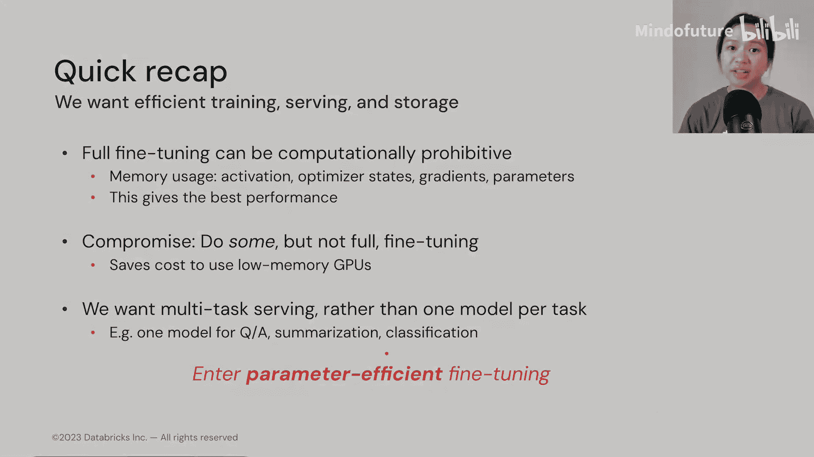

# 011：高效微调概览 🧠

在本模块中，我们将学习什么是微调、为何需要微调，以及如何以参数高效的方式进行微调。我们还将探讨数据准备的最佳实践，因为数据是所有大语言模型的基础。

## 什么是微调？

在上一模块中，我们学习了Transformer的内部工作原理以及几乎渗透于所有语言模型架构的注意力机制。你可能还记得，大语言模型之所以“大”，既因为它训练于海量数据，也因为它拥有海量的可训练参数。这自然使得许多个人和组织难以从头开始训练一个大语言模型。因此，我们转向微调，这是一种只更新模型参数子集的方法。

在深度学习领域，微调是“迁移学习”的一种形式。迁移学习指的是我们将一个通用的预训练模型应用于一个新的、但相关的任务。一个常见的类比是体育运动：如果你会打网球，你可能更容易学会打排球，因为两者都需要力量。

微调属于迁移学习的范畴，它简单意味着我们对模型进行进一步的训练。有些人可能会区分微调和迁移学习，认为当我们改变或修改基础模型的架构（例如解冻基础模型的顶部几层并训练这些层，同时训练新添加的层）时，才称为微调。但实际上，这种区分并不必要，包括吴恩达和Andrej Karpathy在内的许多人通常都互换使用这两个术语。

你可以简单地将微调理解为：对基础模型进行更多训练，或者在更多或不同的数据上训练基础模型。

我们讨论的预训练模型也常被称为基础模型或基座模型，尤其是在大语言模型的语境下。一般来说，利用这些基础模型有三种方式：

*   **直接使用**：按原样使用预训练模型，例如T5、GPT-4、BLOOM、GPT等。
*   **作为特征提取器**：使用基础模型的输出（如嵌入向量）作为特征，输入到另一个机器学习模型中以生成预测。这是BERT嵌入的一个非常常见的用例。
*   **微调**：这是我们本模块的重点。我们可能只更新基础模型的顶部几层，或更新所有层，或在模型使用前添加一些层，以生成我们期望的预测。

我们将看一个此类中最新的语言模型示例，一个名为GOAT的模型。顾名思义，它是另一个农场动物名称。它是Llama的微调版本，专门用于执行算术运算。我们将在稍后回到GOAT模型。

## 为何需要微调？

我们希望在特定下游任务上获得更好的性能。我们可以针对特定任务的数据微调一个预训练语言模型，使其适应特定的风格和词汇。这也有助于我们实现监管合规。

但这个想法并不新鲜。事实上，早在2018年，Jeremy Howard和Sebastian Ruder就发表了一篇论文，介绍了可用于任何NLP任务的微调技术，其中之一就是通过逐步解冻层来为目标任务微调分类器层。

简而言之，微调意味着我们更新模型的权重或参数。通常，当我们更新更多层时，会获得更好的模型性能。典型情况下，当我们进行**全参数微调**（即更新所有模型权重）时，我们会为每个任务生成一个独立的模型。在右侧的图片中，你可以看到我们可以在不同的数据集上微调BERT，例如SQuAD（问答数据集）、命名实体识别数据、MultiNLI（多体裁自然语言推理数据集）。每个微调过程都会给我们一个新模型，因此在部署时，我们为每个任务服务一个模型。

但这意味着我们需要处理同一个基础模型的许多副本，这在当今模型远大于这个1.1亿参数的BERT模型时尤其不受欢迎。虽然如今磁盘空间很便宜，但像Llama这样专为对话设计的模型家族，单个模型就占用近500GB的磁盘空间。

因此，在部署时我们需要考虑的另一个问题是：我们是否有那么多针对特定任务的输入请求？其次，全参数微调可能产生一个不良后果，称为**灾难性遗忘**，即我们之前训练或利用的基础模型已经忘记了如何执行其他预训练任务。

## 全参数微调成本高昂，如何避免？

有两种方法：一种是**小样本学习**，另一种是**参数高效微调**。

在深入探讨参数高效微调（我们常缩写为PEFT）之前，我们先简要了解一下什么是小样本学习。

小样本学习是指我们在文本提示中提供新任务的几个示例。我们通常在不想进行微调，或者缺乏带标签的训练数据，但可以轻松写出几个示例供大语言模型学习时使用这种方法。

这种以文本形式写出指令的过程称为**提示**，我们迭代地编写不同的提示以找到传递给大语言模型的最佳提示，这个过程称为**提示工程**。因此，开发提示的过程也可以称为提示设计。对于本模块尤其重要的是，我们将提示工程称为**硬提示调优**或**离散提示调优**。所以请记住，每当我提到硬提示调优或离散提示调优时，我实际上是在谈论小样本学习。

我们应该区分小样本学习和微调的主要一点是：**小样本学习不更新任何模型权重，而微调更新模型权重**。小样本学习也常被称为**上下文学习**，因为我们为大语言模型提供了一些上下文供其学习或在生成输出过程中利用。

这种小样本学习的优点是：不需要带标签的训练数据；我们不需要为每个新任务创建模型的副本，这可以极大地简化我们的模型部署过程；可能最棒的优势是，我们传入的文本提示可以非常容易理解，因为这些是我们人类精心设计并传递给大语言模型的输入文本。

但其缺点是：尽管我们获得了能够解释文本提示的优势，但一切都是手动的且劳动密集；提示也可能高度特定于模型，这意味着当你换用不同的模型时，可能需要完全重新开发提示；我们还经常遇到**上下文长度限制**。如果要添加更多示例，那么留给指令的空间就会减少。但如果使用具有更高或更大上下文窗口的模型，那么在服务时也会带来更高的延迟。最近也有研究论文表明，更长的上下文窗口可能不是未来大语言模型的解决方案，因为大语言模型也倾向于忘记我们提供的上下文中间部分。

最后，这确实是我们转向微调的原因：即使有小样本学习，模型性能可能仍然不尽如人意。

## 微调优于小样本学习的示例

这里有一个微调优于小样本学习的例子，即我们的GOAT模型（70亿参数）。它的基础模型是Llama，并在100万个合成数据示例上进行了训练。我们发现，在算术任务上，其准确率优于此处的小样本学习模型Palm（5400亿参数）。它在算术任务上也优于GPT-4。事实上，GPT-4在所有算术任务上表现都不太好。我们还看到，这个GOAT模型可以在一个算术基准测试上达到最先进的结果。

这是一个属于**监督指令微调**领域的模型，使用一种名为LoRA的PEFT技术进行训练，我们将在后面几节深入探讨这种技术。

在继续之前，我想指出关于GOAT的两个重要事项：首先，它是一个**指令微调模型**；其次，它可以在服务时**执行多个任务**。第一个任务是加法，第二个任务是减法（但混合了一些自然语言），第三个任务是乘法，第四个任务是除法。你可以看到，在服务时，不需要为这里的每个数学任务生成一个模型，我们使用一个模型来处理我们提供给大语言模型的所有算术任务。

现在，让我们看看其他几个流行的指令微调多任务大语言模型的例子：

*   **FLAN**：代表“微调语言网络”。其基础模型是一个1370亿参数的模型，并在超过60个具有不同任务类型的NLP数据集上进行了微调。不同FLAN风格模型的例子包括T5-FLAN、FLAN-T5或FLAN-PaLM。
*   **Dolly**：其基础模型是Pythia（120亿参数模型），并在15,000对提示和响应上进行了微调。

## 微调模型的目标

现在你已经看到了几个微调模型的例子，让我们回顾一下我们希望通过这些微调模型实现的目标：

1.  **高效训练**：通常，全参数微调对许多组织来说在计算上是难以承受的，尽管这能带来最佳的模型性能。因此，对于预算较小的组织，折衷方案是进行一些微调，但不是全参数微调。
2.  **高效的服务和存储**：我们希望在部署时，这个大语言模型能够进行**多任务服务**，而不是为每个任务服务一个模型。

因此，我们将在下一节进入**参数高效微调**的领域，并介绍一些最流行的技术。

## 总结

本节课中，我们一起学习了微调的基本概念。我们了解到微调是迁移学习的一种，用于在特定任务上提升预训练大语言模型的性能，但全参数微调成本高昂且可能导致灾难性遗忘。作为替代，小样本学习不更新权重但性能可能有限且依赖人工设计提示。因此，参数高效微调成为了平衡性能与成本的关键技术，我们将在后续章节详细探讨。