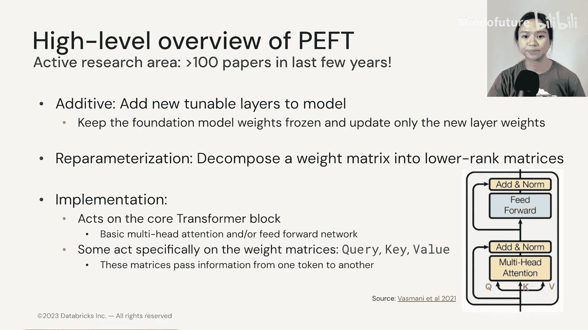
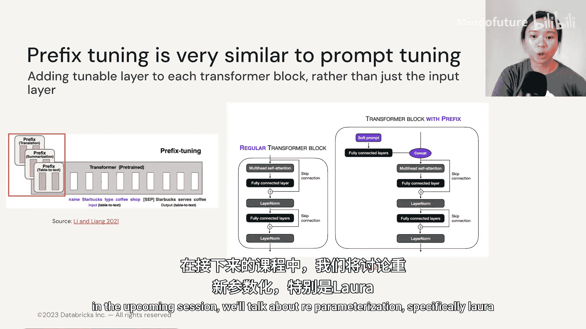

# 012：高效微调-2.3 PEFT与软提示 🧠

在本节中，我们将深入探讨参数高效微调（PEFT）的概念，并重点介绍其“加法”类别中的一种核心方法——软提示（Soft Prompt）。我们将了解如何通过添加可训练的“虚拟令牌”来微调模型，而无需更新庞大的基础模型参数。

## 概述：什么是参数高效微调（PEFT）？

参数高效微调旨在以最小的参数量更新来适应模型到特定任务。它通常缩写为**PEFT**。参数效率涵盖多个方面，包括**存储**、**内存**、**计算开销**以及最终的**模型性能**。

PEFT主要分为三类：加法（Additive）、选择性（Selective）和重参数化（Reparameterization）。在本课程中，我们将聚焦于第一类和第三类，即**加法**和**重参数化**方法，因为选择性方法的研究表明其效果通常不如前两者。PEFT是一个活跃的研究领域。

本质上，这些方法作用于Transformer核心模块。有些方法专门针对负责信息传递的查询（Query）、键（Key）、值（Value）权重矩阵进行操作。

## 从硬提示到软提示

上一节我们介绍了手动编写文本提示，这被称为**硬提示**或**离散提示**。本节内容的核心是如何去除提示工程中的人工环节，转而使用**软提示**。

简单来说，添加软提示意味着我们在输入中添加**虚拟令牌**。

请看下图，我们有文本输入（通常称为文本嵌入），例如“These chips are tasty”。软提示意味着我们现在添加的是虚拟令牌。目前，你只需知道这些虚拟令牌是**任务特定**的。因此，当你听到“软提示”时，应立刻将其等同于“虚拟令牌”。

软提示的维度与我们的输入嵌入向量相同。在微调过程中，我们将这些可训练的虚拟提示（或称虚拟令牌、软提示）与输入嵌入向量进行拼接。我们称此为**提示微调**而非模型微调，因为我们只更新粉红色部分所示的提示权重。

## 深入理解虚拟令牌

硬提示工程面临的挑战在于其高度依赖人工、费力且容易出错。在软提示方法中，我们不再依赖人类去精心设计完美提示，而是让模型通过微调自行寻找最佳提示。

我们首先随机初始化一个由随机数构成的嵌入向量。这个向量的维度与输入嵌入相同。由于这些随机初始化的嵌入向量是完全随机的，它们不属于任何词汇表，我们不知道它们对应什么文本。

在右侧的图表中，你可以看到真实的单词输入令牌可以在嵌入空间中被可视化，并且我们知道它代表什么词。但当我们观察虚拟令牌在嵌入空间中的位置时，我们知道它占据了某个位置，却不知道它对应什么文本。这有点像比特币：我们知道它像货币一样运作，但我们无法像触摸现金一样触摸它，甚至不知道它长什么样，但它确实存在并起作用。

在一些研究中，人们也尝试用离散提示来初始化这些虚拟令牌。这意味着我们为模型提供一些最简单的离散提示作为起点，然后模型在训练过程中可以自由更新这些嵌入向量。例如，我的离散提示可以简单到是“classify this sentence”或“translate this sentence”这三个词。然后，这些离散提示会在模型微调过程中被自由更新。这种用离散提示初始化的方法也被称为**知情初始化**。

但有趣的是，相关论文发现，**随机初始化**（将提示设置为随机数）的效果几乎与提供简单的文本提示输入（即知情初始化）一样好。在后续的实践环节中，我们将尝试这两种初始化方式，以加深对随机初始化和知情初始化的理解。

## 提示微调 vs. 全参数微调

现在，让我们通过对比提示微调和全参数微调的场景，来具体看看提示微调涉及什么。我们继续使用情感分类的场景。现在，我们不止有一个输入，而是有多个输入，因此我们定义任务批次大小为4，因为我们总共有四个情感需要分类。

请注意，虚拟令牌本质上只是随机数，因此不对应任何特定的词汇或文本。

在全参数微调中，我们基于损失通过反向传播更新模型权重，并且整个基础模型的权重是**解锁**或**未冻结**的，以便在反向传播过程中更新所有权重。

相比之下，在提示微调中，如上图所示，基础模型的权重被完全**冻结**。因此，当模型进行前向传播和反向传播时，我们只更新此处的虚拟令牌权重。这些虚拟令牌或软提示基本上是通过反向传播学习到的，并被调整以吸收我们提供的任何数量标签提示的信号，梯度更新仅应用于这些虚拟嵌入向量。

回顾一下，当我们考虑手动提示工程或编写离散提示时（就像在少样本学习中，我们提供一些示例作为上下文传递给LLM），我们是在具有固定嵌入的令牌的**文本空间**中搜索。而在提示微调中，我们是在**嵌入空间**中搜索，以找到LLM应该接受的最佳提示表示。这一切最大的好处是，模型能自动学习提示的最优表示，从而消除了人工设计离散提示的繁琐工作。

## 多任务处理与模型规模的影响

到目前为止，我们的例子只包含了情感分类这一个任务。但如果我们有多个任务，包括问答、翻译等，该怎么办？这不是问题，因为我们可以将每个任务视为一个提示。对于每个任务，我们会指定一个完全不同的软提示。这样，在部署时，我们不需要换入换出基础模型或基础模型，我们只需要换入换出学习到的虚拟令牌。

另一个好处是，模型现在可以处理一个更大的**混合任务批次**。这里的任务批次可以包含多个请求，你现在可以看到它不仅包含情感分类，还可以接受问答请求或翻译请求。一个批次中捕获的各种任务就是我们这里所说的混合任务批次。

研究人员发现，对于更大的模型（特别是参数规模超过110亿的模型），提示微调的性能与全参数微调相当。SuperGLUE分数是一个基准测试，包含各种任务，如回答布尔问题或阅读理解问题，分数越高越好。我们可以看到，当模型较小时，软提示调优效果不佳，这直观上是合理的，因为较小的模型学习能力有限。但当模型变大时，我们可以看到全参数微调与提示微调的性能实际上非常相似。

此外，提示长度对于大模型的性能也没有太大影响。什么是提示长度？你可以在这个例子中看到，当我们初始化虚拟提示时，这里只有两个嵌入向量，所以提示长度为2。大模型即使在提示长度为1时也表现良好，事实上，随着我们增加提示长度，模型性能似乎存在收益递减。提示长度为100（此处绿色线）似乎是最佳点，但也要注意SuperGLUE分数的置信区间也相当宽，因此软提示调优存在性能不稳定的问题。

## 提示微调的优点与缺点

让我们回顾一下提示微调的优点：
*   与少样本学习需要人工进行提示工程不同，我们不受可传递给模型上下文的示例数量的限制。
*   我们消除了手动设计最佳提示的挑战，可以利用反向传播让模型帮助我们找到任务特定虚拟提示的最佳嵌入表示。
*   我们不需要拥有同一模型的多个副本，可以实现多任务服务。
*   最后，它对领域偏移具有弹性。这指的是，由于我们冻结或锁定了基础模型的权重，提示微调防止了模型修改其对语言的一般理解，从而降低了模型在微调数据上过拟合的能力。相比之下，我们学习到的软提示参数数量要少得多，因此在推理时对任务内部的变化更具泛化能力。

当然，正如我们之前看到的，提示微调也有一些缺点：
*   你可能一直在想，我们怎么知道这些虚拟令牌是什么？答案是，我们并不确切知道。解释它们的最佳尝试是使用一些余弦距离或其他距离度量来找到最近的邻居，从而估计或猜测它们可能代表什么词。因此，与离散提示相比，它的可解释性要差得多。
*   第二个缺点是我们刚才看到的，提示微调可能存在性能不稳定的问题。

在软提示类别下，还有另一种非常相似的方法叫做**前缀微调**。前缀微调与提示微调非常相似，它也允许任务特定的提示，其中每个前缀代表不同的任务。唯一的区别是，这些前缀层被添加到每个Transformer块中，而不仅仅是输入嵌入层。

这结束了我们对PEFT加法类别（即软提示）的讨论。在接下来的课程中，我们将讨论重参数化方法，特别是LoRA。

## 总结

本节课我们一起学习了参数高效微调中的**软提示**方法。我们了解到，软提示通过添加可学习的**虚拟令牌**来替代人工设计的文本提示，从而在微调时只需更新少量参数，而保持基础模型权重冻结。这种方法特别适合大模型和多任务场景，虽然存在可解释性较差和性能可能不稳定的缺点，但它极大地提升了微调的效率并降低了资源需求。下一节，我们将探索另一种高效的微调技术——LoRA。