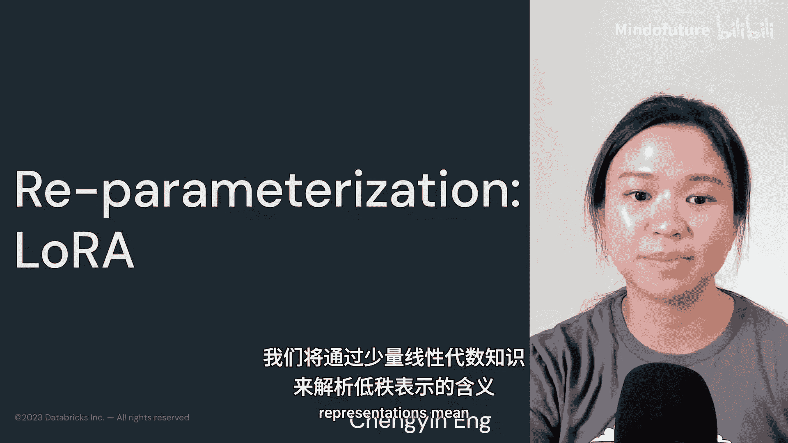
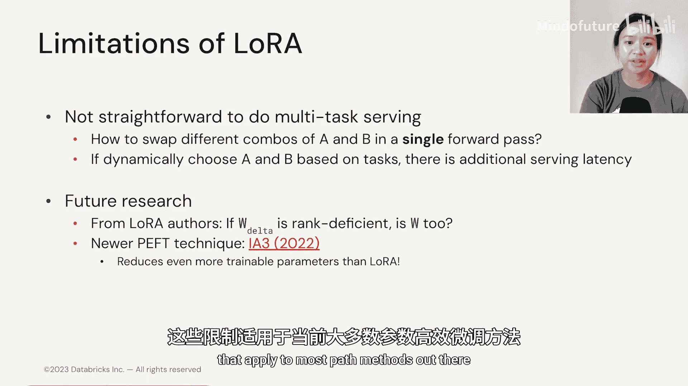

# 013：高效微调-2.4 重参数化-LoRA 🧩

在本节中，我们将讨论当前参数高效微调（PET）中最流行的技术之一：LoRA。LoRA是一种重参数化方法，它利用低秩表示来最小化可训练参数的数量。我们将涵盖少量线性代数知识，以剖析低秩表示的含义。

## 概述




我们将学习LoRA（Low-Rank Adaptation）的核心思想：通过将权重更新矩阵分解为两个低秩矩阵，来大幅减少微调时需要更新的参数数量，同时保持甚至提升模型性能。

## 线性代数基础回顾：矩阵的秩

在深入LoRA之前，让我们简要回顾一下线性代数的基础知识，以理解什么是矩阵的秩。

**秩**指的是矩阵中线性无关列的最大数量。当你有一个满秩矩阵时，意味着该矩阵没有任何冗余的行或列，这些行或列可以基于其他列的组合来表达。

请看下面的例子：

```
矩阵：
[1, 2, 3]
[3, 6, 9]
```

由于第二列和第三列可以通过第一列乘以一个常数得到，它们不是线性无关的；因此该矩阵的列秩为1。对于行也是如此，因为第二行可以通过第一行乘以3得到。

本质上，我们试图确保矩阵中的信息表示没有任何冗余。

## LoRA的工作原理

上一节我们回顾了矩阵秩的概念，本节中我们来看看LoRA如何利用这一概念。

在微调或任何一般的模型训练场景中，我们通过前向和反向传播来更新模型权重。LoRA背后的思想是，我们可以将权重更新矩阵（ΔW）分解为两个低秩矩阵（WA 和 WB）。

你可能会问，这有什么不同？在回答这个问题之前，我们先通过一个例子看看它是如何减少参数量的。

假设 ΔW 的维度是 100 x 100（即10,000个参数）。我们可以将其分解为两个更小的矩阵：
*   **WA** 的维度是 100 x 2（200个参数）
*   **WB** 的维度是 2 x 100（200个参数）

当我们把这两个矩阵相乘（`WB * WA`）时，结果仍然是 100 x 100 的矩阵，与 ΔW 的形状相同。这一点非常重要，因为我们可以将这个结果与原始的预训练权重相加，然后传递给后续的网络层。

这种分解方法极大地减少了参数数量。这里参数总数是 `100*2 + 2*100 = 400`。而原始的 ΔW 矩阵有 10,000 个参数。这带来了 **96%** 的可训练参数减少。

启发LoRA的观察是：在微调过程中，注意力权重矩阵变化的秩通常低于实际的权重更新矩阵ΔW的满秩。因此，我们可以冻结预训练权重，只更新这两个低秩权重矩阵（即图中的 WA 和 WB）。

研究发现，LoRA的性能可以匹配全量微调，有时甚至优于微调，而所需参数仅为原始GPT-3参数的 **0.02%**。

## 如何确定秩的大小？

很自然地，下一个问题是：我们如何确定这些矩阵的秩（即上面例子中的“2”）？

我们可以将其视为一个需要搜索的超参数。一般来说，对于GPT-3，不同的秩大小会产生大致相似的验证准确率。直观地说，太小的秩可能无法适用于所有任务或数据集，尤其是在下游任务与基础模型的原始训练任务差异很大的情况下。

研究人员也尝试过更新权重矩阵的不同组合进行分解，但没有得出明确的趋势性结论。

## LoRA的优势与特点

以下是LoRA方法的主要优势：

*   **参数高效**：与提示词微调类似，LoRA锁定或冻结了模型的大部分权重。
*   **模型共享**：你可以共享或重用同一个基础模型。
*   **训练高效**：由于不需要计算大部分梯度或优化器状态，提高了训练效率。
*   **无额外推理延迟**：因为我们可以将 WA 和 WB 与原始权重合并（`W_final = W_pretrained + WB * WA`），所以在推理时没有额外延迟。
*   **可组合性**：它也可以与其他参数高效微调方法结合使用。然而，Hugging Face现有的PEFT库尚不允许并发使用多种PEFT方法。

在后续我们将探索的实验笔记本中，你将需要应用LoRA作为一种微调技术。

## LoRA的局限性

现在，让我们谈谈LoRA的一些局限性。

尽管理论上我们可以在推理时直接替换不同的权重更新矩阵，但在处理包含多个任务的混合批次时，如何操作并不直接明了。如果我们想在推理时动态选择使用哪一组矩阵A和B，就会产生额外的服务延迟。

当然，也存在其他开放的研究问题，例如：
*   为什么我们只分解 ΔW？可以分解原始权重矩阵W吗？
*   我们能进一步减少参数数量吗？

事实上，已经有一种名为 **IA3** 的新PEFT技术，在LoRA的基础上改进，可以进一步减少可训练参数的数量。

## 总结

本节课中，我们一起学习了LoRA（低秩自适应）技术。我们了解到，LoRA通过将全量权重更新矩阵分解为两个低秩矩阵的乘积，实现了用极少的可训练参数（通常不到原模型的1%）对大型模型进行高效微调。这种方法在保持模型性能的同时，显著降低了计算和存储开销，是当前参数高效微调领域的核心技术之一。



在下一节中，我们将总体回顾适用于大多数PEFT方法的通用局限性。