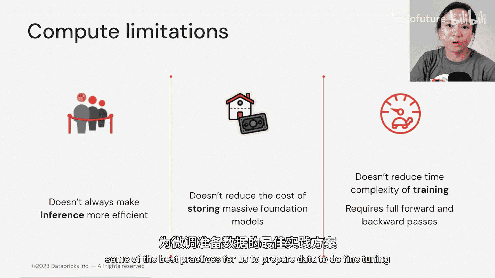

# 014：PEFT的局限性 🧐

在本节中，我们将探讨参数高效微调（PEFT）技术，如提示调优或LoRA，虽然前景广阔，但并非完美无缺。我们将从模型性能和计算限制两个角度，系统地分析PEFT方法存在的普遍局限性。

## 模型性能的局限性

上一节我们介绍了PEFT的各种技术，本节中我们来看看它们在性能方面的挑战。尽管PEFT在许多情况下可以媲美全参数微调的效果，但它存在一些固有的性能不稳定性问题。

*   **性能稳定性不足**：PEFT技术很难持续稳定地超越全参数微调的性能，因为它们对超参数的变化非常敏感。
*   **应用依据不明确**：目前，对于为何选择PEFT、以及为何将适配器仅应用于注意力权重矩阵等决策，缺乏清晰的理论依据。
*   **全参数微调仍有价值**：我们或许不应完全放弃全参数微调。当前PEFT的研究焦点很大程度上集中在**存储优化**上，旨在减少同一基础模型多个副本的存储占用。

然而，存储只是问题的一部分。今年六月，一组研究人员发布了一篇论文，提出了一种名为**LoOMO**的新型优化器。该优化器能将训练所需的内存占用降低至原始需求的**11%**，这为全参数微调的高效化提供了新的思路。

## 计算与成本的局限性

了解了性能方面的挑战后，我们再来看看PEFT在计算效率和成本方面的限制。

以下是PEFT在计算层面存在的主要问题：

*   **推理效率未必提升**：PEFT并不总能提升模型服务或推理阶段的效率。
*   **基础模型存储成本未减**：PEFT无法免除或降低存储单个大型基础模型副本的成本。
*   **训练时间复杂度未变**：对于PEFT，训练过程同样需要进行完整的**前向传播**和**反向传播**，其训练的时间复杂度并未降低。

## 总结

本节课中我们一起学习了参数高效微调（PEFT）技术的局限性。我们了解到，PEFT虽然在节省存储空间方面优势显著，但在模型性能的稳定性、超参数敏感性、以及计算效率（尤其是训练时间成本和基础模型存储成本）方面仍存在挑战。这些局限性提醒我们，需要根据具体任务和资源条件，在PEFT与全参数微调之间做出权衡选择。

在下一节，也是本模块的最后一节，我们将学习为模型微调准备数据的一些最佳实践。