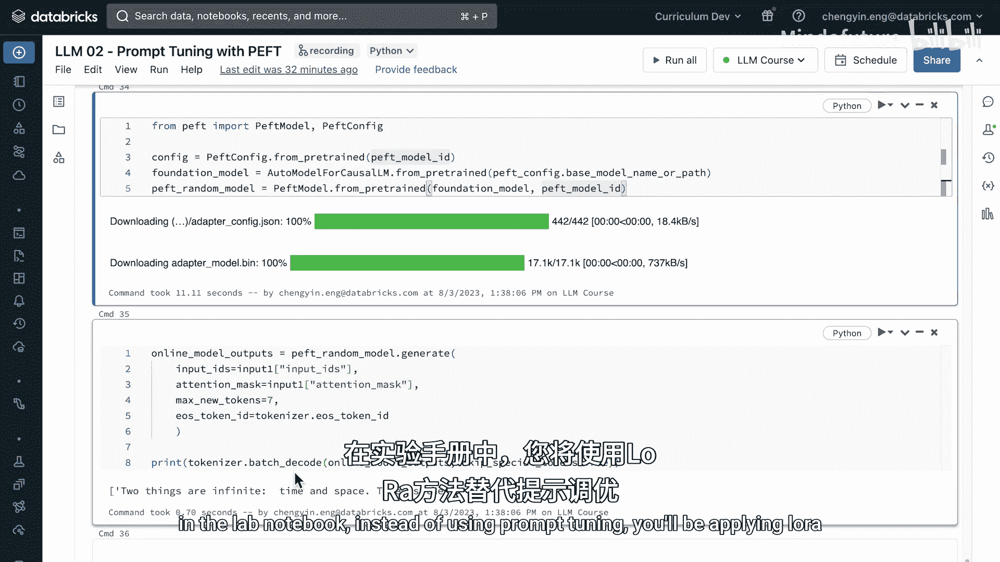

# 016：笔记本教程 🧠

在本教程中，我们将学习如何使用Hugging Face开发的**PEFT**库对大型语言模型进行高效的参数微调。我们将以BloomZ模型为例，通过**Prompt Tuning**技术，在“励志英文名言”数据集上进行微调，并比较不同初始化方法的效果。最后，我们还会学习如何将微调好的模型分享到Hugging Face Hub。


---

## 概述

本节我们将使用Hugging Face的**PEFT**库进行高效微调。PEFT支持多种微调方法，例如LoRA和Prompt Tuning。在本演示中，我们将重点使用**Prompt Tuning**方法，对一个名为BloomZ的自回归语言模型进行微调，目标是让它能够生成励志的英文名言。

---

## 准备工作

首先，我们需要下载PEFT库和课程相关的设置文件。

```python
# 安装PEFT库
!pip install peft
# 下载课程设置（假设有相关脚本）
# !wget [课程设置文件URL]
```

完成上述步骤后，我们可以开始加载模型和分词器。

---

## 加载模型与分词器

我们将使用Hugging Face的`AutoClass`来自动获取预训练模型和分词器。这非常方便，只需指定模型名称即可。

```python
from transformers import AutoTokenizer, AutoModelForCausalLM

# 指定预训练模型名称
model_name = "bigscience/bloomz-560m"
# 加载分词器
tokenizer = AutoTokenizer.from_pretrained(model_name)
# 加载因果语言模型（自回归模型）
model = AutoModelForCausalLM.from_pretrained(model_name)
```

我们使用的模型是**BloomZ**，它是一个在多语言数据集上训练的模型，涵盖46种自然语言和编程语言。

---

## 微调前的基础模型表现

在开始微调之前，我们先看看基础模型在给定输入下的表现。我们提供一个句子开头，让模型生成后续文本。

```python
input_text = "Two things are infinite"
inputs = tokenizer(input_text, return_tensors="pt")
outputs = model.generate(**inputs, max_length=50)
print(tokenizer.decode(outputs[0], skip_special_tokens=True))
```

输出可能是：“The number of people and the number.” 这个回答不算差，但我们的目标是让模型生成更励志、更具哲理的名言。

---

## 准备微调数据集

我们将使用一个名为“English quotes”的数据集进行微调。这个数据集包含了许多名人的名言。

```python
# 假设我们已经加载了数据集
# dataset = load_dataset("english_quotes")
# 为了演示速度，我们只使用50条示例进行微调
train_dataset = dataset["train"].select(range(50))
```

以下是数据集的示例结构：

*   **quote**: "The only limit to our realization of tomorrow is our doubts of today."
*   **author**: "Franklin D. Roosevelt"

我们的目标是让模型学会生成具有类似励志或哲理风格的文本。

---

## 应用Prompt Tuning进行微调

Prompt Tuning允许我们使用**随机初始化**或**文本初始化**的软提示。本节我们将先尝试随机初始化。

### 随机初始化Prompt Tuning

首先，我们配置Prompt Tuning，指定软提示的长度（虚拟令牌数）和任务类型。

```python
from peft import PromptTuningConfig, get_peft_model

# 配置Prompt Tuning
peft_config = PromptTuningConfig(
    task_type="CAUSAL_LM",  # 因果语言建模
    num_virtual_tokens=20,  # 软提示长度
    prompt_tuning_init="RANDOM"  # 随机初始化
)
# 将PEFT配置应用到模型
peft_model = get_peft_model(model, peft_config)
# 打印可训练参数比例
peft_model.print_trainable_parameters()
```

应用PEFT后，可训练参数的数量会大幅减少（通常小于0.01%），这就是高效微调的优势。

---

### 配置训练参数

接下来，我们使用Hugging Face的`Trainer`类来定义训练配置。

```python
from transformers import TrainingArguments, Trainer

# 定义训练参数
training_args = TrainingArguments(
    output_dir="./output",  # 输出目录
    per_device_train_batch_size=4,  # 批次大小
    learning_rate=3e-2,  # 学习率（比全参数微调高）
    num_train_epochs=5,  # 训练轮数
    logging_steps=10,
    save_steps=100
)
```

请注意，由于我们只微调一小部分参数，因此需要使用**更高的学习率**来提高效果。

---

### 设置训练器并开始训练

现在，我们将所有组件传递给`Trainer`类并开始训练。

```python
from transformers import DataCollatorForLanguageModeling

# 数据整理器，用于批处理
data_collator = DataCollatorForLanguageModeling(
    tokenizer=tokenizer,
    mlm=False  # 我们使用因果语言建模，而非掩码语言建模
)

# 创建训练器
trainer = Trainer(
    model=peft_model,
    args=training_args,
    train_dataset=train_dataset,
    data_collator=data_collator
)

# 开始训练
trainer.train()
```

训练过程大约需要10分钟。在Databricks上，这会自动触发一个MLflow运行，用于跟踪超参数、指标和产物。

---

### 保存并测试微调后的模型

训练完成后，我们保存模型并测试其生成效果。

```python
# 保存模型
save_path = "./my_peft_model"
trainer.model.save_pretrained(save_path)

# 加载微调后的模型进行测试
from peft import PeftModel
loaded_model = PeftModel.from_pretrained(model, save_path)

# 生成文本
input_text = "Two things are infinite"
inputs = tokenizer(input_text, return_tensors="pt")
outputs = loaded_model.generate(**inputs, max_length=50)
print("微调后输出:", tokenizer.decode(outputs[0], skip_special_tokens=True))
```

输出可能是：“time and space.” 这比之前的回答更接近哲理风格。请注意，由于训练数据有限，结果可能有所不同。

---

## 文本初始化Prompt Tuning

现在，我们尝试使用**文本初始化**的Prompt Tuning。唯一的区别在于我们需要提供一个初始文本提示。

```python
# 配置文本初始化的Prompt Tuning
peft_config_text = PromptTuningConfig(
    task_type="CAUSAL_LM",
    num_virtual_tokens=20,
    prompt_tuning_init="TEXT",  # 文本初始化
    prompt_tuning_init_text="Generate inspirational quotes"  # 初始文本
)
peft_model_text = get_peft_model(model, peft_config_text)

# 使用相同的训练参数和数据集进行训练
trainer_text = Trainer(
    model=peft_model_text,
    args=training_args,
    train_dataset=train_dataset,
    data_collator=data_collator
)
trainer_text.train()
```

训练完成后，我们同样测试其输出。

```python
# 测试文本初始化模型
outputs_text = peft_model_text.generate(**inputs, max_length=50)
print("文本初始化输出:", tokenizer.decode(outputs_text[0], skip_special_tokens=True))
```

输出可能是：“the number of people that you can count.” 这个回答也还不错。

---

## 随机初始化 vs. 文本初始化

通过比较，我们发现两种初始化方法在单一样例上的表现差异不大。实际上，根据相关研究，**随机初始化**通常能达到与文本初始化相近的性能，且省去了设计初始文本的麻烦。因此，在实践中，随机初始化往往是更受欢迎的选择。

> **注意**：评估生成文本的质量是主观的。为了更客观地比较，我们需要在更多的测试样例上进行评估。

---

## 将模型分享到Hugging Face Hub（可选）

如果您对微调后的模型感到满意，可以将其分享到Hugging Face Hub，供社区使用。

### 步骤1：创建Hugging Face账户并获取访问令牌

1.  访问[Hugging Face官网](https://huggingface.co)并注册账户。
2.  登录后，点击右上角头像，进入“Settings”。
3.  在“Access Tokens”选项卡中，创建一个新的令牌。

### 步骤2：在Databricks中安全地使用令牌

您可以使用Databricks Secrets来安全地存储令牌，或者通过Hugging Face的交互式登录方式。

```python
from huggingface_hub import notebook_login
notebook_login()  # 这会提示您输入令牌
```

### 步骤3：推送模型到Hub

```python
from huggingface_hub import HfApi

# 设置您的用户名和模型ID
username = "your_hf_username"
model_id = f"{username}/my-bloomz-peft-model"

# 推送模型
peft_model.push_to_hub(model_id, use_auth_token=True)
```

推送成功后，您可以在Hugging Face个人主页的“Models”部分看到它。

### 步骤4：从Hub加载模型

其他人现在可以像加载任何Hugging Face模型一样加载您的模型。

```python
from peft import PeftModel
shared_model = PeftModel.from_pretrained(model, model_id)
```

---

## 总结

在本教程中，我们一起学习了：

1.  **PEFT库的基本使用**：如何利用它大幅减少微调时的可训练参数量。
2.  **Prompt Tuning技术**：实践了随机初始化和文本初始化两种方式。
3.  **模型微调流程**：从加载模型、准备数据、配置训练到保存测试的完整步骤。
4.  **结果比较**：观察到在有限数据和训练下，两种初始化方法表现相近。
5.  **模型分享**：如何将微调好的模型上传到Hugging Face Hub与社区共享。



通过本教程，您已经掌握了使用PEFT进行高效微调的基本技能。接下来，您可以尝试使用更大的数据集、不同的模型或PEFT的其他方法（如LoRA）来进一步提升模型性能。