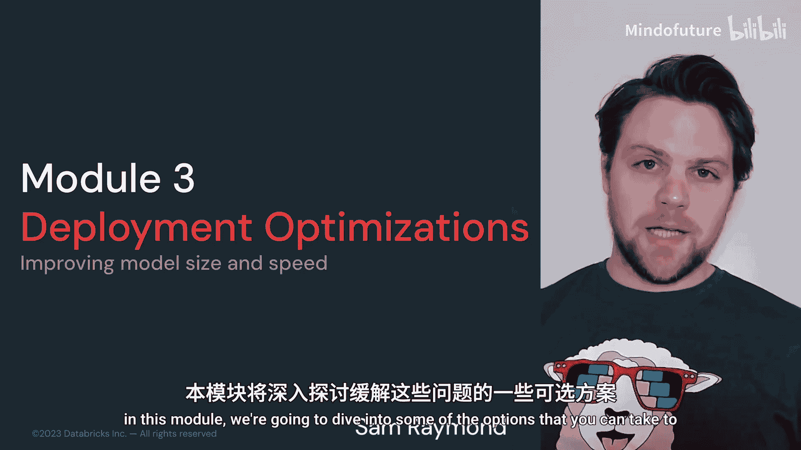
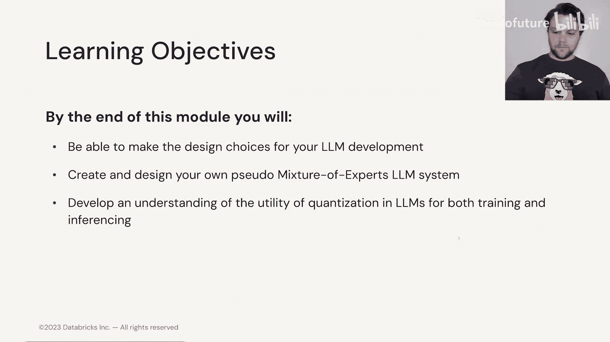
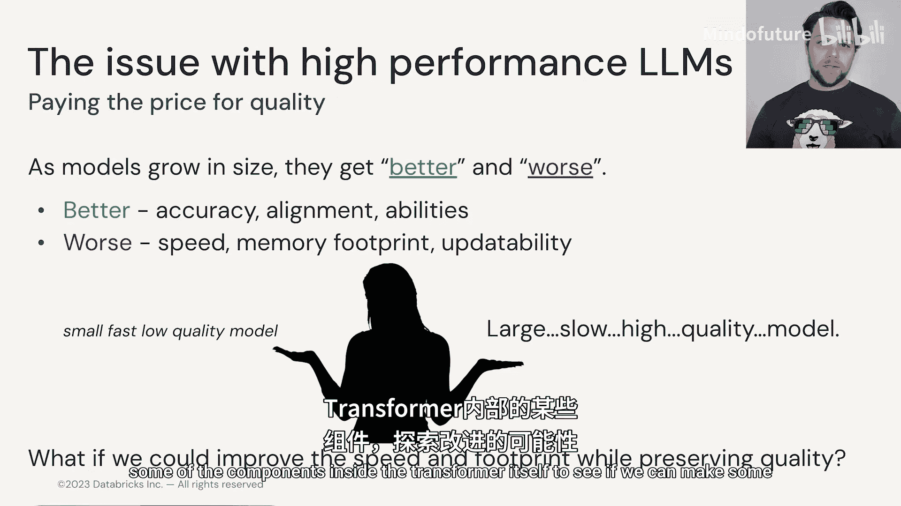

# 018：部署与硬件概览 🚀

在本模块中，我们将深入探讨如何充分利用可用的计算和时间资源。在模块2中，Cheang Yin向我们展示了一些可用的参数高效微调工具。现在，我们需要关注这些工具的原因之一是，大型语言模型确实非常庞大。

具体来说，它们庞大到单个消费级甚至有时企业级的硬件设备都无法处理。这意味着我们必须协调多个硬件设备。这增加了复杂性、成本和限制。

在本模块中，我们将深入探讨一些可以缓解这些问题的方法。到本模块结束时，您将能够做出不同的设计选择，不仅针对如何微调您的大型语言模型，还包括如果您正在进行预训练，如何创建基础模型。

---

上一节我们介绍了本模块的学习目标，本节中我们来看看我们将要探讨的具体技术方向。

以下是本模块将涵盖的两个主要技术方向：

*   **专家混合方法**：我们将研究专家混合方法，以及它如何创建一个系统，让我们能够利用多个LLM，同时节省训练和推理成本。
*   **量化技术**：我们还将探讨量化如何允许我们利用已经训练好的大型语言模型，并将其转换为更小的版本，而不会在性能上牺牲太多。

---

现在，让我们来谈谈当前这些变得异常庞大的大型语言模型所面临的问题。

问题的核心在于**内存**。我们发现，这些拥有数千亿参数的大型语言模型往往无法装入消费级或企业级GPU。

从我们的大型语言模型中可以看到，随着模型规模的增长，它们的性能往往会更好，包括输出准确性更高、能更好地与我们需要的任务对齐，并且解决不同类型任务的能力范围更广。

然而，这是有代价的，特别是速度方面。我们在模块1中已经看到，GPT-2超大模型需要更长的时间来生成输出。对于内存占用，如果您是大型语言模型的开发者，那么“内存不足”错误将是您非常熟悉的。此外还有可更新性，如果有新数据进来，我们需要继续训练模型，模型越大，这一点就越难做到。

因此，我们面临一个选择：是必须选择一个至少速度快但质量不高的小模型，还是尝试使用一个非常大的模型，并尽可能多地投入计算资源以利用其高质量？

或者，我们能否两者兼得？在本模块中，我们将重新审视Transformer内部的一些组件，看看是否能进行一些改进，帮助缓解其中一些问题。

---

本节课中我们一起学习了本模块的概览，明确了大型语言模型在部署时面临的核心挑战——内存限制，并介绍了后续将深入探讨的两种关键技术：专家混合方法与量化技术，旨在实现性能与效率的平衡。