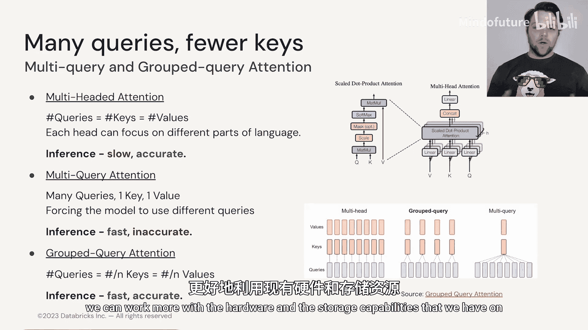
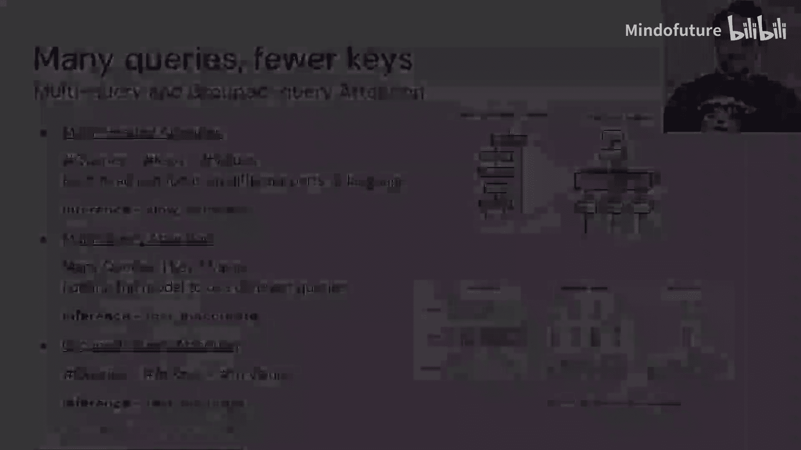

# 019：部署与硬件-3.3 提高学习效率 🚀

在本节中，我们将探讨如何提升大型语言模型（LLM）的学习与推理效率。核心在于理解并优化注意力机制，这是驱动现代LLM的关键技术，但也带来了计算和上下文长度扩展的挑战。

## 注意力机制：成就与挑战

上一节我们介绍了模型部署的基础，本节中我们来看看如何优化其核心计算。注意力机制是解锁当今大型语言模型能力的关键技术之一。这个出色的工具使LLM能够以我们之前难以想象的方式解读文本。然而，它也带来了一些我们必须面对并设法解决的问题。

## 上下文长度的困境

如果我们思考如何与大型语言模型交互，就必须讨论上下文长度。这本质上是我们输入到提示中的信息量，LLM将利用这些信息来解读被询问的内容或正在进行的对话类型。和我们人类一样，更大的上下文对LLM也更有利。但是，增加LLM的上下文长度并不像想象中那么简单。

从理论上讲，注意力机制的操作没有上下文长度限制。涉及查询、键和值向量的运算跨越整个序列长度，这个序列长度可以无限，且不影响模型参数的数量，因为参数是基于每个词嵌入向量的维度确定的。

然而，当我们增加上下文长度并对其应用注意力机制时：
*   计算输入值的开销大致呈线性增长。
*   执行位置前馈神经网络计算的开销也呈线性增长。
*   但计算注意力分数本身的开销呈**二次方增长**，因为我们需要处理一个 **N × N** 的矩阵。

更严重的问题是，如果我们用某个长度（例如1000）训练模型，然后在两倍、三倍甚至十倍于此的长度上进行推理，模型的性能会显著下降。一个可能的原因是我们在为注意力机制提供词元位置关系信息时使用的位置编码。我们使用正弦和余弦函数进行位置编码，以提供词元间的相对位置感。然而，当训练长度和测试长度差异很大时，这种编码似乎无法让神经网络或注意力机制很好地理解位置差异。困惑度分数（用于衡量模型预测下一个词元的能力）会随着上下文长度的改变而越来越差。

## 解决方案：ALiBi位置编码

我们可以尝试通过改进注意力机制本身来解决这个问题。一项名为ALiBi的创新采用了一种方法：对查询向量和键向量的点积结果施加一个线性偏置。具体来说，与当前查询词元距离为 `k` 步的词元，其注意力分数会被减去一个系数 `m * k`。其中，系数 `m` 是一个几何序列。

**公式**：`调整后的注意力分数 = 查询·键 - m * |位置差|`

这意味着，你可以在相对较短的上下文长度上训练模型，然后在推理时将其扩展到几乎任意大小。这使得最大上下文长度从大约4000，一路提升到32,000、64,000，在某些情况下甚至超过100,000。这意味着我们可以在上下文中加入更多信息，包括文档、代码库和聊天历史，从而从LLM中获得更好的性能。

## 计算资源的新挑战

然而，基于我们之前的讨论，你可能会意识到，进行更长的推理所需的计算资源现在成了问题。这不再仅仅是模型参数加载到内存中的问题，而是生成这些注意力权重本身成为了我们必须处理的难题。

幸运的是，这个领域充满了许多聪明人，我们已经提出了许多解决方案。其中，最受广泛关注的是**Flash Attention**。它利用了线性代数中的一个原理：我们实际上根本不需要具体化这些庞大的矩阵，可以进行一种“免矩阵”操作。因为我们知道一个向量的哪个索引需要与另一个向量的哪个索引交互，所以我们可以逐个处理这些单独的变量。

这种方法的重要性在于我们需要考虑计算注意力时使用的硬件。在GPU中计算注意力分数时，我们实际上在与一种叫做SRAM（静态随机存取存储器）的硬件交互。这类似于CPU上的高速缓存，它是一种非常快但容量很小的内存，非常靠近计算单元。对于LLM，当我们尝试加载完整的注意力矩阵时，SRAM会迅速过载。如果我们从不具体化注意力矩阵，就可以持续将单个变量发送到SRAM并进行排列，从而无需访问速度较慢的内存，避免了因矩阵过大无法放入SRAM而导致的性能损失。使用Flash Attention及其后续变体，我们在计算这些因更长上下文而产生的注意力时，看到了数量级的速度提升。

## 注意力机制的进一步优化

进一步审视注意力机制，我们可以思考其他改进方法。在第一模块中，我们讨论了注意力，但没有讨论多头注意力。本质上，多头注意力将键和值矩阵的整个注意力计算分割成多个“头”。这意味着我们将一个查询发送到多个不同的矩阵，但它们的总大小与使用单个矩阵时相同。

我们将此分割成多头的原因在于，它允许这些不同版本的键、查询和值专注于语言的不同部分。通过分割成多个头，可能一个头关注名词，一个头关注介词，另一个头关注其他词性。虽然这能通过得到更详细、更丰富的最终注意力分数来产生更准确的结果，但由于需要分多步进行计算，速度较慢。

对此的一些改进包括**多查询注意力**，即我们创建查询向量的多个副本，但只输入到一个键和值向量中。然而，这种方法的问题在于，虽然比多头注意力快得多，但往往无法捕捉我们在多头注意力情况下所需的所有细微差别差异。

此问题的折中方案是**分组查询注意力**，这也是Llama 2等大型语言模型所采用的方式。在这种机制中，我们的注意力机制有多个不同的“头”，但我们向它们发送几个不同的查询向量。请注意，这些查询向量来自同一个词元，但使用了略有不同的投影操作，从而为键向量提供了不同版本的查询向量以供审视。这使我们能够兼顾多头注意力的多焦点优势和多查询注意力的部分速度提升。分组查询注意力是迄今为止我们在改进注意力操作方面看到的最新创新之一。随着该领域的发展，我们将看到更多创新，现在我们正开始寻找不同的方法来改进Transformer架构，使其从2018年的初始版本不断成熟、精炼。

## 总结

本节课中，我们一起学习了提升LLM效率的关键方法。我们了解到，扩展上下文长度会带来注意力计算的二次方增长和位置编码外推的挑战。通过采用ALiBi位置编码，我们实现了训练与推理上下文长度的解耦。为了应对长上下文带来的巨大计算开销，Flash Attention利用硬件特性，通过避免具体化大型注意力矩阵，显著提升了计算速度。最后，我们还探讨了从标准多头注意力到多查询注意力，再到分组查询注意力的演进，后者在模型表现力和计算效率之间取得了更好的平衡。现在，我们已经了解了这些不同的算法改进，在下一节中，我们将探讨如何更好地利用现有的硬件和存储能力。