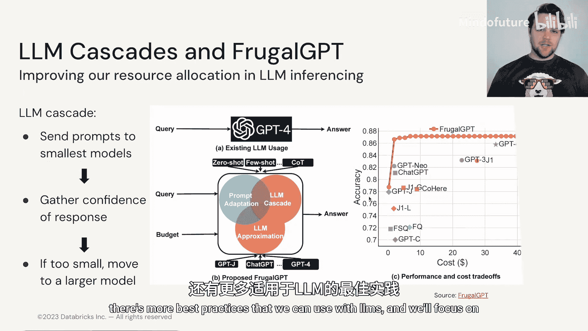
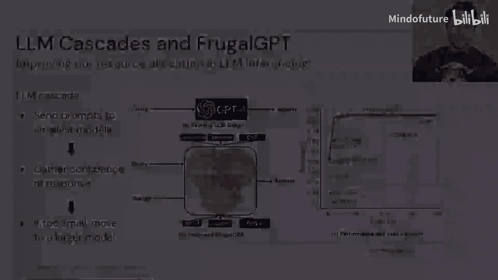

# 021：3.5 多LLM推理 🧠

在本节中，我们将探讨如何利用多个大型语言模型来提升性能或降低成本。我们将介绍两种核心方法：专家混合模型和LLM级联，它们分别适用于模型训练和推理优化的场景。

---

假设你已经完成了所有可能的优化，或者你拥有足够的计算能力来处理一些现成的多参数大语言模型，但你仍有更多数据需要训练。此时你该如何继续？又或者，你虽然能访问多个大语言模型，但推理预算有限。本节将讨论如何在推理和训练中，通过多种不同的方式和风格来使用多个大语言模型。

## 专家混合模型

上一节我们讨论了单一模型的优化，本节我们来看看如何组合多个模型。专家混合模型的核心思想是，我们可以利用多个经过专门任务训练的小型系统。这在机器学习和深度学习领域相当常见，集成方法就是如此运作的。

专家混合模型的不同之处在于，输入会被发送到一个称为“路由器”的组件。路由器经过训练，学习如何将不同的输入分配给不同类型的“专家”。这不一定非得是大语言模型，它可以应用于不同类型的机器学习和深度学习任务，但在此我们将专注于大语言模型背景下的专家混合模型。

当我们思考大语言模型中的参数分布时，超过三分之二的参数存在于位置前馈神经网络中。这些网络存在于每个Transformer块中，用于在向量经过注意力机制后对其进行额外的丰富处理。

由谷歌研究人员提出的Switch Transformer，利用了这样一个事实：通过在训练过程中使用并训练不同的前馈神经网络，我们可以提出一种方法，在同一时间训练多个这样的前馈神经网络“专家”。

这种方法在参数成本方面对我们有帮助，因为我们可以拥有多个（例如，1000亿参数）的前馈网络，但一次只训练其中一个。这意味着在训练过程中，通过每个批次中的不同样本，路由器会学习将信号发送给哪个专家。它可能将信号发送给几个专家，然后对输出进行某种聚合；也可能只发送给一个专家。这就是我们如何将多个千亿参数模型组合在一起，形成一个大型集成模型的方式。通过这种方式，我们可以轻松地从多个千亿参数的Transformer模型扩展到万亿乃至数万亿参数的模型。

关于专家混合模型方法如何工作的研究仍在继续，但Switch Transformer已经展示了出色的成果。这些方法确实需要大量的计算资源，随着我们更深入地探索专家混合模型领域，迄今为止看到的所有优化技术都将派上用场。

## LLM级联与Frugal GPT

但是，假设我们主要关心的不是训练，而是推理。例如，你有一个固定的成本预算，并且只能通过某些API与大语言模型交互。在这种情况下，你可能会考虑像LLM级联这样的方法。

在2023年发布的Frugal GPT论文中，研究人员提出了一种方法：他们首先将提示传递给性能最低的模型，然后查看该模型对其自身表现结果的评估。当我们从模型输出一个特定的词元时，我们可以获取该结果的“困惑度”，这让我们了解大语言模型对其刚刚选择的内容有多大的把握。

如果当前这个低质量模型不确定或具有较高的困惑度值，那么我们将跳过它的输出，转而使用下一个更复杂的模型。这种复杂性和自检的级联效应意味着，Frugal GPT能够在保持更高准确性的同时，使用更少的成本。

像LLM级联和Frugal GPT这样的方法，仅仅是研究和工业用例新探索领域的开始。在这个领域中，我们将充分利用现有的大量大语言模型。

关于使用LLM的最佳实践还有更多内容，我们将在本模块的最后一节重点讨论。

---

**总结**

本节课中，我们一起学习了两种利用多个大型语言模型的核心策略。**专家混合模型**通过一个路由器动态分配任务给不同的“专家”子模型，主要用于构建参数量巨大的高效训练模型，其核心是训练一个能选择专家的**路由器**。而**LLM级联**（如Frugal GPT）则是一种推理优化策略，它让提示依次通过从简到繁的模型，并根据**困惑度**等置信度指标决定是否“升级”到更强大的模型，从而在控制成本的同时保证输出质量。这两种方法展示了如何通过组合模型来突破单一模型在规模或成本上的限制。