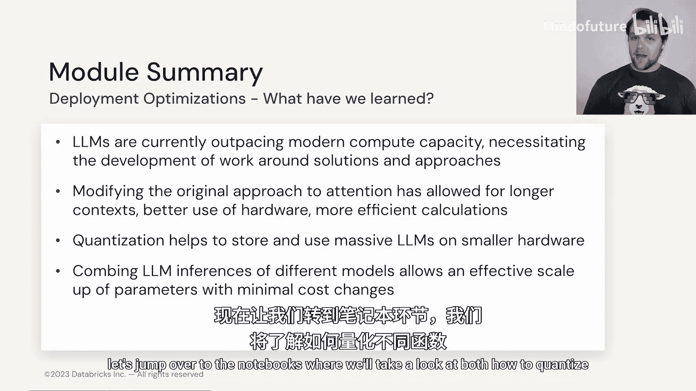
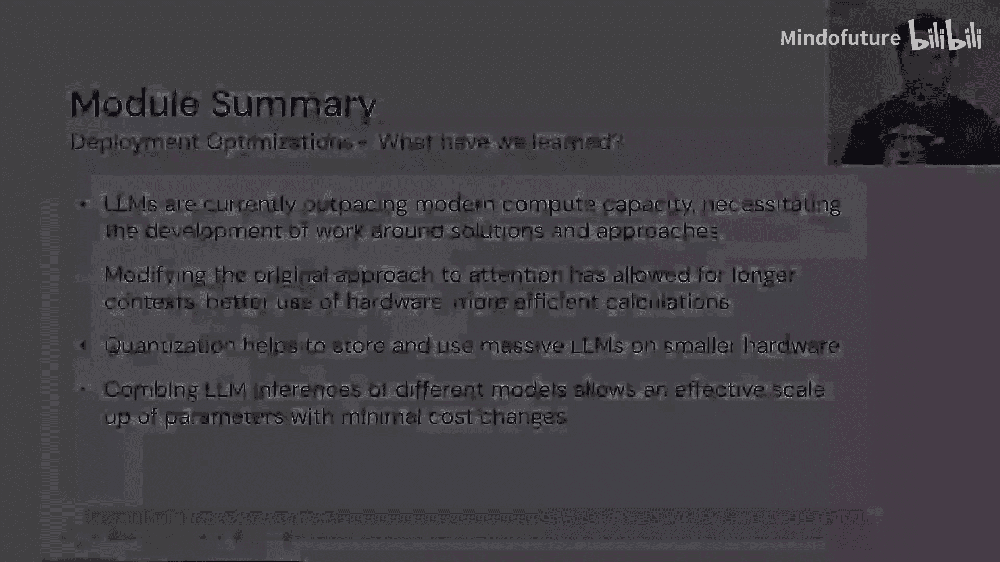

# 022：3.6 当前最佳实践 🚀

在本节中，我们将整合前面所学的优化与改进技术，讨论当前进入大语言模型领域（无论是训练还是推理）时可用的最佳实践选项。

上一节我们介绍了多种针对训练和推理的优化技术，本节中我们来看看如何将它们组合应用，形成一套当前推荐的最佳实践方案。

## 训练最佳实践

如果你计划从头开始训练一个大语言模型，以下是推荐的关键实践：

*   **使用ALiBi位置编码**：这允许模型处理远超其训练时所见长度的上下文，即拥有**非常大的上下文长度**。
*   **利用Flash Attention**：在计算注意力时，此技术能避免GPU的SRAM内存过载，从而支持使用更长的上下文，并提升计算效率。
*   **采用分组查询注意力**：这可以节省注意力机制所需的计算资源和参数量，公式可表示为将传统的多头注意力中的键值对进行分组共享。
*   **考虑混合专家模型**：如果你的目标是实现真正**大规模**的语言模型，混合专家方法是一个值得探索的方向，其核心思想是`y = sum( GatingNetwork(x)_i * ExpertNetwork_i(x) )`，其中路由网络为每个输入动态选择少数专家。

## 推理与微调最佳实践

如果你的重点在于微调现有模型并进行推理，则应关注以下工具和方法：

*   **使用LoRA或其量化版本**：LoRA是一种高效的参数微调方法，它通过注入低秩适配器来更新模型，而非全参数微调，代码示意为`W_updated = W + BA`，其中B和A是低秩矩阵。
*   **探索FrugalGPT与LLM级联**：如果你关心如何在既定推理预算下最小化成本，可以研究FrugalGPT和LLM级联方法。其核心思想是先用小型、低成本模型处理简单请求，仅对困难请求调用更强大但更昂贵的模型。

## 硬件选择参考

社区提供了一些每位LLM开发者都应了解的经验数据。以下是关于GPU内存需求的通用指南：

**模型参数量与GPU显存需求的大致关系是：所需显存（GB） ≈ 参数量（十亿） × 2。**

例如，一个70亿参数的模型，推理时大约需要14GB的GPU显存。请注意，**训练模型需要更多的显存**。

基于当前常见的GPU型号，我们可以得到以下大致的模型容量匹配参考：

*   **V100 (16GB/32GB)**：适合约50亿至200亿参数的模型。
*   **A10G (24GB)**：适合约100亿至200亿参数的模型。
*   **A100 (40GB/80GB)**：适合约200亿至400亿参数的模型。

当然，随着NVIDIA、AMD等厂商技术的不断进步，我们将持续获得更强大的硬件（如H100及后续型号）。但需注意，这些尖端硬件通常价格更高，且获取难度较大。

## 总结

本节课中我们一起学习了LLM部署与硬件模块的当前最佳实践。我们了解到，由于LLM的发展速度超过了当前计算能力的增长，因此必须专注于优化和寻找解决方案。

我们回顾了如何改进原始的注意力机制以支持更长的上下文，并更高效地利用硬件。通常，拥有更长上下文的LLM在任务上表现更好。

在存储这些代表大语言模型的数字时，量化被证明是一个强大的工具，尽管我们需要权衡其带来的性能损失与成本节约。

我们还看到了如何在推理时组合使用大语言模型，例如通过混合专家模型和结合FrugalGPT的LLM级联方法，以尝试在控制成本的同时，获得所需的结果和性能。

接下来，让我们进入实践环节，在Notebook中我们将学习如何量化不同的模型，并有机会构建你自己的混合专家模型。