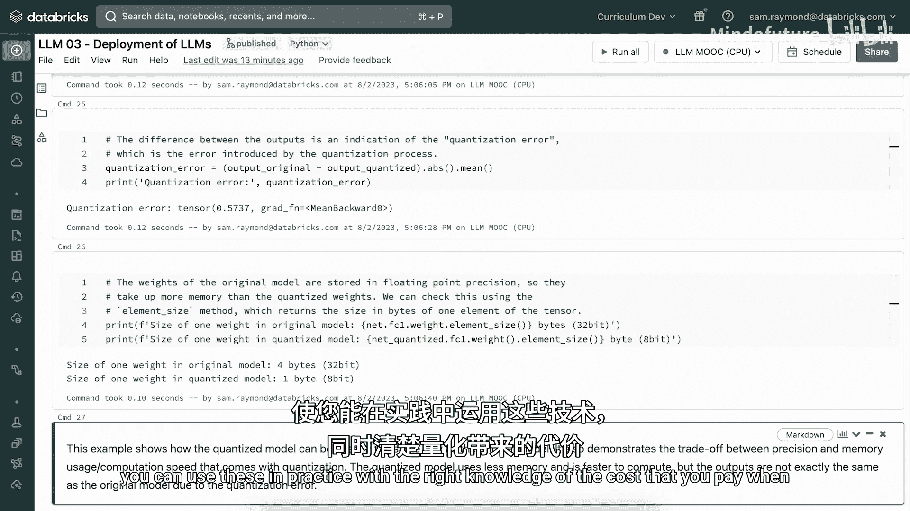

# 023：部署与硬件-3.7 量化技术 📉


在本节课程中，我们将学习量化技术。量化是一种将高精度数字转换为低精度表示的方法，旨在节省模型在训练和推理时的存储空间与计算资源。我们将从单个数值的量化开始，逐步深入到函数和神经网络，最终理解量化如何应用于大型语言模型。

## 概述

量化通过降低数值表示的精度来减少模型的内存占用和计算需求。本节将介绍量化的基本原理、实现方法及其在深度学习中的应用。

## 单个数值的量化

首先，我们来看如何对一个单独的数值进行量化。量化过程将浮点数转换为整数，同时记录缩放因子以便后续恢复。

我们定义两个函数：一个用于量化，另一个用于反量化。量化函数将输入值映射到离散的整数区间，反量化函数则尝试恢复原始值。

以下是量化函数的定义：

```python
def quantize(value, bits):
    # 确保输入值在[-1, 1]范围内
    assert -1 <= value <= 1, "Value must be between -1 and 1"
    # 计算量化值
    quantized_value = round(value * (2**(bits - 1) - 1))
    return quantized_value
```

反量化函数的定义如下：

```python
def unquantize(quantized_value, bits):
    # 将量化值恢复为浮点数
    unquantized_value = quantized_value / (2**(bits - 1) - 1)
    return unquantized_value
```

现在，我们测试4位和8位量化对数值0.5的处理效果：

```python
value = 0.5
bits_4 = 4
bits_8 = 8

quantized_4 = quantize(value, bits_4)
unquantized_4 = unquantize(quantized_4, bits_4)

quantized_8 = quantize(value, bits_8)
unquantized_8 = unquantize(quantized_8, bits_8)

print(f"4-bit量化: 量化值={quantized_4}, 反量化值={unquantized_4}")
print(f"8-bit量化: 量化值={quantized_8}, 反量化值={unquantized_8}")
```

运行上述代码后，我们可以看到4位量化引入了较大的误差，而8位量化的误差较小。这是因为8位量化提供了更高的精度。

## 函数的量化

上一节我们介绍了单个数值的量化，本节中我们来看看如何对整个函数进行量化。量化函数实际上是在离散点上对连续函数进行采样。

我们以正弦函数为例，生成其量化版本，并计算平均误差。

以下是量化正弦函数的步骤：

1. 生成从-1到1的100个点。
2. 计算每个点的正弦值。
3. 对正弦值进行4位和8位量化。
4. 计算量化后的平均误差。

```python
import numpy as np

# 生成输入点
x = np.linspace(-1, 1, 100)
y = np.sin(x)

# 量化函数值
y_quantized_4 = np.array([quantize(val, 4) for val in y])
y_quantized_8 = np.array([quantize(val, 8) for val in y])

# 反量化函数值
y_unquantized_4 = np.array([unquantize(val, 4) for val in y_quantized_4])
y_unquantized_8 = np.array([unquantize(val, 8) for val in y_quantized_8])

# 计算平均误差
error_4 = np.mean(np.abs(y - y_unquantized_4))
error_8 = np.mean(np.abs(y - y_unquantized_8))

print(f"4-bit量化平均误差: {error_4}")
print(f"8-bit量化平均误差: {error_8}")
```

运行上述代码后，我们可以看到4位量化的平均误差较大，而8位量化的误差非常小。这表明8位量化在函数表示上具有更高的保真度。

## 神经网络的量化

上一节我们介绍了函数的量化，本节中我们来看看如何将量化技术应用于神经网络。量化神经网络可以显著减少模型的大小和计算需求。

我们使用PyTorch定义一个简单的神经网络，并在训练后对其进行量化。以下是神经网络的架构定义：

```python
import torch
import torch.nn as nn

class SimpleNet(nn.Module):
    def __init__(self):
        super(SimpleNet, self).__init__()
        self.quant = torch.quantization.QuantStub()
        self.fc1 = nn.Linear(28*28, 128)
        self.fc2 = nn.Linear(128, 10)
        self.dequant = torch.quantization.DeQuantStub()

    def forward(self, x):
        x = self.quant(x)
        x = torch.relu(self.fc1(x))
        x = self.fc2(x)
        x = self.dequant(x)
        return x
```

接下来，我们训练神经网络并在训练完成后对其进行量化：

```python
# 训练神经网络
model = SimpleNet()
criterion = nn.CrossEntropyLoss()
optimizer = torch.optim.SGD(model.parameters(), lr=0.01)

# 训练过程（简化）
for epoch in range(5):
    for data, target in train_loader:
        optimizer.zero_grad()
        output = model(data)
        loss = criterion(output, target)
        loss.backward()
        optimizer.step()

# 量化模型
model.eval()
model.qconfig = torch.quantization.get_default_qconfig('fbgemm')
torch.quantization.prepare(model, inplace=True)
torch.quantization.convert(model, inplace=True)

# 保存模型
torch.save(model.state_dict(), 'quantized_model.pth')
```

量化后，我们可以比较原始模型和量化模型的大小：

```python
import os

original_size = os.path.getsize('original_model.pth')
quantized_size = os.path.getsize('quantized_model.pth')

print(f"原始模型大小: {original_size} 字节")
print(f"量化模型大小: {quantized_size} 字节")
print(f"量化后模型大小减少: {(original_size - quantized_size) / original_size * 100:.2f}%")
```

运行上述代码后，我们可以看到量化模型的大小显著减少，通常可以减少到原始模型的25%左右。

## 总结



在本节课中，我们一起学习了量化技术的基本原理和应用。我们从单个数值的量化开始，逐步扩展到函数和神经网络的量化。量化通过降低数值表示的精度来减少模型的内存占用和计算需求，尤其在大型语言模型中具有重要应用。尽管量化会引入一定的误差，但通过合理选择量化位数（如8位），可以在保持较高精度的同时实现显著的空间节省。希望本节内容能帮助你更好地理解量化技术，并在实际项目中应用它。