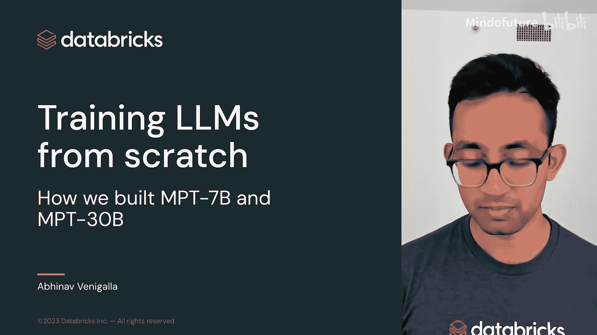
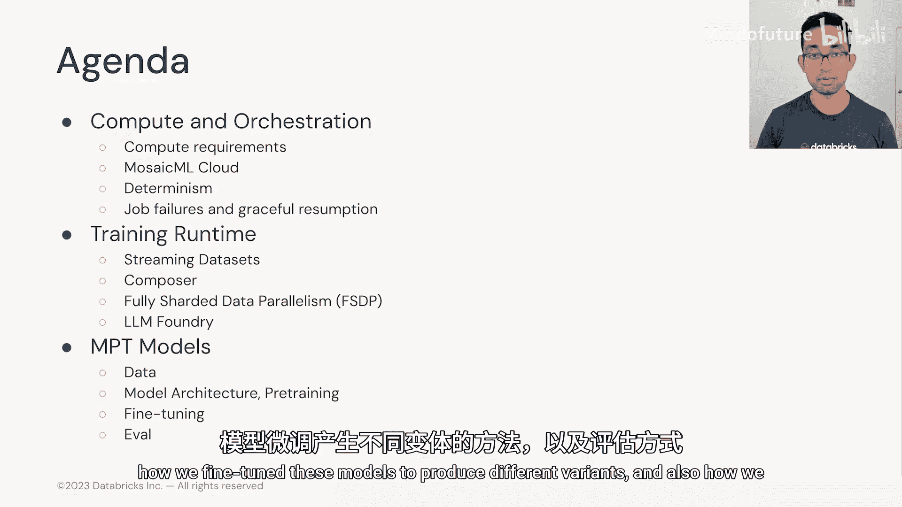
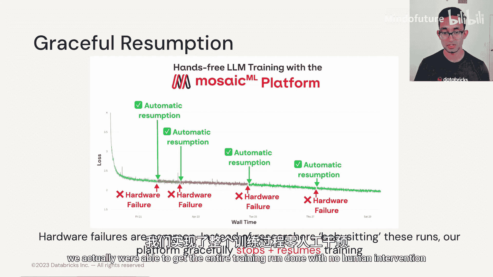
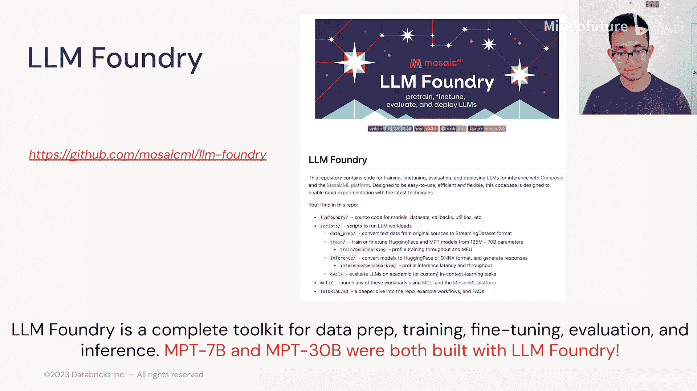
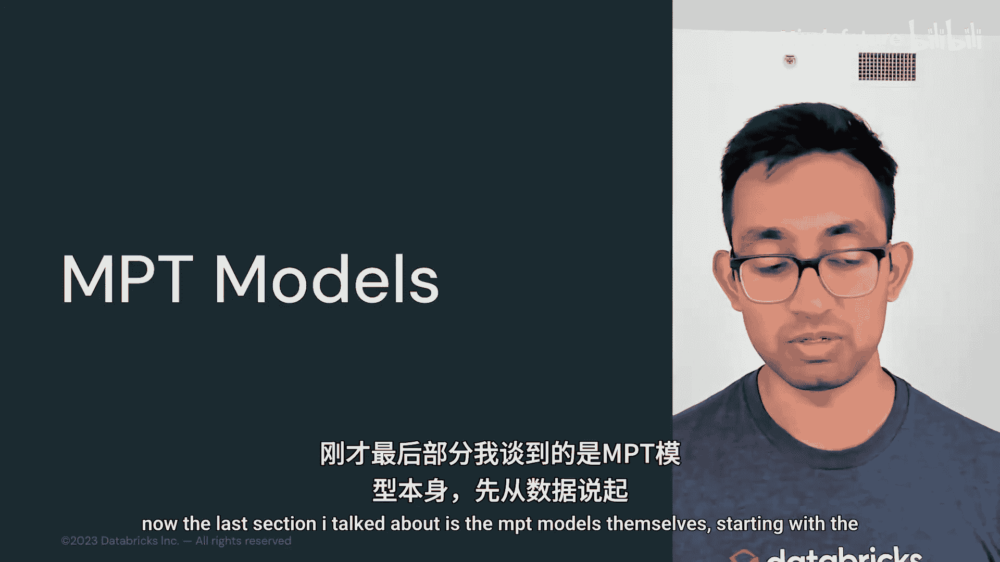
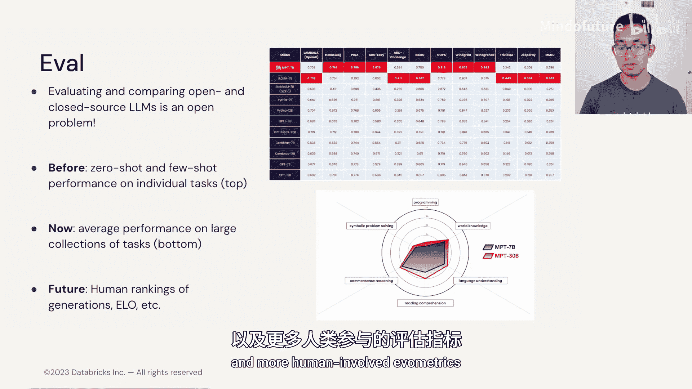

# 024：3.8 MosaicML 关于从零开始训练LLM的客座讲座 🚀

在本节课中，我们将学习如何从零开始训练大型语言模型，重点介绍MosaicML（现为Databricks的一部分）在构建开源模型MPT-7B和MPT-30B过程中所涉及的基础设施与科学原理。课程将分为计算与编排、训练运行时以及MPT模型本身三个主要部分。

## 计算与编排 💻

上一节我们介绍了课程概述，本节中我们来看看训练LLM所需的核心基础设施：计算与编排。

训练LLM最需要了解的一点是它们需要大量的计算资源。这里的“计算”指的是实际训练模型所需的数学和浮点运算。为了在人类友好的时间尺度（例如几周而非几年）内完成所有这些运算，我们必须将工作并行化到成百上千个GPU上。这正是其独特之处：我们需要专门的工具来在大型GPU集群上启动这些大规模训练任务，管理计算资源，与团队成员共享，在发生故障时自动恢复运行等。

在MosaicML，我们决定构建一个专门为机器学习工程师解决这些问题的产品，称之为MosaicML Cloud。它是一个编排和调度层，可以部署在任何GPU计算集群之上。它的特别之处在于，它解决了机器学习工程师在尝试大规模训练模型时面临的所有不同问题。这意味着支持多节点训练、故障时恢复运行、支持用于数据流和检查点的对象存储，以及集成如MLflow和Weights & Biases等实验跟踪器。当然，最重要的是它的高性能，我们已针对所有不同的云提供商进行了优化。

在实践中，用户可以通过MosaicML Cloud提交一个多节点训练任务。用户提交一个YAML文件，其中包含几个关键部分：一个Docker镜像、一个用于检出GitHub仓库的集成（即源代码），然后就是一系列训练运行命令。神奇之处在于，你可以将此任务提交到你账户中的任何一个集群，并且可以无缝地扩展GPU数量，无论是1个、8个还是256个，一切都能正常工作。

多节点编排使得在大型集群上启动这些运行变得容易，但性能如何呢？我们发现，云中构建的许多计算集群实际上拥有非常好的节点间网络。这意味着不同机器间GPU的带宽相对较高。在正确的软件和编排工具下，你可以在大型集群上启动任务，并实现近乎线性的扩展。这意味着你的任务可以更快完成。例如，在此图中，我们使用16倍的GPU数量获得了14.4倍的加速。这基本上意味着你可以更快地完成任务，而总成本增加不多。毕竟，如果你的任务规模扩大了10倍，但只用了1/10的时间，那么实际成本大致相同。

在MosaicML早期，我们专注于多节点扩展，以此作为在不增加客户支付价格的前提下，更快地向客户交付模型的一种方式。

扩展可能是LLM训练中最令人兴奋的部分，但在进行科学研究时也有很多细节需要注意，其中之一就是确定性。我们在技术栈的许多组件中早期就关注确定性，以便能够精确地进行科学研究。基本上，任何时候你想尝试新方法或不同架构，你都需要确保你的运行没有太多噪声，或者你测量的评估指标也没有噪声。

在左侧，你可以看到我们构建的一项技术：流式数据集。它使我们能够将数据从对象存储流式传输到大型GPU集群。无论你使用1个、2个还是64个GPU，你得到的损失曲线基本上是确定性的，样本的顺序也是确定性的。你可以看到在没有此功能时（顶部），得到的曲线大致相同但不完全一致；而在底部，你得到了几乎完全确定性的结果。这也意味着你可以在不同数量的GPU上恢复运行。如果你的集群发生故障，或者你需要与队友共享一些计算资源，你可以在不同节点/GPU上停止并恢复任务，并且它会像之前一样继续运行。

在右侧，我们的训练器或实际训练模型循环也面临类似情况。其中一个挑战是我们使用微批次技术来避免内存不足错误。这意味着当我们有一批总数据需要处理时，我们首先将其分割成更小的微批次，对每个微批次进行前向和后向传播，然后在所有微批次上累积梯度。同样，为了确保我们的训练运行对内存容量和你选择的微批次大小不敏感，我们基本上确保了我们的微批次引擎是确定性的。因此，你可以看到，无论我们使用大小为1、2还是直到7的微批次，我们得到的损失曲线在误差范围内几乎完全相同。

编排栈的最后一部分是恢复。这实际上是一个许多人直到真正开始大规模训练LLM时才会知道的挑战：这些GPU集群经常发生硬件故障。这些硬件故障的范围从网络错误到实际的硬件故障（需要移除整台机器），问题在于它们发生得相当频繁，大约每100到1000天一次。例如，在这个案例中，我们在512个A100 GPU上进行训练，基本上每两天就会发生一次故障（这是MPT-7B的训练运行）。传统上，研究人员必须像照看婴儿一样照看这些训练运行，等待出现问题，然后可能在凌晨2点醒来，停止运行并恢复它。通过我们的平台，我们的目标是基本消除这种情况。我们的编排工具会自动检测这些故障，无缝地停止运行，检测任何硬件故障，隔离那些损坏的机器，然后自动恢复运行。对于MPT-7B，我们实际上能够在没有任何人工干预的情况下完成整个训练运行，这要归功于我们的编排工具。

## 训练运行时 ⚙️

上一节我们介绍了计算与编排，本节中我们来看看训练运行时。这是实际的软件库，其中许多我们已经开源，使得高效训练LLM变得容易。

以下是训练运行时的核心组件：

*   **MosaicML Streaming**：第一个组件实际上与模型无关，而是与数据相关。从一开始，我们就专注于帮助客户使用他们自己的私有数据训练私有模型。但为了以安全的方式做到这一点，我们需要能够将他们的数据从对象存储流式传输到计算集群。我们构建了一个名为MosaicML Streaming的开源库来实现这一点。它使你能够使用任何对象存储提供商（如S3、GCS、OCI或R2），并将数据流式传输到计算集群，而无需等待整个数据下载。它具有非常高的性能和良好的随机打乱功能，并且关键的是，一旦运行完成，数据就会被删除，因此它仅用于训练目的而临时使用，我们从不将其存储在计算集群上。另一个好处是，它基本上让你可以将计算位置与数据存储位置分开。例如，你可以将数据从AWS流式传输到Oracle Cloud中的计算集群，我们经常这样做。这基本上意味着你在计算提供商方面拥有很大的议价能力。

*   **Composer**：下一个组件是我们的开源训练库Composer。Composer是一个构建在PyTorch之上的库，使得训练从扩散模型到LLM再到图像模型都变得容易。它处理了所有细节，如混合精度训练、分布式训练、对象存储检查点等，使你能够在云中大规模训练这些模型。它还有一个非常简洁的回调系统，因此你可以根据需要自定义它。你可以编写在训练循环不同阶段（如前向传播之后或优化器步骤之前）发生的算法，注册这些算法，并基本上根据你的运行需求进行定制。在MosaicML内部，我们所有的训练运行都使用Composer，它让一切变得非常顺利，并且适用于扩散模型和LLM。

*   **完全分片数据并行**：针对大型语言模型，我想讨论的一种技术是完全分片数据并行。这基本上是一种将模型参数拆分到集群中所有GPU上的方法，以避免内存不足。我们训练的一些大型模型有300亿或更多参数，因此在训练时它们永远无法装入单个GPU。相反，我们使用PyTorch团队构建的FSDP，将这些参数拆分到整个集群中，然后仅在需要时才在前向传播过程中从集群中收集它们。这样做的一个好处是它对模型架构非常灵活。我们可以训练任何Hugging Face风格的LLM、我们的MPT架构，我们也用它来训练Stable Diffusion架构。这基本上意味着我们不必担心张量并行或流水线并行，我们只需在所有模型类型上使用这一种FSDP策略。

下图展示了FSDP的实际工作原理：在前向传播过程中，我们从集群中收集权重到每个GPU上，仅执行该层的前向传播，然后丢弃该层的权重，接着对第2层、第3层等重复此过程，直到网络末端。反向传播过程是相反的：当我们需要最后一层（第N层）时，我们收集所有权重并执行反向传播，然后再次丢弃。梯度和优化器状态同样被分片，因此训练期间使用的整个模型状态现在被拆分到整个集群中。这实际上意味着，现在你的参数总数只需要适应集群内存，而不是每个GPU的内存。这就是它与数据并行（DP）的不同之处。

*   **LLM Foundry**：最后我想提的是，所有这些组件单独使用都很有用，但将它们整合到一个统一的LLM平台是我们今年上半年的重点。我们有一个名为LLM Foundry的开源库。这基本上是一个完整的工具包，用于准备你的预训练数据、实际执行训练运行、之后对模型进行微调、在自定义评估数据集上评估它们，甚至为推理准备你的模型。我们构建的这个系统的神奇之处在于，我们研究团队使用的所有东西都是外部化的。因此，MPT-7B和30B都是用LLM Foundry构建的，这样我们的客户和社区成员就可以使用完全相同的工具来构建他们的LLM。

## MPT模型本身 🧠

上一节我们介绍了训练运行时，本节中我们来看看MPT模型本身，从数据开始。

当我们着手训练MPT-7B和30B时，我们选择了大约1万亿token的预算，然后用来自网络的各种不同数据源填充它。你可以看到我们使用了不同来源的英文网络数据（如Common Crawl抓取数据）、来自The Stack和GitHub的代码数据、来自arXiv和Stack Exchange的科学论文等等。

处理这些非常庞大的数据集时，必须对它们进行清理。过滤和去重这些数据空间至关重要，特别是当你有多个重叠的网络抓取数据时。选择数据比例也很重要。当我们预训练这些模型时，我们通常有一个目标通用用例，我们期望这些基础模型能被不同客户针对不同任务进行微调。但我们仍然需要做出一些选择，例如放入多少英文数据与多少代码数据。使用我们极其数据化的库，可以在运行时轻松选择这些比例。对于MPT，我们选择实际上增加了代码的比例，因此与一些类似规模的开源模型相比，MPT模型在编码方面表现得特别好。我们还发现分词器有很大影响。在特定领域（如数学、算术编码，其中空格和制表符非常重要）以及外语中，为这些情况构建的分词器将极大地提高性能。

在模型架构方面，对于MPT系列，我们选择保持相当保守。我们基本上从与GPT-3系列相同的架构和模型开始，这是一个仅解码器的Transformer。我们做的主要改进是在性能方面使用了Flash Attention，这是一个针对注意力操作进行了大量优化的内核，在数学上等效，但提高了速度并减少了内存使用量。我们做的另一个重大改变是移除了位置嵌入（传统上对序列中可以拥有的token数量设置了硬性限制），而是使用了一种称为ALiBi的相对位置编码。

ALiBi使我们能够做的是，实际上在注意力掩码上添加一个偏置。这样在运行时，如果我们愿意，可以将这个偏置张量扩展到更长的序列长度，并且如果你希望，可以非常容易地对基础模型进行微调以获得更长的上下文长度。正如稍后将讨论的，我们为MPT-7B的一个名为StoryWriter的模型做到了这一点。

研究团队如何实际做出这些决策呢？这都归结为扩展定律。我们通过小型测试运行（例如1亿到10亿参数的小模型）来测试许多不同的架构选择。我们喜欢绘制我们获得的质量与使用的计算量之间的关系图，并可以从中得出扩展趋势。基于这个趋势，我们可以看到一种架构是否在每个规模上都提高了性能，这就是我们所看到的帕累托改进，然后这将给我们信心将该架构扩展到最终规模（如70亿和300亿参数）。我们发现这些扩展定律对于预训练非常有帮助。

那么微调呢？对于每个我们构建的MPT模型（7B和30B），我们也构建了几个不同的微调变体。这些变体以经过长时间预训练的基础模型为起点，然后在一个小型、精选的数据集上继续训练。这个精选数据集要么具有特定的输入-输出风格，要么有一个前缀，使其更好地与你想要的内容对齐。我们为30B和7B专注于两个变体：指令跟随变体（有助于短格式任务，如将指令转换为JSON或从列表中选择最佳项目）和多轮聊天微调模型（基本上用于聊天用例，如ChatGPT）。对于MPT-7B，我们还针对一个独特的情况：StoryWriter。我们以基础模型为基础，在大量具有非常长上下文的书籍上对其进行微调。正如我之前提到的，我们使用ALiBi的架构选择使得这变得非常容易。结果，我们能够构建一个可以吸收整本书（如《了不起的盖茨比》）然后继续撰写下一章或后记的模型。这些大多是演示，但它展示了我们客户可能实现的艺术效果。因此，如果他们需要长上下文的特定任务，我们可以帮助他们构建这些模型。

重要的是要知道，微调比预训练更快、更便宜，以至于我之前谈到的某些扩展定律在这里不太相关。在微调领域，我们实际上可以以完整的token预算尝试所有想法，并基本上选择最好的一个。我们还发现，更大的模型（如30B相对于7B）更容易微调，并且可能实际上需要更少的样本来做到这一点。

基于这一点，以下是MPT-7B及其微调模型的一些实际训练细节。你可以看到基础模型的训练成本大约为20万美元，但微调模型要便宜得多：指令模型仅需37美元，聊天模型几百美元，StoryWriter几千美元。因此，总的来说，为客户提供强大的基础模型，使他们为自己构建自定义微调模型变得更容易、更具成本效益。

最后一部分是评估。评估是一个非常开放的问题，正如你将在其他模块中听到的，没有一种方法可以做到。我们不断改进我们的技术，并随着时间的推移变得更好。过去，在我们的第一篇MPT-7B博客文章中评估MPT与其他模型时，我们基本上查看了我们的模型在单个任务（学术任务）上的零样本和少样本性能，这些任务收集自之前的论文（如GPT-3论文），并以此方式了解我们与竞争对手的对比情况。然而，由于我们的基础模型被用于大量不同的任务，我们发现这个系统有点低效。相反，我们现在实际上在大量任务上聚合性能。你可以在底部看到我们的新模型评估技术“Gauntlet”。在这里，跨越六个不同的维度（如编程、世界知识），我们实际上在每个维度内有20到30或50个任务，我们在这些任务上平均性能，然后我们实际上可以在这个雷达图中看到每个模型代际如何比上一代改进。例如，我们可以看到MPT-30B在每一个维度上都优于7B。

未来，我们认为模型评估将比这走得更远。我们一直在探索一些技术，我们将相同的提示发送给两到三个不同的模型，并要求人类实际对他们更喜欢哪一个进行排名。这可以帮助我们开发模型之间的正面竞争或ELO评分。主要的启示是，随着LLM变得更强大，开始在我们简单的基准测试上达到饱和，我们必须想出更复杂的基准测试和更多涉及人类的评估指标。

## 总结 📝

本节课中我们一起学习了构建像MPT这样的模型需要大量的基础设施和科学研究。在MosaicML和Databricks，我们致力于帮助更多客户掌握这些技术，使他们不必担心所有具有挑战性的基础设施和多节点训练细节。他们只需提供数据，并专注于构建适合他们的模型。