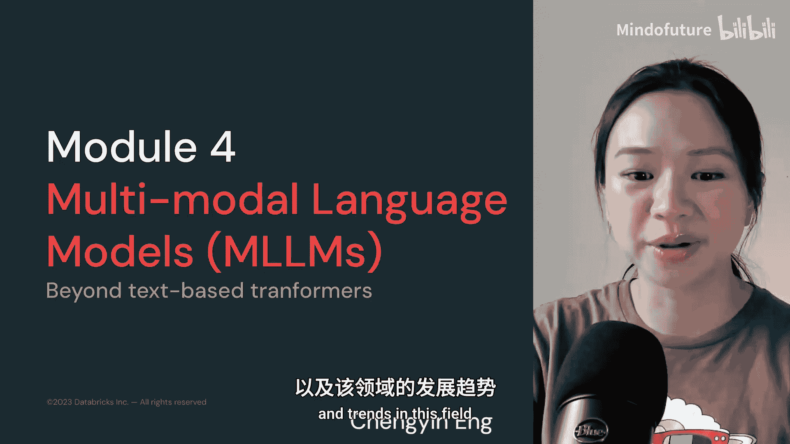
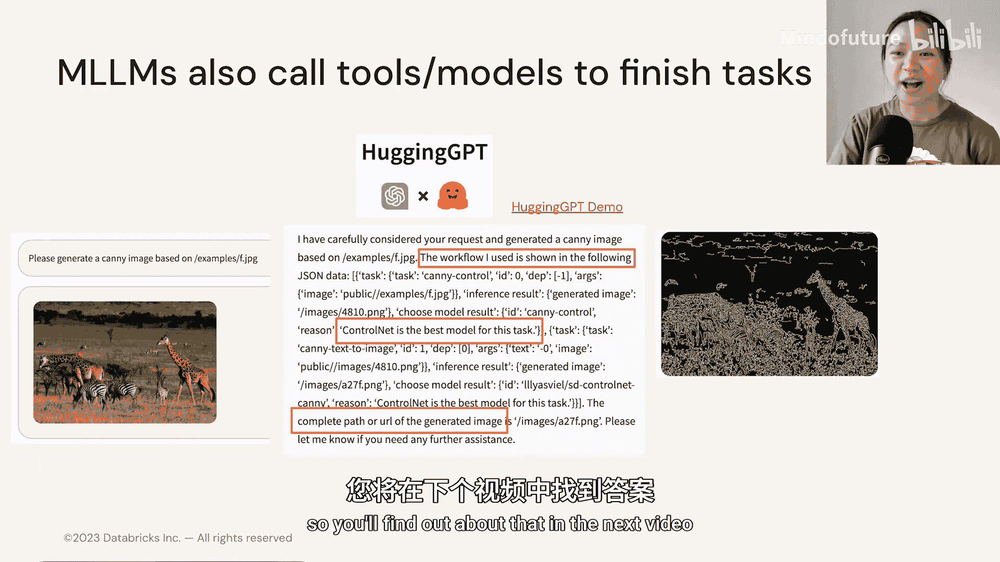

# 026：4.2 模块概览 🧠

在本模块中，我们将一起探索多模态语言模型的广阔领域。多模态模型能够处理文本、图像、音频等多种类型的信息，这为人工智能应用开启了无限可能。我们将了解其工作原理、核心模型以及未来的发展趋势。

---

## 从文本到多模态：Transformer的扩展

上一模块我们深入探讨了基于Transformer的纯文本语言模型。本节中，我们来看看如何将Transformer架构的强大能力扩展到文本以外的领域。

Transformer架构之所以通用和灵活，关键在于其注意力机制。它最初设计用于处理文本序列，但其核心思想——计算输入元素之间的相关性——同样适用于其他类型的数据。关键在于如何将非文本数据（如图像、音频）转化为模型能够理解的“语言”，即数值向量序列。

以下是实现多模态输入的核心步骤：

1.  **模态编码**：使用专门的编码器（如卷积神经网络处理图像，音频特征提取器处理声音）将不同模态的原始数据转换为特征向量序列。
2.  **序列化与投影**：将这些特征向量序列投影到与文本词向量相同的语义空间，形成统一的“令牌”序列。
3.  **联合处理**：将处理后的多模态令牌序列与文本令牌序列拼接，一同输入标准的Transformer模型进行处理。

通过这种方式，一个原本为文本设计的Transformer模型，就能“理解”并综合处理来自图像、音频和文本的联合信息。

---

## 多模态模型的应用与能力

多模态模型非常实用，它们更加用户友好和灵活，几乎能模拟人类感知信息的方式。以下是一些令人印象深刻的应用实例：

*   **视频理解**：可以构建视频问答应用，让模型描述视频内容并回答后续问题。
*   **图像生成与理解**：例如，DALL-E可以根据文本描述生成图像，而CLIP可以判断图像与文本描述的匹配程度。
*   **复杂任务处理**：可以使用MiniGPT-4来解释难以理解的网络梗图，甚至根据描述生成包含特定笑话的网站代码。

与大型语言模型类似，多模态语言模型也展现出思维链推理能力。

我们可以提供多模态信息作为上下文。例如，提供一系列视频帧，要求模型解释帧与帧之间发生了什么；或者提供饼干和苏打水的照片，询问它们有何共同属性。

更令人印象深刻的是，多模态语言模型能够同时处理多种模态的输入。我们可以同时传入一张图片和一段录音，并向语言模型提出相关问题。

此外，多模态语言模型还可以作为智能体，调用其他工具或模型来完成复杂任务。

---

## 本模块学习路线图

虽然许多多模态模型基于Transformer架构，但我们目前所知的Transformer主要处理文本。那么，它是如何适应多模态输入的呢？我们将在下一个视频中揭晓答案。

在本模块的后续内容中，我们将：
1.  纵览多模态语言模型的广阔前景。
2.  深入理解Transformer架构如何灵活地接受非文本输入。
3.  讨论当前多模态语言模型的局限性，以及可能替代Transformer和注意力机制的其他架构。
4.  最后，通过探讨多模态应用的广泛可能性来总结本模块。

---

## 总结

本节课中，我们一起学习了多模态语言模型的基本概念和巨大潜力。我们了解到，通过扩展Transformer架构，AI模型可以像人类一样综合处理文本、图像和音频信息，从而实现视频问答、图像生成、复杂推理等丰富应用。这标志着人工智能向更通用、更贴近人类感知世界的方式迈出了关键一步。在接下来的课程中，我们将深入其技术细节。