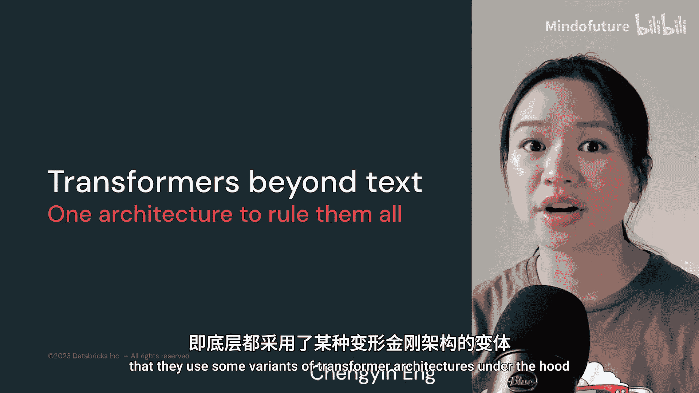
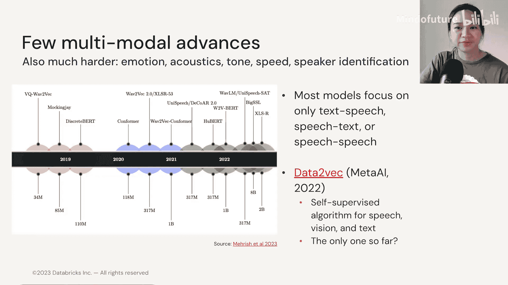

# 027：文本以外的 Transformer 🎯

在本节中，我们将探讨 Transformer 架构如何超越文本处理，应用于图像、音频等多种模态。我们将了解其核心原理、具体实现方式以及面临的挑战。

***

上一节我们见识了一系列令人印象深刻且多样化的多模态语言模型应用。它们都有一个共同点：在底层都使用了某种 Transformer 架构的变体。

***

## Transformer 的普适性

Transformer 架构具有惊人的通用性，它是一个通用的序列处理工具。事实证明，我们可以将许多事物视为序列，包括图像、音频文件、乐谱、视频帧，甚至一系列游戏动作或蛋白质结构。具体来说，**交叉注意力机制**可以帮助连接不同模态，无论是图像、音频、文本还是神经时间序列。实际上，这正是文本生成图像模型 Stable Diffusion 所使用的技术。你可以看到右侧的图片，我们可以要求 Stable Diffusion 模型根据文本生成图像，这正是利用交叉注意力在文本和图像之间建立桥梁。

***

## 计算机视觉中的 Transformer 🖼️

首先，我们来看看如何将 Transformer 用于计算机视觉。

自2021年以来，如何将 Transformer 用于计算机视觉已得到深入研究。在此之前，计算机视觉领域的事实标准架构是卷积神经网络。本幻灯片中列出的模型代表了计算机视觉领域的里程碑。我不会逐一介绍这里列出的每个模型，而是将重点放在 **Vision Transformer** 上。这是首个用于计算机视觉的 Transformer，其在计算效率和准确性方面比卷积神经网络高出近四倍。此后，一系列研究随之展开，将 Transformer 应用于计算机视觉。我们稍后也会在计算机视觉和 Transformer 的背景下回顾零样本和少样本学习。

但首先，我们需要理解如何将图像表示为数字。

***

### 图像的数值表示

当我们购买新手机或新相机时，我们可能关心的一个细节是相机分辨率，即照片中的像素数量，通常以百万像素为单位。我们可以将图像分割成许多微小的像素，每个像素都包含主要颜色构成的信息，即图像中蓝色、绿色和红色的含量。你可以看到中心图像中，每个像素都有一个十六进制代码和 RGB 级别，这通常是我们传递给神经网络的数据。像素值的范围可以从 0 到 256。

事实证明，彩色图像可以表示为张量。在文本处理中，我们通常以矩阵形式表示文本嵌入，这是一个二维张量。对于彩色图像，它们是三维张量。第三维是代表红、绿、蓝的通道数。灰度图像也可以是三维张量，但由于所有三个通道共享相同的值，我们可以将它们表示为二维张量。这就是为什么在大规模图像处理模型中我们经常使用灰度图像，因为它们所需的空间要少得多。

***

### 像素处理的初步想法及其局限

处理像素的最初直觉是简单地将它们变成一个序列。我们可以在自回归上下文或像 BERT 那样的掩码建模上下文中使用像素序列。但不是预测下一个词元，我们使用自注意力来预测下一个像素。

但这存在两个限制：
1.  我们失去了像素之间的垂直空间关系。这并不难理解，因为当我们从左到右将像素展平为单个序列时，我们不再知道这个灰色像素是否直接在橄榄绿色像素的上方。
2.  这种使用自注意力的方法会产生非常高的复杂度，为 O(n²)，因为我们需要计算每个像素相对于所有其他像素的复杂度。即使在像 256x256 这样的较低分辨率图像中，从左到右我们也会有超过 65k 次计算。但我们还需要从上到下复制这个过程。因此，对于我们的 256x256 图像，单个注意力层将需要进行 10⁹ 次计算。你可以想象，当图像分辨率高于 256x256 时，我们需要多少更多的计算资源。因此，这种方法不可行。

***

## Vision Transformer 的工作原理

于是，Vision Transformer 应运而生。让我们先来了解相关术语。

Vision Transformer 将输入图像表示为一**系列图像块**。在 NLP 中，我们将这些单独的块称为词或子词词元。对于 Vision Transformer，它将图像分割成 16x16 的块，但在这张图片中，我只将我的猫分割成 4x4 块。因此，从左到右，你可以想象有 16 个块，每个块内有多个像素。这就是为什么 ViT 论文的标题是“一张图片值 16x16 个词”。

以下是 Vision Transformer 的工作步骤：

1.  **构建图像块**：Vision Transformer 将一张大图像分割成一系列块，就像你在这里看到的一样。每个块的维度是：通道数（3）x 像素数 x 像素数。
2.  **线性投影**：构建图像块后，ViT 使用一个线性投影层将图像块映射到一个 D 维向量。这些 D 维向量输出称为**块嵌入**。就像相似的词应该出现在相似的嵌入空间中一样，相似的图像块也应该被映射到相似的块嵌入空间。
3.  **添加位置嵌入**：但如果你回想起本课程的第一个模块，我们了解到 Transformer 没有任何默认的排序机制。我们需要让模型能够以某种方式知道或推断出块的位置或顺序。因此，ViT 添加了**位置嵌入**。添加位置嵌入后，块嵌入就完整了。
4.  **添加分类标记**：现在，这里我们参考了 BERT 中学到的东西。在 BERT 中，引入 Transformer 的一个特性是使用了 `[CLS]` 标记，它代表分类标记。这个标记是一个特殊标记，因为它实际上不代表一个实际的词元，它始于空白状态，因此 Transformer 将被迫学习将整个序列的通用表示编码到该嵌入中。ViT 也使用相同的逻辑，添加了这个 `[CLS]` 标记，也称为**可学习嵌入**。因此，这个可学习嵌入的输出将用作分类器的输入，以便分类器以后能够学会做出准确的预测。
5.  **输入 Transformer 编码器**：如你所见，我们现在将整个序列作为输入传递给一个标准的 Transformer 编码器。
6.  **预训练与分类**：然后，我们使用来自 ImageNet 数据集的图像标签对模型进行预训练，这正是 ViT 所使用的。在最后，最后一个 Transformer 块的输出通过一个**分类头**，然后给我们一个图像类别预测。这就是 ViT 的工作原理。

***

### Vision Transformer 的性能与影响

我们发现，ViT 仅在更大的数据集上才优于 ResNets（另一种流行的基于卷积神经网络的计算机视觉网络）。因此你可以看到，仅对于 ImageNet，当图像数据集较小时，ViT 表现更差，但在更大的数据上，ViT 优于 ResNet。不过需要注意的是，ViT 的训练比 ResNet 在计算上高效得多，事实上，它的训练速度比 ResNet 快四倍。

在 ViT 研究之后，出现了许多其他利用注意力机制进行计算机视觉的后续研究。其中之一叫做 Swin Transformer，下一个叫做 MLP-Mixer。需要说明的是，MLP-Mixer 实际上既不是 Transformer 也不是 CNN，但它基于这篇论文的发现启发了许多同期论文和后续研究。所以如果你对 MLP-Mixer 在做什么感兴趣，一定要看看他们的论文。

我还想提一下，Vision Transformer 是一种进化，不一定是革命。根据密歇根大学这位计算机科学教授 Justin Johnson 的说法，我们基本上可以使用卷积神经网络解决相同的问题，但使用注意力的主要好处可能归结为速度，因为矩阵乘法比计算卷积对硬件更友好。因此，具有相同浮点运算次数的 ViT 比卷积网络训练和运行速度更快。

***

## 音频处理中的 Transformer 🎵

现在，让我们来看看音频。音频可以表示为频率和时间的函数。

同样的想法也适用于音频，我们可以为每个固定长度的音频帧创建嵌入向量。因此你可以看到，当我从左到右移动时，这告诉我音频的长度，每一列将代表每个音频帧的长度，这可以是每三秒、每六秒、每一分钟等等。既然现在我们可以简单地将音频表示为序列，那么在嵌入向量中，我们也可以利用 Transformer 架构。

但你会发现，音频通常比文本长度长得多。因此，你在本幻灯片上看到的内容，90% 甚至更高比例应该看起来很熟悉，因为它基本上是原始的编码器-解码器架构。但它有一个额外的部分，即在输入层之后添加了卷积神经网络层，以减少音频输入的维度。

这是一个 Speech Transformer。这篇论文的作者还尝试使用可选模块，如添加 ResNet 或长短期记忆网络，在将输入传递给 Transformer 编码器块之前进一步处理输入。

***

### 音频多模态模型的挑战

与计算机视觉相比，音频领域的多模态进展要少得多。本幻灯片上显示的模型都是 Transformer，但在 2019 年之前的很长一段时间里，音频处理模型并未使用 Transformer 架构。事实上，你在这里看到的大多数模型只专注于文本到语音、语音到文本或语音到语音。这或许并不奇怪，因为仅处理音频数据并提取所有可用信息已经足够困难了，比如情感、声学、语调、语速、如何识别谁在说话等等。

唯一似乎结合了多模态的模型是 Meta 去年刚刚发布的 Data2Vec 模型。生产此类模型的另一个主要挑战是，与仅获取文本数据或图像数据相比，获取高质量的多模态数据要困难得多。

***

## 总结

本节课中，我们一起学习了 Transformer 架构如何突破文本的界限，应用于图像和音频等多种模态。我们深入探讨了 Vision Transformer 如何将图像分割成块并进行处理，以及音频如何被表示为序列并输入 Transformer。同时，我们也认识到，尽管潜力巨大，但为多模态模型获取高质量的训练数据仍然是一个主要挑战。这正是我们下一节将要讨论的内容：多模态模型的训练数据到底是什么样子的。