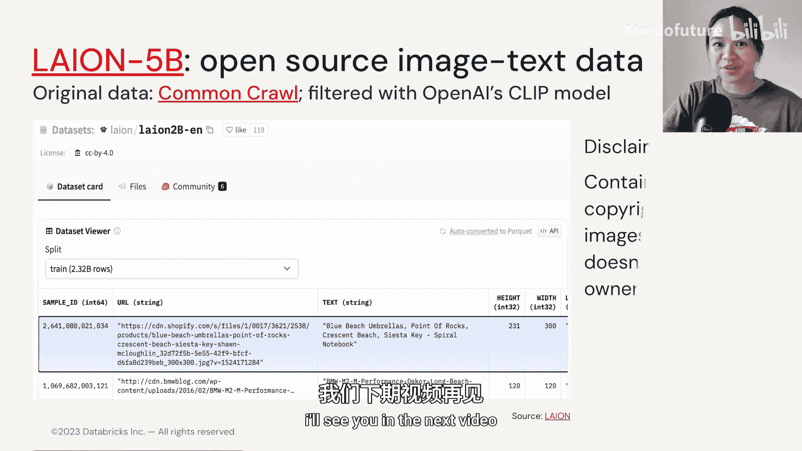

# 028：多模态LM的训练数据 📊

在本节中，我们将探讨多模态大型语言模型（MLLM）训练数据的关键方面。我们将了解这类数据的构成、收集的挑战性，以及一个重要的开源数据集示例。

与文本-图像数据相比，文本-音频或文本-视频数据的收集要困难得多。事实上，许多研究人员必须从头开始手动整理这些数据。

以下是几个数据收集和标注方式的例子。

## 数据标注示例

在第二个图像示例中，我们看到标注人员必须逐帧提供详细的视频描述。描述遵循“首先，接下来，然后，最后，总体”的结构。

另一组研究人员使用了名为 **FAMOS**（缩写为farmers）的框架来描述他们在图片中看到的场景。他们同样使用这个框架，将场景描述分为结构化描述和密集描述。

数据也可以组织成 **JSON** 格式或表格格式。左侧的JSON文件展示了基于特定图像ID，人类与GPT模型之间的对话交换。右侧，我们看到类似的数据，但以表格形式组织。

## 高质量数据的重要性

你可能会问，能否让模型为我生成数据示例？答案当然是肯定的。但需要注意的是，你需要先做一些基础工作，提供高质量的例子。

在左侧图像中，研究人员首先通过编写预标题（pre-caption）来全面描述特定图像或场景，其次标注图像中的对象。在右侧图像中，研究人员还为单张图像提供了多个可以正确应用的标题示例。你还可以看到标注人员编写的另一段对话交换。

由此可见，在训练出优秀模型之前，标注人员必须投入如此细致的努力。

## 重要的开源数据集

目前最好的开源图像-文本数据集可能是 **Laion-5B**。许多图像-文本旗舰模型都是在专有数据集上训练的，而Laion-5B是第一个为研究目的发布的大规模开源数据集。它包含 **58.5亿** 个经过CLIP过滤的图像-文本对，其中 **23亿** 对是英文的，**22亿** 对是其他语言的。

然而，有一个非常重要的免责声明：该数据集中的图像大多受版权保护，Laion不声称对这些图像拥有任何所有权。

## 总结与展望

希望现在你能明白，高质量的数据整理，尤其是对于多模态用例，可能非常耗时且并非易事，而这正是产出高质量模型的关键。

你脑海中可能浮现的下一个问题是：如果我们没有那么多数据，或者没有那么多资源来收集优质数据，但仍然想利用这些多模态模型，该怎么办？这就是**小样本学习**的用武之地。我们将在下一个视频中探讨。