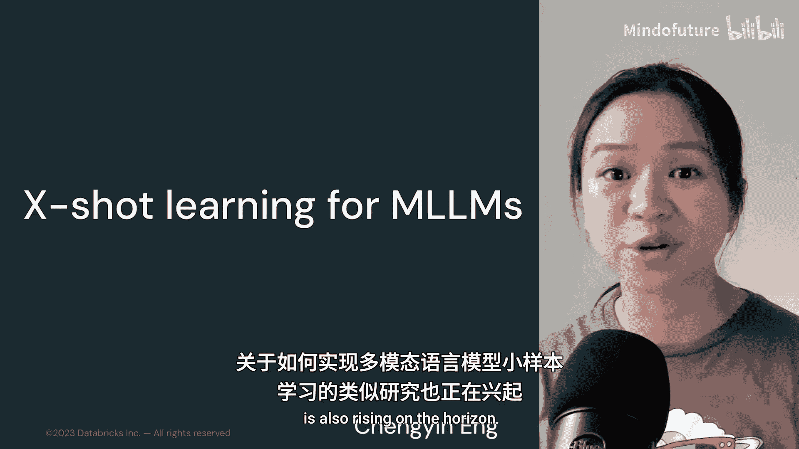
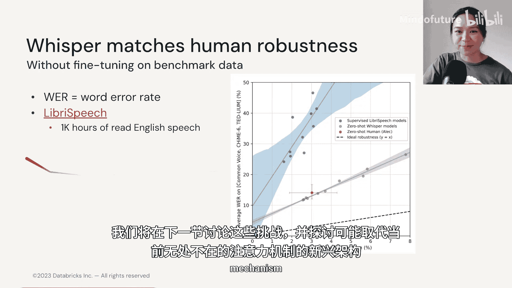

# 029：小样本学习 🎯

在本节中，我们将探讨多模态大语言模型中的小样本学习技术。正如在纯语言任务中，小样本学习变得越来越流行和重要，关于如何为多模态语言模型执行小样本学习的研究也正在兴起。

我们将首先关注计算机视觉领域。我们知道，收集多模态数据非常困难，在这种情况下，仅使用少量标注样本会非常有帮助。因此，本节我们将先看一个零样本学习的例子——CLIP模型，然后介绍一个最令人兴奋的多模态小样本学习模型——Flamingo，它于2022年底发布。

## CLIP：对比语言-图像预训练 🖼️📝

CLIP代表“对比语言-图像配对”。其核心思想是从海量的自然语言数据语料库中学习视觉表示。

CLIP使用一个简单的对比损失来训练一个图像编码器和一个文本编码器。其目标是：给定一组图像和文本，预测哪些文本-图像对实际出现在训练数据中。

因此，对比预训练涉及最大化这个N×N矩阵对角线上编码的余弦相似度，因为它们才是真实的图像-文本对。这是一个相当简单的预训练任务，使得CLIP在测试时能在零样本设置下表现良好。

在第二张图中，可以看到CLIP模型通过最大化单词“狗”与视觉信息之间的相似度，正确预测了狗的标题。

我们发现，CLIP在各种设置下都能表现得更好。在这张图中，我们有ImageNet数据集，还有其他可能更真实的、描绘不同场景中香蕉的图像。无论香蕉在图像中显得模糊不清，还是只是一张草图，或者存在故意对抗性的干扰使模型更难识别那是香蕉，CLIP在这些非ImageNet数据集上都表现良好。

但CLIP的一个主要限制是：虽然我们可以预测标题的概率，以确定哪个文本最可能与图像相关联，但它**无法生成文本**。

## Flamingo：多模态小样本生成模型 🦩

现在，让我们转向另一个具有小样本能力的多模态模型——由DeepMind发布的Flamingo。Flamingo模型是一个视觉语言模型家族，能够接收交织的视觉数据和文本作为输入，并生成自由形式的文本作为输出。

其第二个亮点是它使用了一个**感知器重采样器**。这个感知器重采样器接收来自视觉编码器的空间、时间特征，并输出一组固定大小的视觉标记。

然后，这些视觉标记将通过**新初始化的交叉注意力层**来调节冻结的语言模型，这些交叉注意力层被交织在预训练的语言模型层之间。因此，这些层将为语言模型提供一种方法，将视觉信息整合到下一个标记的预测任务中。

让我们更详细地了解一下。请记住，这些作者的首要目标是**利用预训练的语言模型**，这样他们就不必花费更多时间或计算资源从头开始训练一个大型语言模型。具体来说，他们使用了一个名为Chinchilla的模型，它也是由DeepMind引入的。

这使得Flamingo模型具备了强大的生成语言能力，并能访问大量的预训练语言知识。视觉模型的作用是从给定的图像和视频中提取丰富的语义空间特征。

Flamingo的第二个目标是**和谐地桥接视觉和语言模型**。为此，作者冻结了这些模型的权重，并通过两个可学习的架构将它们连接起来。

Flamingo模型的一个重要方面是，它能够对文本`y`的似然进行建模，这些文本`y`与一系列先前的图像或视频以及先前的文本标记交织在一起。

因此，这种架构可以实现广泛的任务，包括开放式任务（如视觉问答或图像描述）和封闭式任务（如分类）。

让我们再仔细看看**感知器重采样器**。感知器重采样器模块将从视觉编码器输出的可变大小的时空视觉特征映射为固定数量的输出标记。

这里看到的键和值只是时空视觉特征的拼接，而查询则包含一组学习到的潜在向量。

在重采样器的另一端是固定数量的输出标记，在这个例子中我们看到有五个。

## 性能与数据的重要性 📊

当仅给出四个任务示例时，Flamingo击败了所有先前的小样本学习方法。事实上，它甚至超越了16个最先进微调模型中的6个。

促成这一成功的一个重要因素是，Flamingo的研究人员策划了三个高质量的数据集。这再次印证了前面模块传达的信息：**数据确实对模型输出质量有很大影响**。

以下是Flamingo输出的一些精选示例：
*   **图像理解与推理**：当给Flamingo模型一个输入提示时，它可以推断出物体是什么，并围绕这些物体进行一些推理。
*   **遵循格式的响应**：它可以接收图像和文本，然后我们可以提出查询，模型会遵循之前看到的响应格式，生成类似的响应。
*   **视频问答**：这里看到的第三个例子是一系列视频帧，我们可以向Flamingo询问关于这些视频帧的问题。

## 音频领域的小样本学习 🎵

既然我们已经讨论了计算机视觉领域的小样本学习多模态模型，那么音频领域呢？

同样，音频领域最常被引用的零样本例子是OpenAI的**Whisper模型**。不出所料，它使用了编码器-解码器Transformer架构，同时也使用卷积神经网络来降低输入音频的维度。

在Whisper的例子中，输入音频被分割成30秒的帧。研究人员将Whisper与其他在LibriSpeech（包含1000小时的英语朗读语音）上微调过的模型进行比较，发现Whisper的平均词错误率要低得多，甚至在零样本设置下可以媲美人类的鲁棒性。

## 总结与展望 🔮

在本节中，我们一起学习了多模态大语言模型中的小样本学习技术。我们介绍了**CLIP模型**，它通过对比学习实现了强大的零样本图像分类能力，但无法生成文本。接着，我们深入探讨了**Flamingo模型**，它通过创新的感知器重采样器和交叉注意力机制，桥接了视觉与语言模型，实现了卓越的小样本多模态理解和生成能力。最后，我们简要提及了音频领域的**Whisper模型**，展示了零样本学习在语音识别上的成功应用。

尽管我们在多模态语言模型中看到了所有这些显著的进步，但我们当然仍有许多尚未解决的挑战。我们将在下一节讨论这些挑战，并看看可能取代当前无处不在的注意力机制的新兴架构。