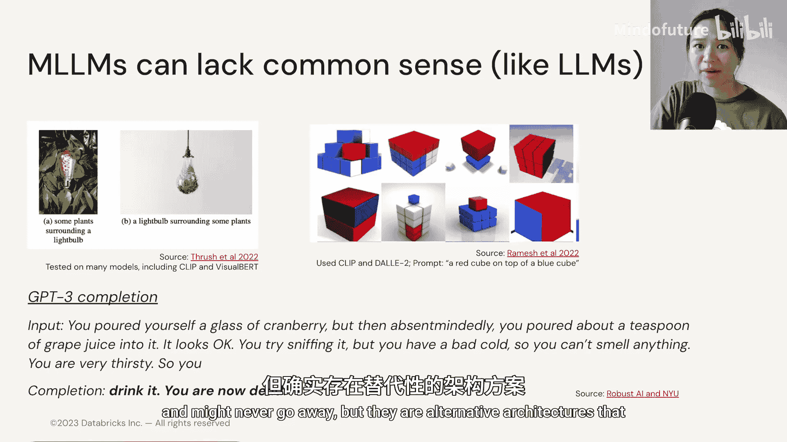
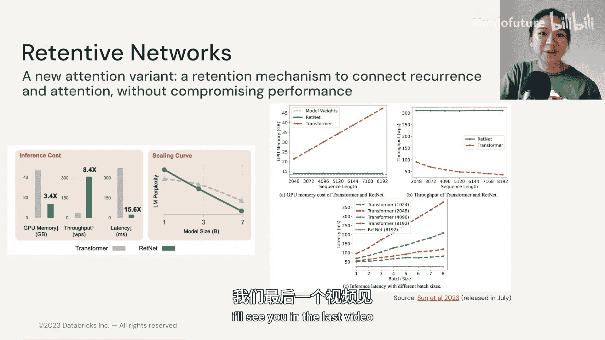

# 030：4.6 挑战与替代架构 🧩

在本节中，我们将探讨多模态语言模型所面临的挑战，并了解一些可能超越当前主流架构的替代方案。

## 概述

上一节我们探讨了多模态语言模型的潜力。然而，我们尚未完全解决所有问题。多模态语言模型并非对传统语言模型的局限性免疫，事实上，它们继承了许多相同的风险。

## 多模态语言模型的挑战

以下是多模态语言模型面临的主要挑战。

### 幻觉问题

模型可能完全虚构图像中不存在的内容。例如，当被问及手机屏幕上显示什么信息时，Flamingo模型输出“来自朋友的短信”，而图像中并无此内容。

### 继承自LLM的局限性

其他语言模型的局限性，如提示敏感性、上下文长度限制和推理计算成本，在多模态语言模型的少样本学习案例中同样存在。

### 偏见与毒性

模型可能继承并放大数据中的偏见。例如，一个亚洲女性要求模型让她的照片“更专业”，结果模型却让她的肤色“更白”。值得注意的是，该公司使用的模型是在目前最好的开源文本-图像数据集Laion上对Stable Diffusion模型进行微调的。因此，这个问题很可能并非该公司独有。

### 版权问题

与语言模型类似，多模态模型也面临版权问题。模型训练所使用的数据（如Reddit数据集）的版权归属和付费问题已被提出讨论。

### 缺乏常识

当要求模型根据文本生成图像时，输出结果可能完全不合逻辑。语言模型也存在类似问题，例如，当要求GPT-3补全关于“蔓越莓汁”和“重感冒”的提示时，它可能生成“你应该喝它，但你会死”这样不合常理的句子。

## 潜在的改进方向与替代架构

那么，我们接下来可以构建什么来改进现有模型呢？许多挑战可能很难解决甚至永远不会消失，但除了注意力机制，我们还可以考虑其他替代架构。

注意力机制，特别是自注意力，一直是NLP乃至计算机视觉领域的焦点。但看起来，确实存在其他现有或新兴的有前景的竞争架构。此处不会深入所有架构的细节，目标是让大家注意到它们，因为未来谁会成为主流尚未可知。

### 可能成为应用核心的部分：RLHF

无论模型变得多好，构建可靠的生产级模型的最佳方式或许始终是让人参与其中。这就是**RLHF**。

**RLHF**代表**基于人类反馈的强化学习**。
其流程通常如下：
1.  人类反馈用于训练一个奖励模型。
2.  这个奖励模型通常是另一个语言模型，用于输出人类偏好的标签、排名或分数。
3.  同时，使用KL散度损失来确保微调后的模型不会与原始预训练模型偏离太远。
4.  奖励模型编码人类偏好，并为模型输出分配质量标签。
5.  最后，**近端策略优化**算法会根据奖励信号更新预训练的大型语言模型。

这是一个非常庞大的主题，鼓励大家自行深入阅读。

### 可能的下一代架构

现在，让我们谈谈可能的下一代架构。

1.  **Hyena Hierarchy**
    它使用卷积神经网络而非Transformer或注意力机制。研究人员发现，它在语言任务上是一个相当不错的少样本模型，并且其性能也能与视觉Transformer匹配。或许CNN正在卷土重来。

2.  **Retentive Networks**
    这种架构近期在NLP通讯中获得了相当多的关注。作者提出了一种注意力的新变体——**保留机制**。
    这种保留机制可以连接循环和注意力。其特别之处在于，它能够在**不牺牲模型性能的前提下实现更高的计算效率**。这通常是一个难以破解的挑战：如何在不使模型过慢的情况下保持良好的性能，反之亦然。

## 总结

本节课中，我们一起学习了多模态语言模型面临的一系列挑战，包括幻觉、偏见、版权和常识缺失等问题。同时，我们也展望了未来的改进方向，重点介绍了**基于人类反馈的强化学习**这一重要方法，并了解了**Hyena Hierarchy**和**Retentive Networks**这两种有潜力的替代架构。最后，我们将在下一个视频中探讨多模态语言模型领域涌现的各种新应用。