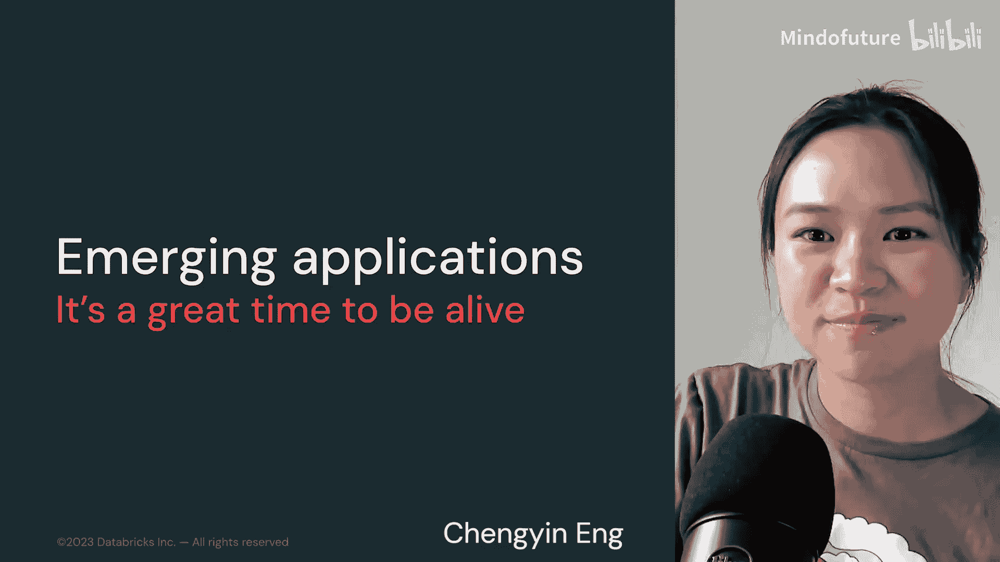
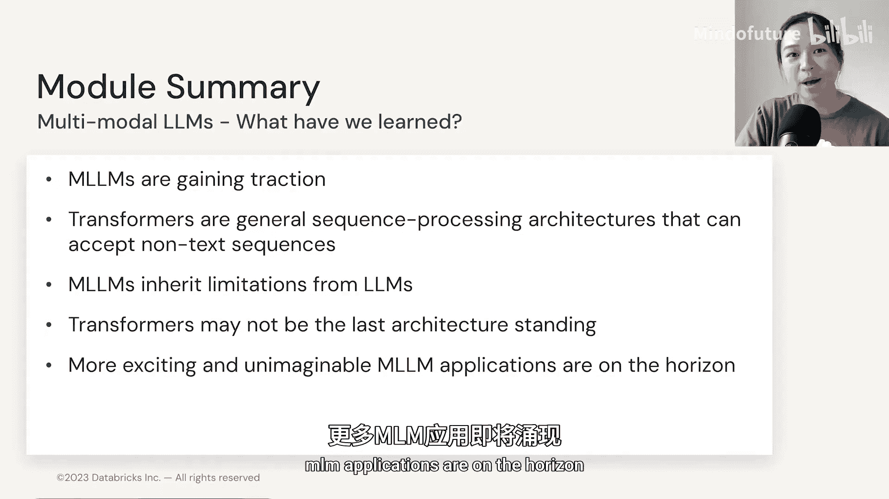
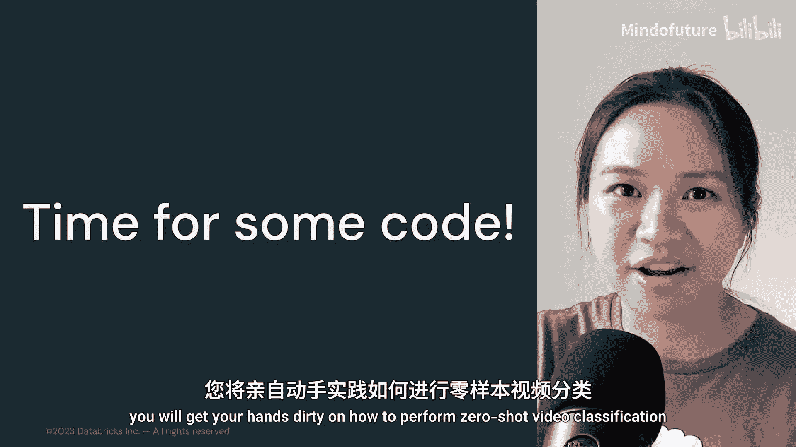

# 031：多模态语言模型 - 4.7 新兴应用 🚀

在本节中，我们将探讨多模态语言模型领域令人兴奋的新兴应用。这些应用展示了AI技术如何突破传统文本处理的界限，进入图像、视频、音频乃至机器人领域。

---

目睹此前难以想象的AI应用不断涌现，确实是一个非常激动人心的时刻。整理这一部分内容也充满了乐趣，因为这个领域的发展速度令人惊叹。希望接下来展示的这些前沿应用实例能给你带来启发，并激励你持续学习。或许，下一个具有新闻价值的语言模型应用就将由你创造。

## 新兴应用概览 🌟

以下是当前多模态语言模型领域一些引人注目的新兴应用方向。

*   **文本生成3D对象**：例如 Dream Diffusion，可以根据文本描述生成3D物体模型。
*   **文本生成视频**：Meta 发布的 Make-A-Video 应用，能够从文本生成视频内容。
*   **语言模型与机器人结合**：例如 Google 的 PaLM-E，它将大型语言模型（PaLM）与机器人应用相结合。
*   **代码生成**：使用大型语言模型自动生成代码。例如，用AI代码解决“用N片制作披萨所需的最少分钟数”这类问题。
*   **多语言模型进展**：在多语言模型，尤其是覆盖低资源语言（如Bactrian-X）的模型上，终于看到了一些进展。
*   **音频应用**：例如 Textless NLP，它可以直接从原始音频生成语音，无需任何文本转录。这对于解决低资源语言训练数据不足的挑战具有重要意义。
*   **Transformer在生物研究中的应用**：Transformer架构开始在生物学研究中掀起波澜。因为蛋白质序列可以被视为一种序列，很容易输入到Transformer架构中进行处理。
*   **未来家庭机器人**：或许十年后，每个家庭都可能拥有一个能为我们做一切事情、陪伴我们的机器人，包括玩游戏、聊天、搭积木等。

## 本模块回顾与展望 🔄

上一节我们介绍了多模态模型的具体技术，本节中我们看到了它们广阔的应用前景。现在，让我们对本模块内容做一个快速回顾。

我们看到，多模态语言模型在研究领域正真正获得发展动力。Transformer是一种通用的序列处理架构，能够接受非文本序列（如音频和图像）作为输入。然而，它们也继承了我们所使用的预训练大型语言模型的一些局限性。

尽管Transformer架构已经存在并似乎无处不在，但它可能并非最终的架构。越来越多激动人心的多模态语言模型应用即将到来。

---

## 实践环节预告 💻

在接下来的演示笔记本中，我们将学习如何构建自己的图像描述生成模型。而在实验笔记本中，你将亲手实践如何进行零样本视频分类。

我们笔记本中见。