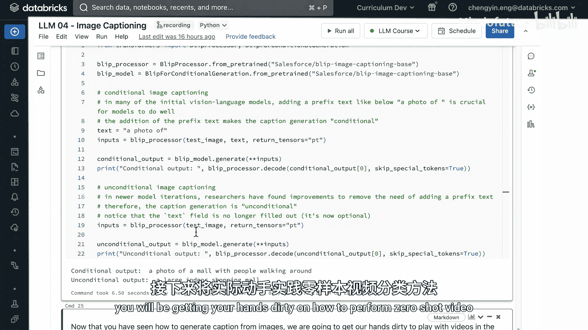

# 032：从零构建图像描述模型 🖼️📝


在本教程中，我们将学习如何构建一个基础的图像描述模型。我们将选取一个基于Transformer的视觉模型和一个基于Transformer的文本模型，并将它们连接起来。之后，我们会将这个“拼接”模型与一个预训练好的图像描述模型进行性能对比。

## 概述

我们将使用SBU Captions数据集，它包含约100万对图像URL和英文描述。我们的目标是构建一个模型，能够理解图像内容并生成对应的文字描述。整个过程包括数据准备、模型构建、训练和评估。

## 数据准备与处理

首先，我们需要定义数据处理函数。这个函数需要能够同时处理图像和文本数据。

以下是数据处理的关键步骤：

1.  **获取图像**：对于数据集中的每个图像URL，我们将发送请求获取图像像素数据。
2.  **处理图像**：使用视觉模型的**特征提取器**将图像转换为模型可理解的格式。
3.  **处理文本**：使用文本模型的**分词器**将描述文本处理成单词或子词标记。

我们将使用现成的分词器和特征提取器。具体来说，文本部分使用GPT-2的分词器，图像部分使用Vision Transformer（ViT）的特征提取器。

```python
# 示例：初始化分词器和特征提取器
from transformers import GPT2Tokenizer, ViTFeatureExtractor

tokenizer = GPT2Tokenizer.from_pretrained("gpt2")
feature_extractor = ViTFeatureExtractor.from_pretrained("google/vit-base-patch16-224")
```

为了加速后续的微调过程，我们只使用数据集中2000个样本。

## 构建视觉-编码器-解码器模型

现在，我们将视觉编码器（ViT）和文本解码器（GPT-2）连接起来，形成一个视觉编码器-解码器架构。

```python
from transformers import VisionEncoderDecoderModel

model = VisionEncoderDecoderModel.from_encoder_decoder_pretrained(
    "google/vit-base-patch16-224", # 编码器：ViT
    "gpt2" # 解码器：GPT-2
)
```

**注意**：在加载GPT-2解码器时，你可能会看到“某些权重未初始化”的警告。这是因为预训练权重并不包含适配下游任务（如图像描述）的所有必要参数。因此，Hugging Face建议我们在下游任务上进一步微调整个模型，以获得最佳性能。

## 模型配置与训练

在开始训练前，我们需要定义一些模型配置，例如如何处理填充标记、序列结束标记、词汇表大小、生成文本时的束搜索数量以及最大输出长度。

接下来，我们定义训练参数，如批次大小和训练轮数。我们将使用Hugging Face的`TrainingArguments`和`Trainer`类来简化训练步骤。

```python
from transformers import TrainingArguments, Trainer

training_args = TrainingArguments(
    output_dir="./image-caption-model",
    num_train_epochs=3,
    per_device_train_batch_size=8,
    save_steps=10_000,
    save_total_limit=2,
)

trainer = Trainer(
    model=model,
    args=training_args,
    train_dataset=train_dataset,
    data_collator=data_collator,
)
trainer.train()
```

训练过程大约需要一分半钟。你可以通过MLflow链接监控训练日志。

## 模型评估与问题分析

训练完成后，我们使用测试集中的一张图像来评估模型。图像显示的是一个有商贩和顾客的户外集市。

我们让模型为这张图生成描述：

```
生成描述：“从悬崖上俯瞰海滩的景色。”
```

这个描述与图像内容完全不符。这主要归因于两个原因：

1.  **解码器权重问题**：正如之前警告所示，GPT-2解码器的权重并未针对图像描述任务进行充分初始化或微调。最佳实践是先在文本描述数据上单独微调解码器，再将其接入编码器-解码器架构。
2.  **训练不足**：我们只使用了少量数据进行了短期训练。增加训练轮数、提供更多训练样本以及调整模型超参数，都可能改善性能。

这个实验表明，简单地拼接两个强大的预训练模型并快速微调，可能无法直接达到理想效果。

## 使用预训练图像描述模型

为了获得更好的效果，我们可以直接使用专门为图像描述任务预训练的模型。接下来，我们使用一个名为BLIP的先进模型。

BLIP模型的全称是“Bootstrapping Language-Image Pre-training”，其突出特点是不仅有一个生成描述的生成器，还有一个过滤器来筛除不相关的描述。

我们使用BLIP模型进行两种描述生成：

*   **条件图像描述**：在输入图像时，同时提供一个前缀文本（如“a photo of”）来引导模型。
*   **无条件图像描述**：直接输入图像，不提供任何文本前缀。

```python
from transformers import BlipProcessor, BlipForConditionalGeneration

processor = BlipProcessor.from_pretrained("Salesforce/blip-image-captioning-base")
model = BlipForConditionalGeneration.from_pretrained("Salesforce/blip-image-captioning-base")

# 条件描述
text = "a photo of"
inputs = processor(images=image, text=text, return_tensors="pt")
out = model.generate(**inputs)
caption = processor.decode(out[0], skip_special_tokens=True)
print(f"条件描述: {caption}")

# 无条件描述
inputs = processor(images=image, return_tensors="pt")
out = model.generate(**inputs)
caption = processor.decode(out[0], skip_special_tokens=True)
print(f"无条件描述: {caption}")
```

对于同一张集市图片，BLIP模型生成的结果如下：

*   **条件描述输出**：“a photo of a mall with people walking around.”
*   **无条件描述输出**：“a large indoor shopping mall.”

这两个描述都准确地捕捉了图像的核心内容（尽管对“室内/室外”的判断略有不同）。这也说明了评估图像描述模型的挑战性：对于同一张图像，可能存在多个同样正确的描述。

## 总结

本节课中我们一起学习了图像描述模型的基础构建流程。

1.  **我们首先**了解了如何将视觉Transformer编码器和文本Transformer解码器拼接成一个多模态模型。
2.  **接着**，我们实现了数据预处理、模型构建和训练流程，并观察到一个快速拼接微调的模型可能表现不佳。
3.  **最后**，我们使用了专门的预训练模型BLIP，它展示了显著更好的性能，并介绍了条件与无条件图像描述两种生成方式。



核心结论是：对于复杂的多模态任务（如图像描述），使用针对该任务设计和预训练的模型（如BLIP），通常比简单拼接通用模型并快速微调要有效得多。当然，如果我们对自建模型进行更充分、更精细的微调，也有可能提升其性能。在接下来的实验中，你将有机会在零样本视频分类任务上亲自实践。