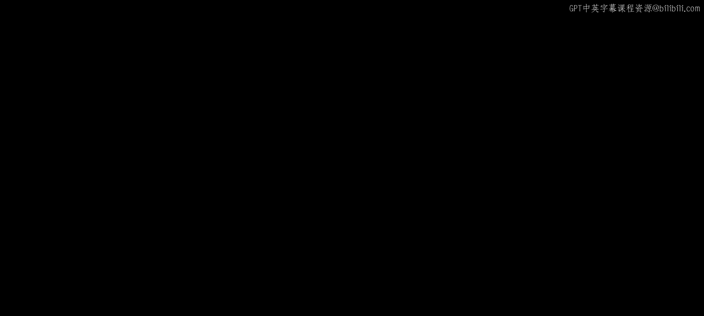
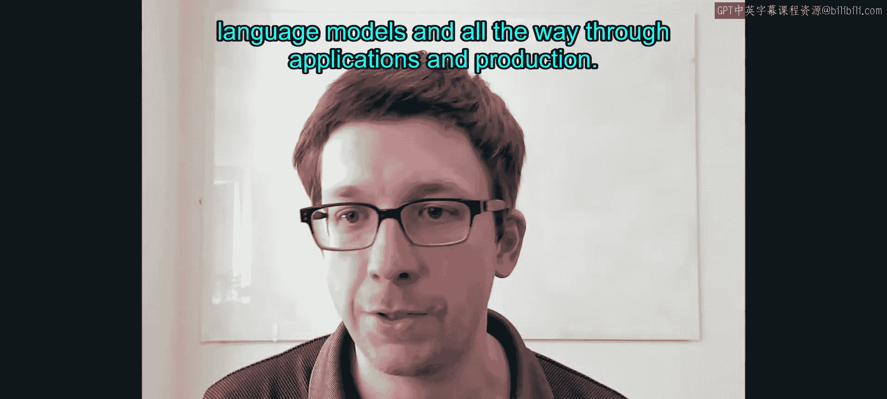
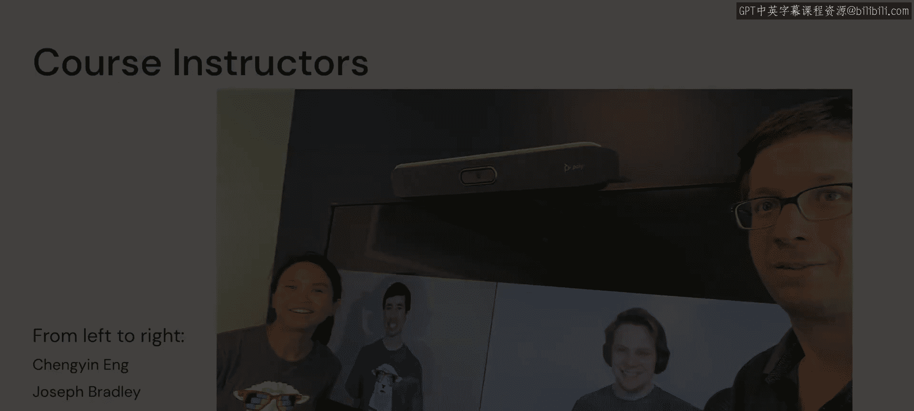
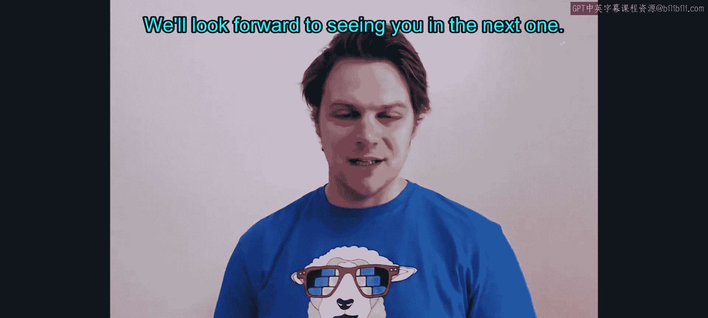
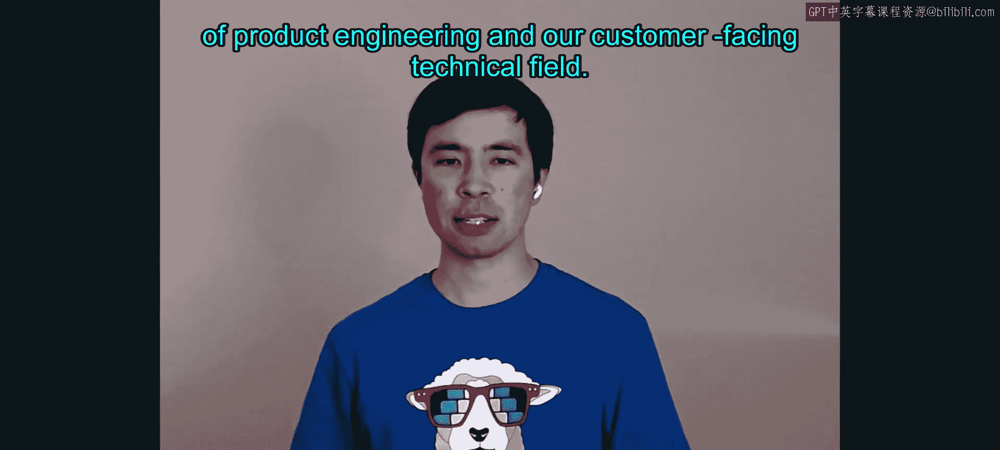
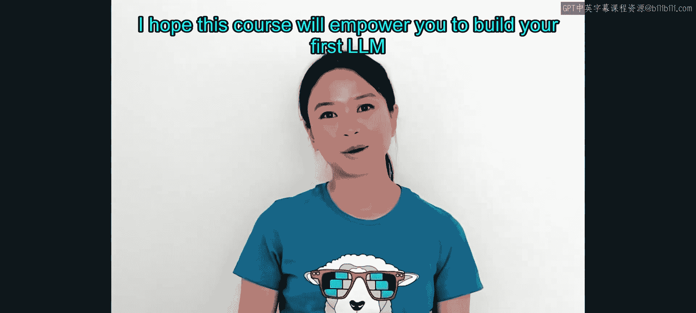

# 1：欢迎与课程介绍

在本节课中，我们将学习这门关于大语言模型（LLM）的课程概述，并认识四位主讲老师。课程将涵盖从基础概念到实际应用与生产的完整知识体系。

欢迎来到我们的大语言模型课程。我是Matei Zaharia。

我是Databricks的联合创始人兼首席技术官，同时也是斯坦福大学的计算机科学副教授。我长期致力于大语言模型、检索系统及其他工具的研究。我们非常高兴能为大家带来这门课程，内容涵盖大语言模型的使用，直至其应用与生产部署的全过程。本课程还有另外三位优秀的讲师与我一同授课。

大家好，欢迎来到这门精彩的课程。我是Sam Raymond，是你们的联合讲师之一，也是Databricks的一名高级数据科学家。在加入Databricks之前，我从事了约十年的AI研究工作，始于我在麻省理工学院的博士阶段，专注于物理信息机器学习等领域。我最近的研究关注如何利用农业数据和AI预测碳封存。希望大家喜欢这门课程。我们期待在下一节课中与大家相见。

我是Joseph Bradley，Databricks的首席产品专家。我在卡内基梅隆大学攻读博士学位期间进入机器学习领域，随后在加州大学伯克利分校进行了一些研究。2014年，我作为第二名机器学习工程师加入了Databricks。最初，我作为提交者和项目管理委员会成员，致力于ML和Apache Spark的工作。接下来的几年，我帮助构建了我们的ML产品和平台。最近几年，我一直在产品、工程以及面向客户的技术领域交汇处工作。

大家好，我是Chen Eng，Databricks的一名高级数据科学家。我在机器学习领域已有超过六年的经验。我在马萨诸塞大学阿默斯特分校读研究生时开始了自然语言处理（NLP）的旅程。我做过的最难的计算机作业之一是从零开始实现一个基础的Transformer模型。直到今天，我仍然记得那些熬夜的日子，以及我如何因为ELMo和BERT而梦到芝麻街。

自那以后，我在Databricks开发并教授了NLP领域的课程。我也帮助客户实施和设计NLP解决方案的架构。我希望这门课程能赋予你力量，去构建你的第一个LLM应用，并走得更远。

本节课中，我们一起认识了本课程的四位主讲老师，并了解了课程的核心目标：系统性地学习大语言模型，掌握从理论到应用，再到生产部署的完整技能栈。在接下来的章节中，我们将深入探索大语言模型的各个方面。