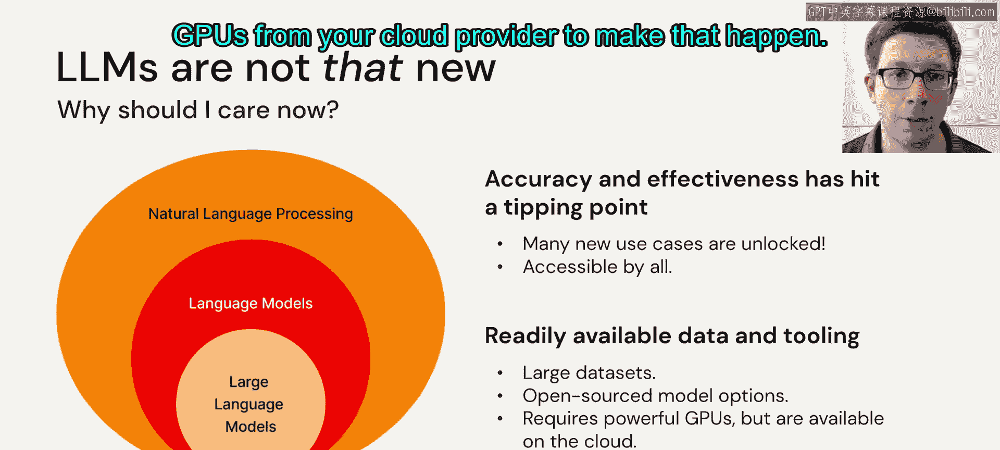

# 2：为什么需要大语言模型？🤔

在本节课中，我们将探讨大语言模型（LLMs）为何重要。我们将分析围绕LLMs的常见问题，解释其核心概念，并讨论在实际应用中需要考虑的关键因素。

---

我们经常听到许多关于大语言模型的问题。例如，围绕它们的炒作是否合理？这是行业的“iPhone时刻”，还是一个最终效果不佳的技术炒作？对于商业和软件开发的不同领域，LLMs是威胁还是机遇？

上一节我们提出了关于LLMs价值的核心问题，本节中我们来看看如何利用它们。

如何利用LLMs在您所在的行业中获得强大的竞争优势？最后，如何快速地将LLMs应用到您自己的数据中？我们将快速讨论所有这些内容，从第一个问题开始。

我们相信，许多人认为LLMs远不止是炒作。它们正在彻底改变每一个涉及某种形式人机交互、语言数据或界面，或广义上处理语言的行业。

以下是关于LLMs影响力的一些近期案例。Chegg是一家公司，其股价大幅下跌，因为它发现用户正在使用ChatGPT来回答问题，而不是使用其服务。因此，LLMs已经产生了影响，该公司必须思考如何在这个LLM时代调整其业务。

许多公司正在利用LLMs构建全新的产品。例如，You.com是一家初创公司，它从事搜索业务，但真正专注于一个可以为您查看个性化结果、分析页面内容并提供高质量、复杂结果并引用来源的搜索助手。这只有通过LLMs才可能实现。

即使是现有的机器学习工具，如GitHub Copilot，也随着最新一代的LLMs变得更加强大。GitHub Copilot本质上是一个帮助您自动补全代码的系统，但现在它还可以通过查看错误来修复代码、生成测试等等。所有这些新功能都得益于更强大的语言模型。

同时，LLMs作为一种基础技术并不算新。它们已经存在多年，即使是以深度学习形式，例如BERT这样的模型早已出现。那么，为什么您现在应该关注它们？

真正的原因在于，随着经验的积累，这些模型的质量已经显著提高。起初，人们会训练语言模型，我们稍后会详细讨论。您可以在一堆文本上训练一个模型，然后必须对其进行大量定制才能使其执行特定用例，例如分析产品评论并判断其是正面还是负面，或者确定评论涉及产品的哪个方面。

因此，即使您拥有这项基础技术，也必须进行大量手工编码、数据收集和机器学习工作，才能将其转化为有用的应用程序。随着我们在构建和调整LLMs方面变得更好，我们已经能够制造出只需用自然语言给出指令的LLMs，这些模型现在可以用极少的人力设置来完成许多有用的任务。

因此，真正推动所有这些强大应用的是两件事的结合，尽管其中的机器学习部分已经有一段时间保持不变了。第一，准确性和有效性已经达到临界点，首先，许多用例现在因准确性而成为可能；其次，同样重要的是，由于能够用自然语言指令它们，它对每个人都变得可访问。

此外，越来越多的高质量数据和工具变得可用。几年前，如果您想使用LLMs构建一些东西，您必须抓取网络、收集干净的数据集，并从零开始做各种事情。现在，您可以找到许多收集好的优秀开源数据集，可以找到在特定用例中非常高质量的完整开源模型。当然，有时您确实需要进行大量计算，但您可以从云提供商那里获得许多优秀的商业服务（如GPU）来实现这一点。

---

上一节我们讨论了LLMs的兴起和影响，本节中我们来具体看看什么是LLM。

那么，具体来说，什么是LLM？它是一个大语言模型。“大”当然是相对的，但它之所以越来越被称为“大”，主要是因为它比人们以前尝试使用的模型更大，本质上，它更大的主要方式之一是它也在非常大量的数据上进行了训练。

然而，也许更重要的问题是，究竟什么是语言模型？语言模型是一种统计模型，试图预测某种语言文本中的单词。设置这个问题的方式基本上是一个统计问题：您有一个文本集合，然后您说，如果我向您展示一些单词，比如一个句子的开头但不是结尾，您能预测缺失的单词是什么吗？这是一种预测问题，这是我们一直在机器学习和统计学中做的事情。

长期以来，有很多方法可以尝试拟合模型到数据以预测这些单词。但事实证明，在过去几年里，我们已经开发出能够获得越来越好的准确性的方法，尤其是在您输入更多数据时，这种可扩展性最终会为您提供能够学习关于世界的有用知识，或可用于获取关于世界的有趣信息的模型。

为了让您了解这些模型运作的规模，一个典型的人一生可能阅读几百本书，比如平均700本。这是很多书，需要很长时间，但与我们今天输入大语言模型的数据量相比并不算多。一本书大约有80,000个单词，当编码成语言模型接受的形式时，大约是100,000个标记。标记是单词的一部分，我们稍后会详细讨论。但像ChatGPT这样的典型模型，今天通常是在数万亿个标记上训练的，这意味着数千万本书，如果您计算一下的话。这比一个人可能阅读的书要多得多。如果您有一种方法将这些转化为有用的统计模型，您最终通常会得到可以应用于现实世界文本的东西。

作为一个非常简单的例子，说明如何利用这种语言建模能力来捕捉关于世界的知识：想象我写了句子“牛油果是”，然后我留了一个空白，我问模型：您能预测哪个词更有可能出现在那里吗？如果我有一个好的语言统计模型，我可以用它来了解一些关于牛油果的事情。例如，如果我不确定牛油果是什么颜色，我可以尝试放入一堆不同的颜色，然后问模型这个答案的可能性有多大。模型会说，“绿色”这个词出现在空白之后的可能性要大得多（牛油果是绿色的），而不是“蓝色”（牛油果是蓝色的）。在某种意义上，模型学习了关于牛油果颜色的知识，即使它并不真正知道牛油果是什么，它只知道单词的概率。同样，您可以推断出“牛油果是美味的”，牛油果可能不聪明，诸如此类。如果您将这种能力发挥到极致，以更复杂的方式使用它，您可以得到这些模型，它们会做一些事情，比如生成具有特定属性的文本（例如生成一首关于圣莫尼卡日落的歌曲），或者分类数据（您可以问它：这是一个好评还是差评？），它会做到。这些都是基于它从看到的大量文本中收集到的关于世界和推理的知识。

---

那么，这对您作为开发者和用户意味着什么？LLMs可以自动化许多以前需要人工详细完成的任务，这些任务通常涉及难以编码并放入计算机的不精确语言或关于世界的知识。这些可以帮助加速创新、构建软件的新功能和新界面，并提高企业的投资回报率和效率。

以下是一些您可以用它做的事情的例子：
*   您可以加速软件开发，因为很多软件就是代码，它是一种语言，您可以获得擅长特定部分的助手。
*   您可以 democratize AI 本身，许多用户现在可以通过与LLMs对话并要求它们做事来使用它们，而无需进行繁重的机器学习项目。
*   您可以开启丰富的用例，如助手、分析商业文档、生成广告文案等等。
*   当然，您可以降低应用程序的开发成本，并减少人们必须做的单调任务，将简单的事情交给模型，让人们专注于困难的事情。

我们才刚刚开始触及用例的表面，您将在整个课程中看到更多。

---

现在，不幸的是，对于LLMs来说，没有完美或万能的模型。因此，一旦您超越了“我可以用它来做什么”的想法，并尝试在实际应用中使用它，正确的模型将在很大程度上取决于您应用程序的需求，并且需要进行许多权衡，可能还需要相当多的定制开发。

以下是考虑使用LLMs的应用程序时需要考虑的一些因素：
*   **模型质量**：我能从中获得什么样的质量？我能找到一个现成的、高质量的可使用模型吗？或者我有办法自己改进它吗？或者我是否需要将LLM包装在一个更大的应用程序中，使用这个不可靠的组件最终做出可靠的事情？这是一个重要的部分。
*   **服务成本**：这在很大程度上取决于您要做什么。例如，如果您的应用程序是每天阅读几份文档并从中提取一些信息，那么LLM处理一份文档花费一美元或十美元都没关系，完全可以接受。如果您的应用程序是在网页上放置针对每个用户定制的广告，或者在用户浏览您的商店网站时为他们选择推荐，您无法承受每次有人查看页面时花费数美元。您需要每天以适中的成本为数百万甚至数亿个实例提供服务，因此您将真正为成本进行优化。
*   **服务延迟**：另一个重要因素。同样，如果您正在进行一些离线分析，您的应用程序花费几分钟是可以接受的。但如果您在交互式网页上进行某些操作，它最好在几毫秒内运行才能获得高质量的应用程序。
*   **可定制性**：最后一点可能很棘手，但思考它很重要。如果您有一个重要的应用程序，您会希望随着时间的推移不断提高其质量，在出现问题时进行调试，并通常使其变得更好并进行定制。因此，您需要考虑不同的解决方案：我有哪些控制旋钮来控制它的表现、监控它、使其变得更好、防止某些我不希望出现的坏行为等等。这是设计LLM应用程序时需要思考的重要事项。

---

那么，本课程适合谁？在本课程中，我们真正希望它对从业者有用，并弥合当今您在其他课程中可以找到的两方面内容之间的差距。其中之一是黑盒解决方案，比如您可以调用的第三方LLM即服务API，教程非常简单，就像“好的，只需在这里输入您的文本并调用这个函数，您就会得到结果”，但很难在此基础上进行定制、将其放入更大的应用程序并确保获得最佳质量和性能等，因为它基本上是为每个人提供的一个模型。这是一方面。

另一方面，是LLMs工作原理的第一性原理，机器学习如何工作，如何思考构建可靠管道，这些您经常在学术课程、理论和算法中找到。

本课程旨在构建一个介于两者之间的实用课程。这样，当您的老板问您“您能在我的应用程序中用LLMs做点什么吗”，而您真正关心的是使其良好工作并做对时，您就拥有了使用现有组件构建自己的应用程序的工具，并随着时间的推移找到它并使其变得真正出色。我们希望这能让您了解该领域的一些研究和学术基础，以及根据我们今天所知，您可以做的一些工程上的事情，以可靠地创建高质量的应用程序。

---

以上就是对课程的简要概述，我们希望您喜欢它。我们在制作过程中非常愉快，并且非常兴奋地期待看到您用LLMs构建什么。

---

本节课中我们一起学习了为什么大语言模型（LLMs）在当前如此重要。我们探讨了LLMs如何超越炒作，正在变革多个行业，并解释了其作为统计语言模型的核心工作原理。我们还讨论了在实际应用LLMs时需要考虑的关键因素，如质量、成本、延迟和可定制性。最后，我们明确了本课程的目标是弥合理论与实践之间的差距，为您提供构建可靠、高质量LLM应用所需的实用知识和工具。