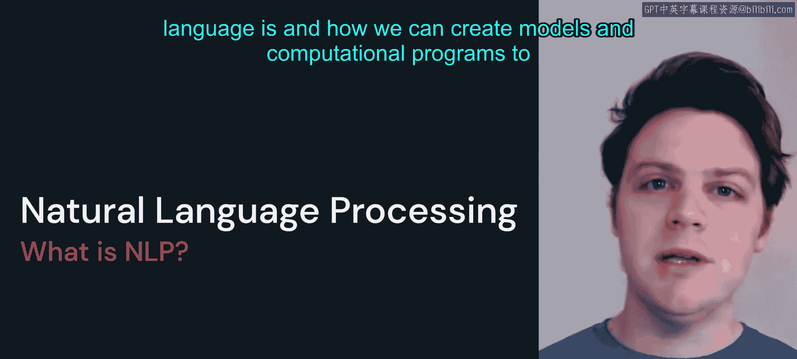
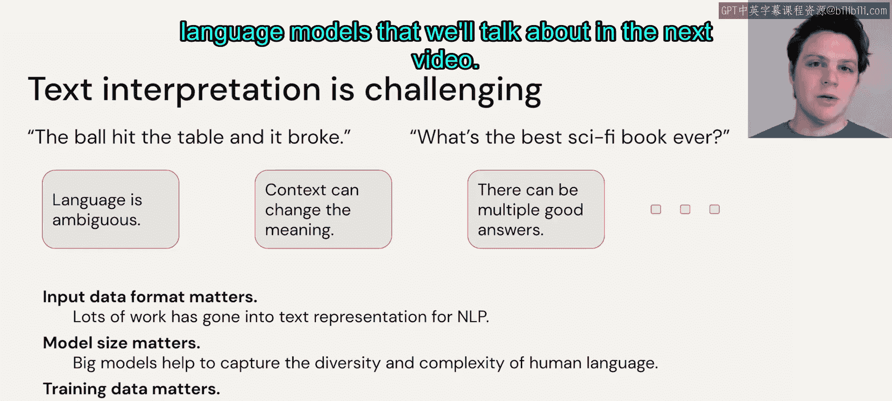

# 3：入门知识

在本节课中，我们将学习自然语言处理的基础知识，并了解一些重要的定义和概念。这些知识是理解后续大语言模型内容的基础。

## 什么是自然语言处理？🤔

自然语言处理是一门研究领域，它探讨什么是自然语言，以及如何创建模型和计算程序来解决自然语言相关的问题。

无论我们是否专门研究这个领域，我们每天都在使用自然语言处理技术。例如，当我们在电脑或手机上输入文字时，系统会利用自然语言处理技术为我们提供自动补全、拼写检查等功能。这些功能都属于自然语言处理的应用范畴。

并非所有这些问题都通过大语言模型解决，但未来我们可能会看到更多基于大语言模型的解决方案。

## 自然语言处理的应用场景 📝

自然语言处理之所以有用，是因为它能帮助我们解决多种不同的任务。

以下是自然语言处理的一些常见应用场景：

*   **情感分析**：判断用户对某个产品的评论是正面还是负面。
*   **机器翻译**：将一种语言翻译成另一种语言。
*   **聊天机器人**：构建依赖自然语言作为输入形式的交互式系统。
*   **相似性搜索**：我们将在模块2中详细讨论，它同样属于自然语言处理领域，旨在实现自然语言输入和输出。
*   **文本摘要**：总结复杂文档，或从长文档中提取关键信息。
*   **文本分类**：不仅仅是判断情感，还可以识别文本的体裁、情绪或包含的内容。

可以看到，自然语言处理的应用范围非常广泛。

## 核心定义与概念 🔑

上一节我们介绍了自然语言处理的应用，本节中我们来看看其核心定义。理解这些术语对于后续学习至关重要。

考虑这个句子：“The Moon, Earth's only natural satellite, has been a subject of fascination and wonder for thousands of years.” 这是一个完整的句子。如果我们分析这个句子的构成，它由短语、单词、字符等基本单元组成。在自然语言处理中，这些基本单元被称为 **`tokens`**。

`tokens` 不一定是单词、字符或子词，它是我们在创建模型时做出的一种选择。你可以将 `tokens` 视为构建自然语言处理问题的“积木”或“原子”。

一个 **`sequence`** 则是一系列 `tokens` 的集合，旨在表示这些 `tokens` 的顺序排列。如果 `token` 是单词，那么一个 `sequence` 可能是一个完整的句子或句子片段。如果 `token` 是字符，那么一个 `sequence` 可能是单词“the”中的字符 `T`, `H`, `E`。

**`vocabulary`** 是我们特定模型可用的全部 `tokens` 的集合。这可以是英语中的所有单词，也可以是我们定义问题时使用的所有字符。

## 自然语言处理的任务分类 🧩

利用这些定义，我们可以对自然语言处理中的不同任务进行分类。

*   **翻译任务**：可以视为 **`sequence-to-sequence`** 任务，因为它接收一个序列（源语言文本），并通常输出另一个序列（目标语言文本）。
*   **情感分析**：如果将其视为分类问题，技术上属于 **`sequence-to-non-sequence`** 预测，因为它通常输出一个或几个 `tokens`（如“正面”或“负面”）。
*   **问答系统**：则更为复杂，它接收一段文本序列，然后通常生成一大段非确定性的文本序列，这是一个更开放的问题。

能够对这些不同类型的任务进行分类，在课程后续部分会很重要。因为我们将发现，评估一个模型的好坏可能相当主观，并且取决于你所要解决的具体任务。

## 自然语言处理的广阔领域 🌐

当然，自然语言处理是一个比文本建模更广阔的领域。本课程将重点放在基于文本的自然语言处理问题上，因为这一领域本身就有大量内容需要探讨。但你需要清楚，自然语言处理远不止于文本到文本的问题解决。

例如，将可听语言转换为文本或将一种可听语言转换为另一种可听语言的**语音识别**；根据文本生成图像描述的**图像字幕生成**；以及过去12个月里我们看到的像DALL-E、Stable Diffusion等从文本生成图像的惊人工具，都属于自然语言处理的范畴。

你可能会问，为什么本课程不涵盖这些内容？原因在于，仅文本理解本身就极具挑战性。我们会看到，即使深入研究简单问题，仅处理文本本身就已经很复杂了。事实上，想想你的日常生活和与他人的交流，仅使用语言的口头形式就面临着许多不同的挑战。

语言可能具有**歧义性**；**上下文**可能因你说话的方式、地点和时间而改变；对于一个特定的问题或评论，可能存在**多个合理的答案**。

## 数据与模型的发展趋势 📈

过去几年，我们看到输入这些模型的数据量在不断增长。模型规模也在以类似的方式增长。我们将在本项目的第二部分更详细地讨论这些模型规模的具体含义。但在本课程中，我们将默认接受模型规模会不断增长以变得更准确、性能更强这一事实。

同样，**训练数据**也是我们将在模块4的微调部分探讨的内容，但本课程不会过多涉及细节。

所有这些因素都很重要，因为它们决定了我们将在下一个视频中讨论的不同类型的语言模型。

## 总结

本节课中，我们一起学习了自然语言处理的基础知识。我们了解了自然语言处理的定义、常见应用场景，以及 `tokens`、`sequence`、`vocabulary` 等核心概念。我们还对自然语言处理任务进行了分类，并认识到该领域远不止于文本处理。最后，我们了解了数据和模型规模的发展趋势，为学习下一课关于语言模型类型的内容做好了准备。