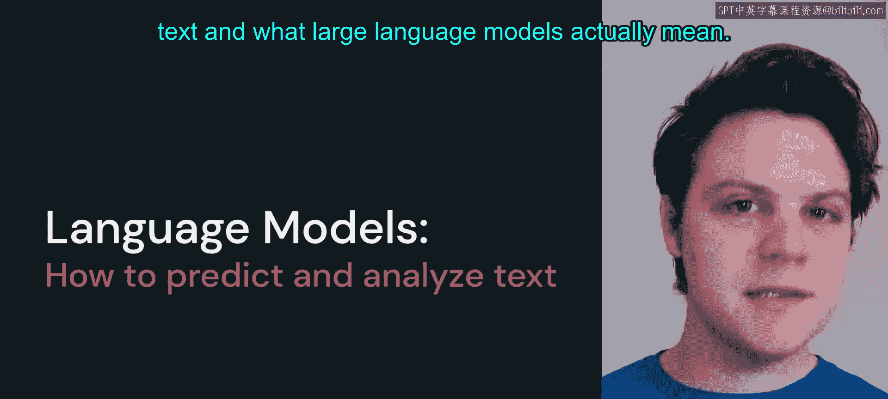
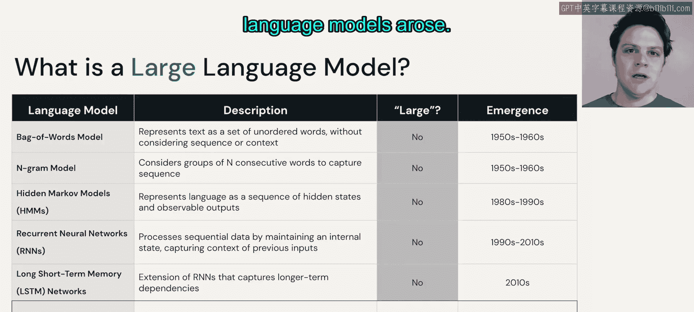

# 4：语言模型

在本节课中，我们将要学习语言模型的基本概念，了解它们如何预测文本，并探讨“大语言模型”这一术语的具体含义。

---

## 什么是语言模型？

上一节我们介绍了文本的表示方法，本节中我们来看看语言模型本身。语言模型本质上是一种计算模型。它接收某种序列（例如我们之前讨论过的词元序列），然后在整个词汇表上计算出一个概率分布，以找出最可能的词。

语言模型通常可以分为两大类：生成式模型和基于分类的模型。

以下是这两种模型的主要区别：

*   **基于分类的模型**：这类模型的目标是预测一个被掩盖的词。例如，在一个句子中遮盖掉一个词，模型的任务就是找出最适合填入该位置的词。
*   **生成式模型**：这是当前大多数研究的主题。这类模型的目标是预测给定序列之后最可能出现的下一个词。

因此，语言模型的核心任务，就是在内部计算一个覆盖整个词汇表的概率分布，从而找出最适合接在后面的词。这就是语言模型的全部。其内部实现可以基于像Transformer这样的架构（我们将在本课程中深入探讨，并在课程2详细讲解Transformer的架构细节）。目前，我们可以将其视为一个黑箱，其内部过程就是为词汇表中的每个词元计算一个概率。

---

## 什么是大语言模型？

了解了语言模型的基础后，本节我们来看看是什么让它们变得“大”。大语言模型是语言模型的一种，其规模从通常的1000万到5000万个参数，增长到了如今我们所见的数十亿甚至数百亿个参数。

Transformer是一种在2017年左右提出的架构，自此之后便主导了自然语言处理领域。在此之前，也存在许多语言模型格式，其中一些甚至采用了深度神经网络架构。然而，它们通常不被认为是“大”模型，因为那些模型的参数量通常少于几百万。

我们暂时不过多讨论“参数”具体是什么。尽管Transformer之前的这些语言模型不被认为是“大”模型，但它们仍然需要大量的计算努力才能获得结果。Transformer释放了巨大的计算效率潜力，这正是2017年后相关技术真正起飞，以及“大语言模型”这一新术语兴起的原因。

---

## 总结

本节课中我们一起学习了语言模型的核心概念。我们了解到，语言模型是一种通过计算概率分布来预测文本（如下一个词或被掩盖的词）的计算模型。而“大语言模型”特指那些参数量极其庞大（达到数十亿级别）的语言模型，其规模的飞跃主要得益于Transformer架构带来的计算效率突破。