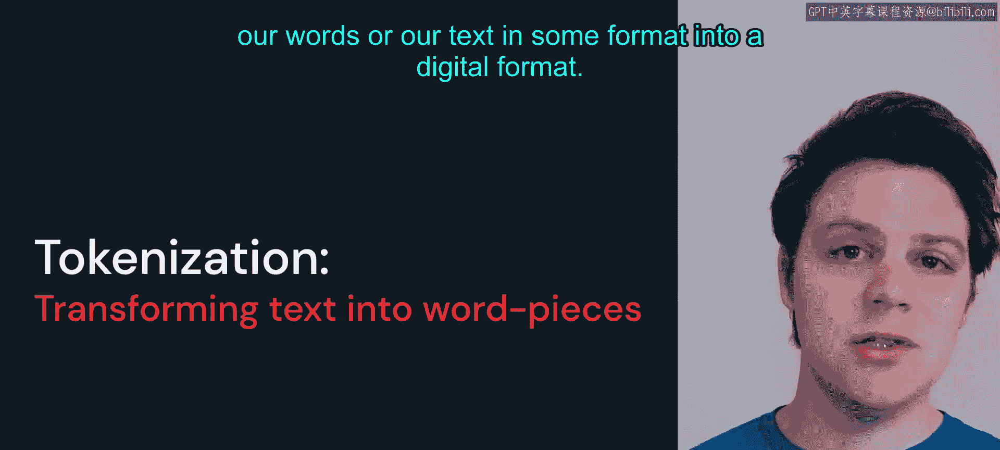
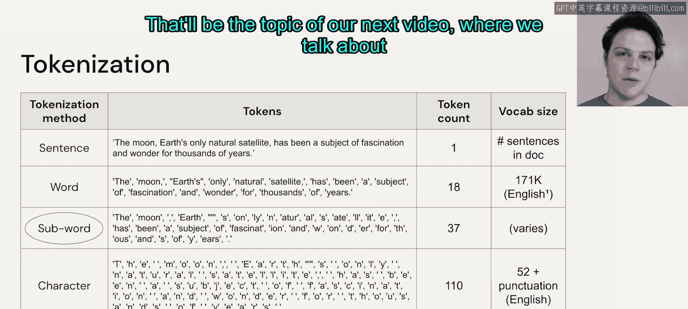

# 5：分词

在本节课程中，我们将学习**分词**的概念。分词是自然语言处理中的基础步骤，它将文本转换为计算机可以处理的数字格式。我们将探讨不同的分词策略及其优缺点。

## 什么是分词？ 🤔

我们之前定义过，给定一个短语或句子，构成这个短语或句子的**标记**将成为我们在NLP建模中的一个设计选择。这些标记可以是不同的单词、字符或单词片段。分词的过程旨在将我们选择的文本片段（如单词）转换为可用于计算的格式。计算机不擅长符号数学，因此我们需要将文本转换为数字格式。

## 分词策略对比 📊

上一节我们介绍了分词的基本概念，本节中我们来看看几种主要的分词策略：基于单词、基于字符和基于子词的分词。

以下是三种主要分词策略的概述：

*   **基于单词的分词**：将句子或单词序列切割成独立的单词。
*   **基于字符的分词**：将文本切割成单个字符。
*   **基于子词的分词**：将单词切割成有意义的子单元。

### 基于单词的分词

基于单词的分词过程分为两步。首先，我们根据训练数据创建一个包含所有不同标记的**词汇表**。例如，我们可以将英语词典中的每个单词都放入词汇表，并为每个单词关联一个数字（如从0开始编号）。这就构建了我们的索引。之后，每当我们看到一个新的单词序列，就可以将其转换为一个索引数字列表，从而编码成一系列模型可以处理的数字。

然而，基于单词的分词存在一些局限性和问题。如果我们构建词汇表时使用的训练集遗漏了某些常见或不常见的词，那么在后续使用语言模型时遇到这些词，就会产生**词汇表外**错误。这是基于单词分词的一个限制，因为它必须为每个独立的单词关联一个特定的标记值。

这也意味着，如果存在拼写错误，或者我们想创造新词，这种分词方案无法处理这种灵活的行为，它非常脆弱。此外，这还会导致词汇表非常庞大，因为我们必须为每个单词的每种形式（如 `fast`, `faster`, `fastest`）都分配不同的标记。如果我们有 `slow`, `slower`, `slowest`，又需要另外三个词。而实际上，我们可以只取这些单词的词干，然后将后缀作为单独的片段添加。

### 基于字符的分词

另一种使词汇表显著变小的解决方案是查看单个字符。如果选择英语，我们会有26个小写字母、26个大写字母，以及一些其他标点和数字字符。因此，词汇表大小大约在100左右。

这确实会创建一个非常小的词汇表，并且我们能够创建任何想要的新词，也能够处理任何拼写错误。然而，问题在于我们失去了“单词”的概念。在处理NLP问题时，我们必须牢记，我们需要尝试捕捉上下文和含义。通过将文本分解为单个字符，我们失去了单词的意义。

这也意味着我们的序列长度会变得非常长。例如，如果进行单词分词，句子“The moon”的前两个标记是单词“The”和“moon”。但如果进行字符分词，那么这个序列的前两个标记将是“T”和“h”。因此，我们最终需要处理非常长的序列长度，这也是我们希望尽量避免的。

### 基于子词的分词

介于上述两种极端方案之间的折中方法是进行**子词**分词。例如，单词“subject”可以被拆分为“sub”和“ject”，然后你可以用这些词块构建其他单词，如“object”、“subjective”、“subordinate”、“submarine”。

有多种不同的策略可以构建这类词汇表，**字节对编码**是一种流行的方案。还有许多其他方案，如 **SentencePiece** 和 **WordPiece**，在现代大语言模型中非常常用。这些方案在词汇表大小与灵活性之间取得了良好的平衡，既能处理词汇表外的单词，又能保留所描述单词的足够含义。

我们会发现，子词分词是该领域人们使用的主要分词方案。

## 总结 📝

本节课中我们一起学习了分词的核心概念。通过比较不同的分词方案，我们可以看到子词分词在标记数量与词汇表大小之间提供了最佳平衡。一旦我们获得了这些标记，下一步就是尝试理解如何融入含义和上下文，这将是我们下一个视频讨论**词嵌入**的主题。

