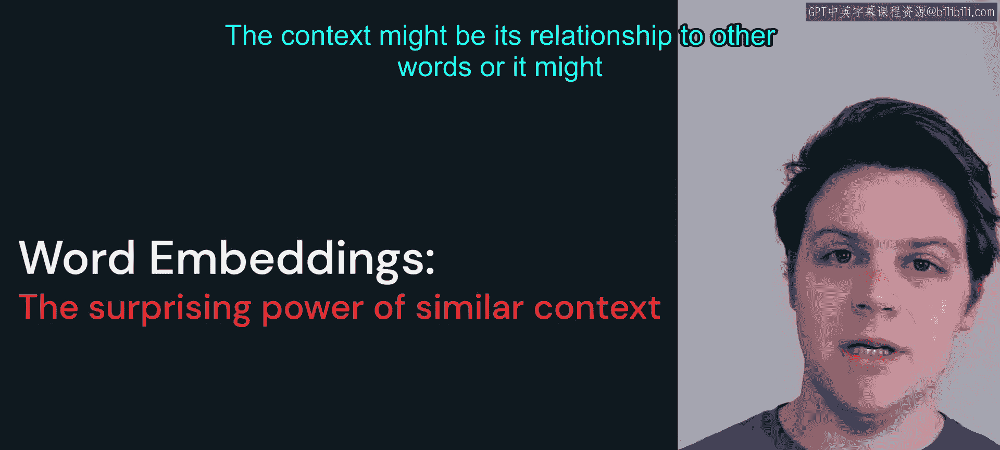
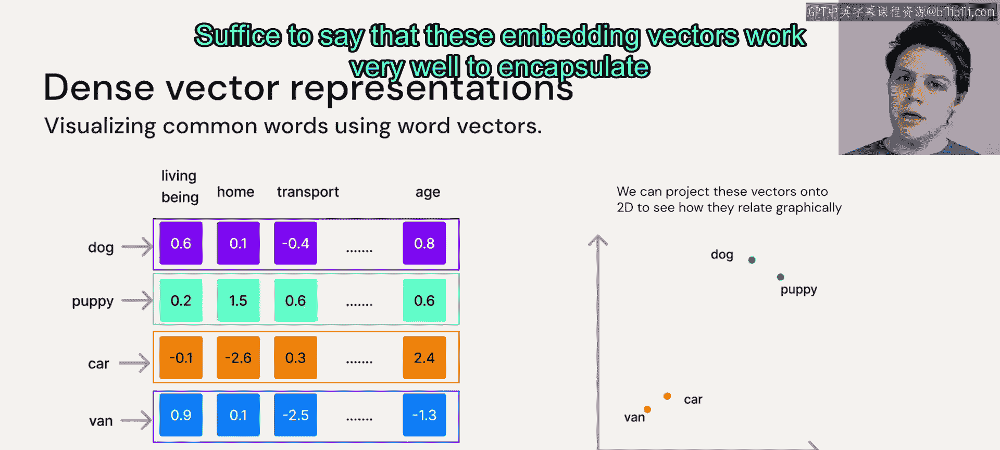

# 6：词嵌入（Word Embeddings）🚀

在本节课中，我们将要学习自然语言处理中的一个核心概念——词嵌入。词嵌入的目标是尝试捕捉并保留特定词汇在其语境中的上下文信息，这包括该词与其他词的关系，或其自身的内在含义。

## 从词汇到向量

上一节我们介绍了如何将句子转换为标记（Token）。我们通过分词方案将句子中的词汇转换为特定的数值。然而，在自然语言处理中，我们常常需要比较两个句子或文档，以判断它们是否相似、是否包含相反的观点或情感等。

因此，含义相似的词，往往出现在相似的上下文中。例如，我们看这两个句子：
*   “The cat meowed at me for food.”
*   “The kitten meowed at me for treats.”

这两个句子明显不同，但在某些语境下，它们具有几乎相同的含义：都描述了一只猫科动物对着我喵喵叫，想要食物。单词“cat”和“kitten”显然是不同的词，但它们含义非常相似。如果我们将这些词投射到某个高维向量空间中，它们在某种意义上会非常接近。同样，“food”和“treats”也存在这种上下文相似性。

理想的情况是，我们能建立某种方案或模型，用数值来表达这种关系。我们的目标就是构建一些可用于上下文映射和嵌入的向量。

## 词袋模型（Bag of Words）及其局限性

让我们先通过一个简单的例子来探索。假设我们有以下三个句子，词汇表包含这些句子中出现的所有单词：
1.  The cat sat.
2.  The cat sat in the hat.
3.  The cat with the hat.

以下是构建向量表示的方法：
我们将统计每个单词在这些文档中出现的频率，看看这如何帮助我们比较不同的文档。

*   对于第一个句子“The cat sat.”，我们在词汇表的前三个单词位置得到值1，其余位置为0。
*   对于第二个句子“The cat sat in the hat.”，我们得到两个“the”，然后除了“with”之外，其他单词几乎都出现一次。
*   对于第三个句子“The cat with the hat.”，我们再次得到两个“the”，一个“cat”，没有“sat”和“in”，一个“hat”和一个“with”。

这样，我们就为这些文档构建了向量表示。如果我们想比较这些文档，我们可以使用这些向量来查看，例如，“the”这个词在每个文档中相对于其他文档的出现情况。可以说，最后两个句子更相似，因为它们有更多共同的词汇。

然而，如果我们将这种方法扩展到具有现实词汇量的更大场景中，就会遇到问题。由于任何合理长度的句子都不可能包含一种典型语言中的所有不同单词，因此向量中几乎99%的位置都会是零。例如，英语大约有25万个独特单词，除非使用词典，否则任何句子或文档都不可能接近包含所有这些单词。

虽然词袋模型是一个有用的工具，并且许多语言模型确实基于此类方法构建（如果你有兴趣了解更多，可以查看TF-IDF，它是旧版语言模型中非常常用的工具），但这里的稀疏性问题意味着，当我们将模型扩展到更大的问题和更复杂的文档时，这种方法并不真正有效。

此外，这种方法也丢失了每个单词本身的含义。虽然我们可以看到“the”这个词比其他任何词都更常见，但它并没有真正告诉我们这个词的实际含义。回想上一张幻灯片，我们希望找到一种方法，让“cat”和“kitten”在某种意义上能够“在一起”。

## 词嵌入函数

这正是词嵌入函数或单词向量化函数发挥作用的地方。我们不会深入探讨词嵌入方法的具体实现（这超出了本课程的范围），但你可以自行查阅像Word2Vec这样的工具，它是一套将不同单词转换为向量表示的算法。

本质上，其工作原理是：我们使用训练数据集中的每个单词，并查看它周围的单词。我们设置一个窗口，查看每个单词左边和右边的单词。这样，它就构建了一个映射，显示一个单词如何与另外三个单词一起出现，以及另一个单词在特定上下文中如何与相同的三个单词一起出现。

以我们之前看过的短语“the kitten meowed at me”和“the cat meowed at me”为例，我们可以看到“kitten”和“cat”处于相同的位置，并且被相同的单词包围。如果我们对整个词汇表或整个训练数据集进行此操作，就可以构建出代表哪些单词通常出现在这些单词附近的向量。

如果我们给向量赋予数百到数千的维度，我们就可以开始为这些单词构建一些有趣的含义和嵌入值。

通常的流程是：我们有一个单词，将其转换为标记（Token），然后将该标记放入嵌入函数，最后从该标记的单一索引中得到某种向量。

## 词嵌入的可视化与理解

完成这一步后，我们可以通过观察不同单词之间的关系来获得一些有趣的发现。正如我们在上一张幻灯片中看到的，这些向量非常长，有数百甚至数千个维度。但在某些情况下，我们可以将这些向量投影到2D平面上，并像你在这里看到的那样绘制在屏幕上。如果投影得当，我们往往会看到这些向量聚集成簇，含义相似的词会聚集在一起。

正如你所料，“dog”和“puppy”紧密相关，“car”和“van”也是如此。我们并不总是确切知道不同列（维度）的含义，它们几乎不像我们现在屏幕上显示的那样是精确的概念。然而，你可以感受到这些嵌入向量所发生的情况：我们使用的单词或标记，是由这个高维空间中的一系列值来描述的。

因此，你至少可以从概念上这样理解：例如，“dog”包含一些与“生物”相关的值，一些与“家庭”相关的值，可能一些与“交通工具”无关的值，以及一些与“年龄”相关的值（比如“dog”和“puppy”在这方面会有不同的值）。

我想再次强调，这些列并不对应如此具体的含义。然而，从向量的行为方式来看，其含义在某种程度上是分布在不同列中的。

如果这令人困惑，请不要过于担心，因为我们不需要过多纠结于此。 suffice to say，这些嵌入向量在封装每个标记的含义方面效果非常好。

## 总结

本节课中，我们一起学习了词嵌入（Word Embeddings）的概念。我们了解到，将单词转换为高维向量表示，可以有效地捕捉词汇的语义和上下文信息。我们首先探讨了简单的词袋模型及其在处理大规模词汇时的稀疏性局限，然后引入了更先进的词嵌入方法（如Word2Vec），该方法通过分析词汇的共现关系来生成稠密向量。最后，我们看到了这些向量在降维可视化后，语义相近的词汇会聚集在一起，这直观地展示了词嵌入如何将语言的含义编码为数学模型，为后续更复杂的自然语言处理任务奠定了基础。