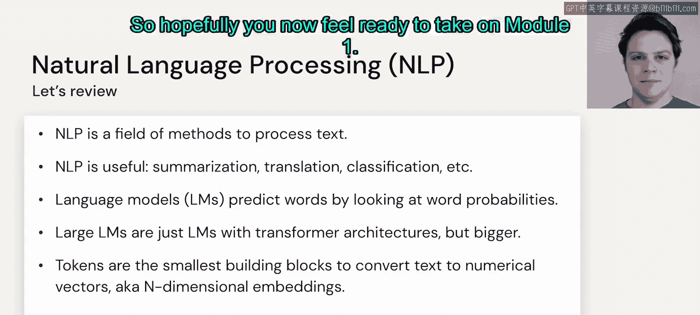

# 7：总结

在本节课中，我们将对自然语言处理的基础知识进行回顾与总结，梳理核心概念，为后续模块的学习做好准备。

自然语言处理是一个专注于研究自然语言的领域。它主要研究文本，但其范围远不止于如何建模基于文本的问题。自然语言处理还研究语音、文本视频、图像转文本等其他概念，只要这些概念中自然语言是重要的组成部分。

自然语言处理在许多方面都极其有用。例如，将一种文本翻译成另一种文本，总结长篇文本，以及处理分类问题。在这些问题中，我们期望输入是自然语言，输出也是自然语言。这些任务由语言模型完成。

语言模型本质上是一种工具，用于在我们所使用的词汇表上创建一个概率分布。其核心公式可以表示为：

**P(w_t | w_1, w_2, ..., w_{t-1})**

这个公式表示，给定前 `t-1` 个词（或标记）的情况下，下一个词 `w_t` 出现的概率。

大语言模型是基于Transformer架构的语言模型，其参数量达到数百万甚至数十亿级别。

标记是我们语言模型的最小构建单元。它们将我们的文本转换为索引，然后这些索引被转换为多维的词嵌入向量。通过这种方式，我们可以更好地理解每个标记或每个词背后的上下文和含义。

以下是本课程核心概念的快速回顾列表：

*   **自然语言处理**：研究如何让计算机理解、解释和生成人类语言的领域。
*   **语言模型**：一种对词汇序列的概率分布进行建模的工具。
*   **大语言模型**：基于Transformer架构、参数量巨大的语言模型。
*   **标记**：文本处理的基本单元，可以是词、子词或字符。
*   **词嵌入**：将标记映射到高维向量空间的技术，以捕捉语义信息。

至此，我们已经完成了自然语言处理入门部分的学习。希望你现在已经准备好进入模块一的学习。

我们下一个模块再见。