# 9：安装数据集 📂

在本节中，我们将学习如何在自己的工作空间中安装课程所需的数据集。这是为了确保后续的代码能够顺利运行，并避免不必要的计算资源消耗和时间浪费。

## 概述

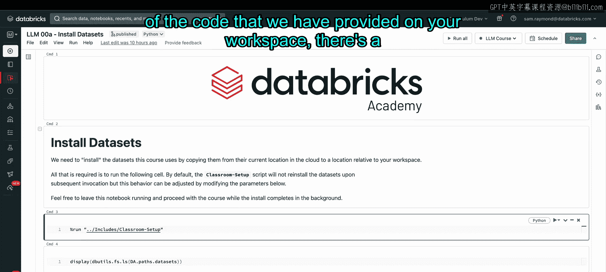

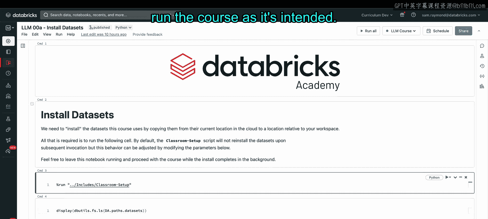

如果你使用自己的工作空间，并希望运行我们提供的所有代码，你需要先执行几个初始步骤。其中最重要的一步是确保数据集已安装并缓存在你的工作空间中。否则，代码运行可能会非常耗时，并可能消耗不必要的计算资源。

## 安装步骤

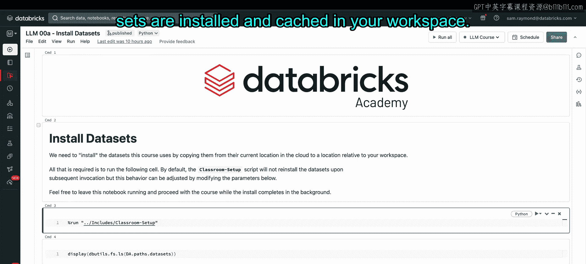

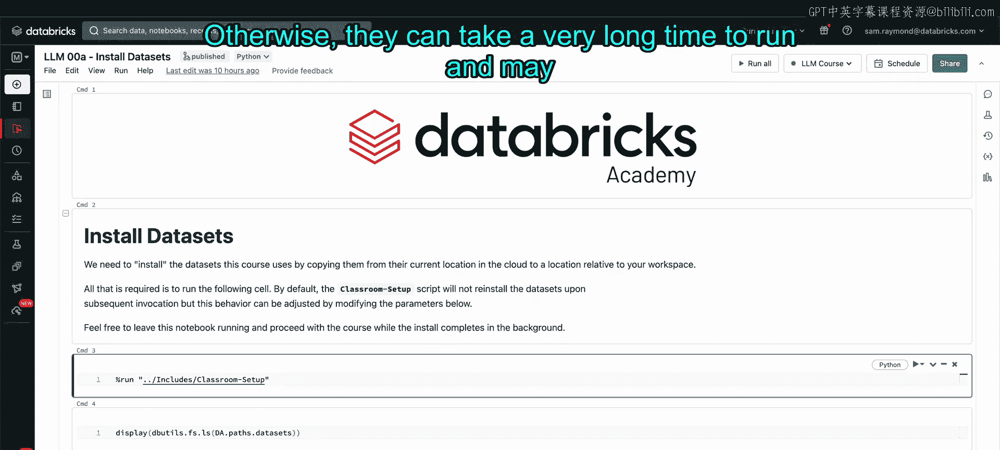

以下是安装数据集的具体步骤。

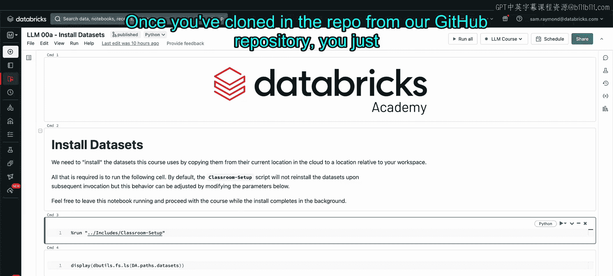

首先，你需要从我们的GitHub仓库克隆代码库。克隆完成后，导航至 `LLM 0 - Introduction` 文件夹，并找到名为 `0.9 Install Datasets` 的笔记本文件。

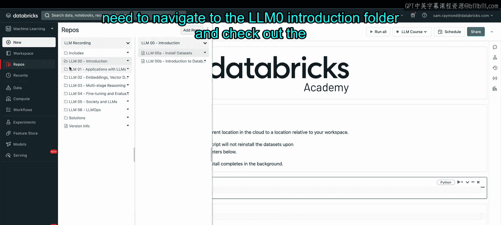

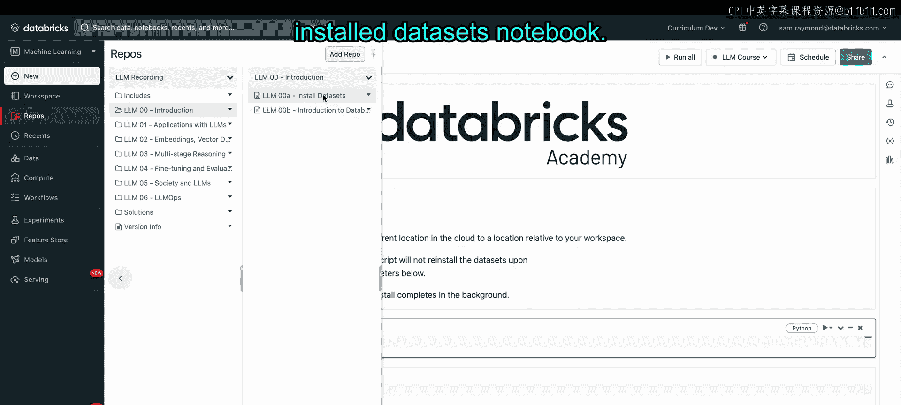

接下来，你只需运行笔记本中的第三个命令，即 `%run ./Includes/Classroom-Setup`。

这个命令会查找所有课程所需的数据集，并将它们安装到相对于你工作空间的本地位置。

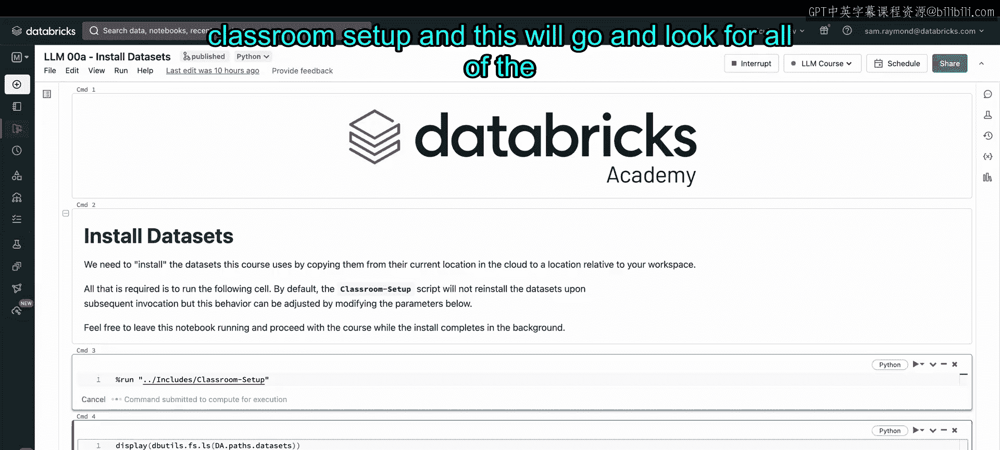

根据你的网络连接速度和数据可用性，这个过程可能需要大约20分钟。如果数据集已经安装过，则此过程将立即完成。

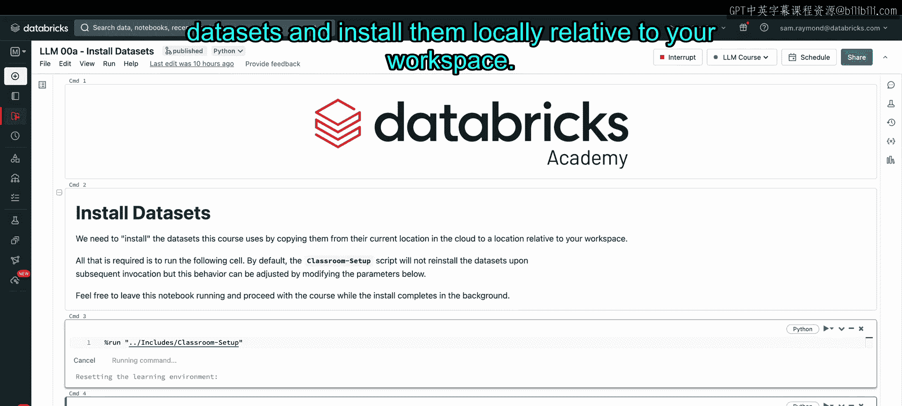

## 验证安装

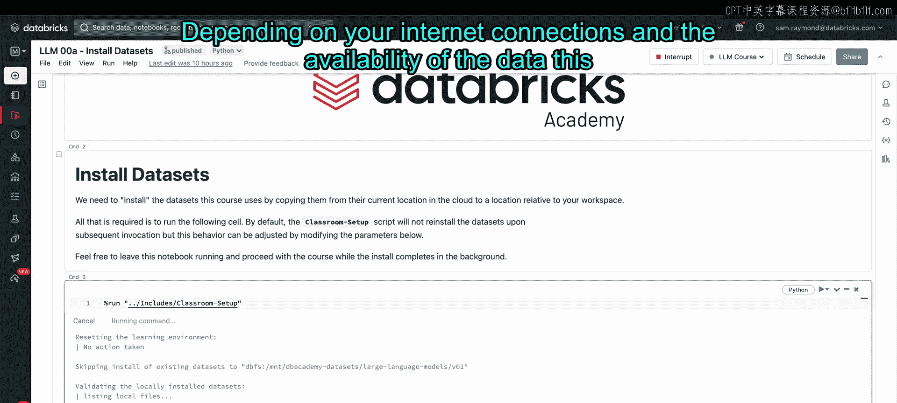

安装完成后，你可以运行第四个命令来验证所有数据集是否已正确安装在指定位置。

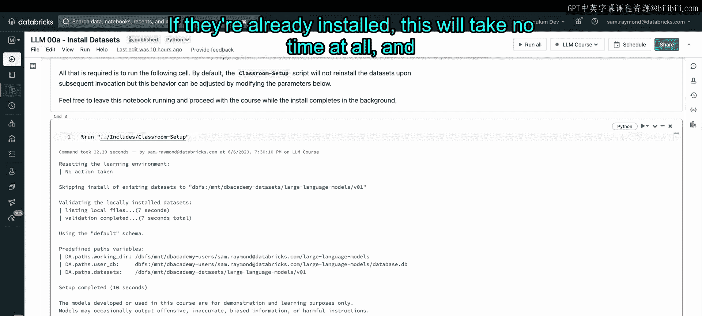

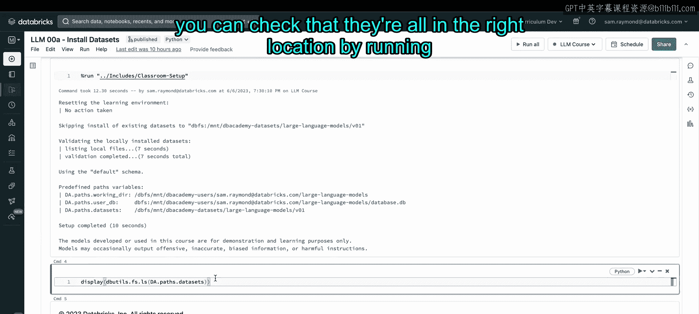

这个命令会显示所有数据集及其存储路径。确认无误后，你就可以顺利运行课程中的其余代码了。

## 总结

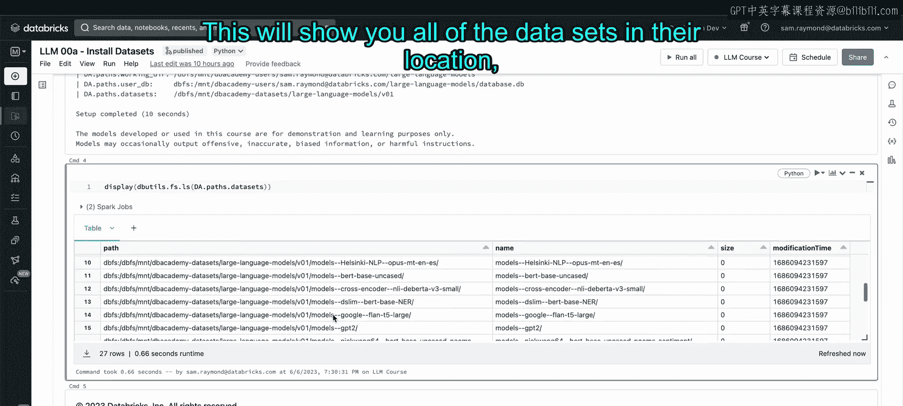

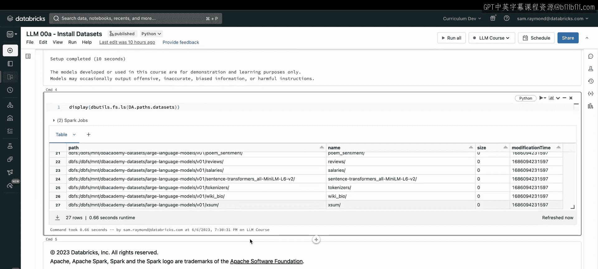

本节课中，我们一起学习了如何为Databricks课程安装必要的数据集。我们了解了安装的重要性，并逐步完成了从克隆仓库到运行安装命令，再到验证安装结果的完整流程。确保数据集正确安装是后续所有实验和代码运行的基础。