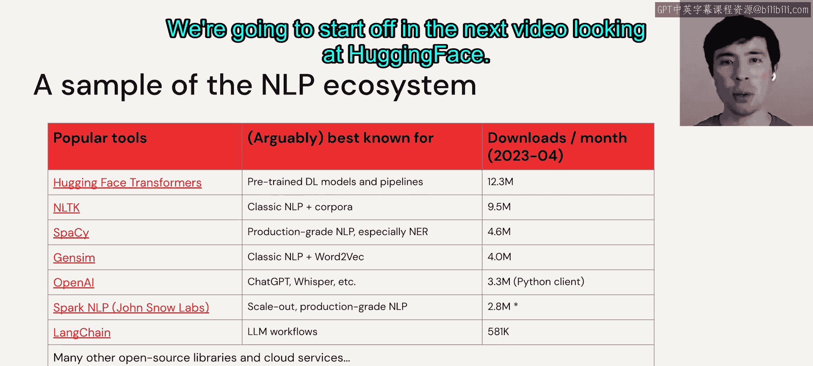

# 11：课程概述与LLM应用入门 🚀

在本节课中，我们将学习如何快速入门大语言模型的应用。我们将了解预训练大语言模型能解决哪些问题，并学习如何使用Hugging Face的API、数据、流水线、令牌和模型来与LLM进行交互。课程的核心目标是帮助你快速为你的应用找到合适的模型，并理解提示工程的重要性。

## 课程目标

上一段我们介绍了本模块的整体目标，以下是本模块具体的学习目标清单：

*   理解预训练大语言模型所能解决的各类应用问题。
*   使用Hugging Face的API、数据、流水线、令牌和模型来下载并与LLM交互。
*   掌握如何快速为你的应用找到合适的模型，例如通过Hugging Face Hub。
*   理解提示工程的重要性并掌握其入门方法。

## 从业务问题到技术方案

正如Matttee所提到的，许多CEO或CTO最近都在说“尽快开始使用LLM”。而我们其他人自然会问：我能用LLM来做什么？以及具体该如何实现？

面对一个业务问题，我们的思路是：首先确定它对应哪种标准的自然语言处理任务。确定了任务之后，再寻找适用的模型。观察右侧的图表（2023年4月Hugging Face Hub的截图），我们可以看到，针对这些常见的NLP任务，有成千上万个模型可供选择。

问题在于模型数量太多，我们必须做出选择。本模块将花费相当多的时间来讨论如何选择模型。

## 实战案例：新闻摘要生成

为了让内容更具体，我们将使用一个贯穿始终的示例：为新闻源生成摘要。😊

给定文本文章（长篇文本），一个标准的NLP任务就是将其总结为更短的文本。对于这个应用而言，目标是生成简短的摘要，以便显示在新闻应用中供用户滚动浏览。

## NLP生态系统工具简介

在我们深入实践之前，先快速了解一下庞大的NLP生态系统中的部分工具样本。

*   **Hugging Face**：位于顶部，我们已经提到过。其Transformers库及相关的Hub最为人所知的是拥有大量基于深度学习的预训练NLP模型和流水线。Hugging Face提供的功能远不止这些。
*   **经典NLP库**：目前仍然存在许多非常流行的库，专注于经典NLP方法，而非基于LLM或深度学习。
*   **专有服务**：例如围绕Open AI的一些著名专有服务。
*   **新兴框架**：例如LangChain等新来者，它们本身不提供模型，而是提供围绕模型的工作流或链。我们将在课程后续部分详细讨论这些。

## 总结

本节课中，我们一起学习了本模块的总体目标和具体学习路径。我们了解了如何将业务问题映射到NLP任务，并认识到从海量模型中做出选择是一个关键挑战。我们引入了一个新闻摘要生成的实战案例，并简要概述了当前NLP生态系统中的主要工具。接下来，我们将从探索Hugging Face开始我们的实践之旅。