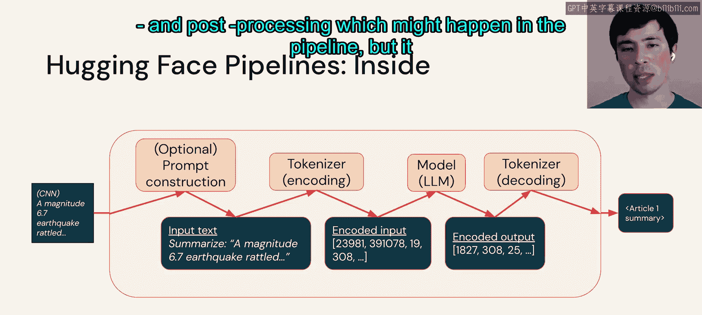
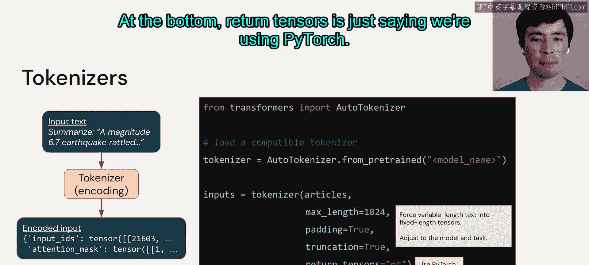
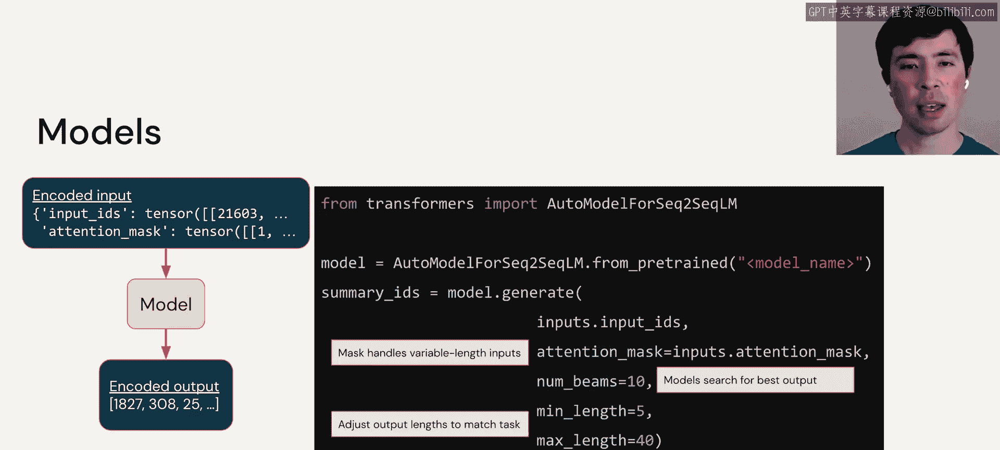
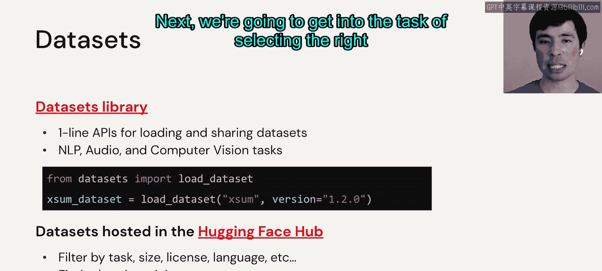

# 12：Hugging Face 简介与核心组件 🚀

在本节课中，我们将学习 Hugging Face 这一平台及其核心库 `transformers` 和 `datasets`。我们将了解如何使用这些工具来简化大语言模型的应用流程，包括文本的预处理、模型调用以及数据集的加载。

---

## 概述：Hugging Face 平台

Hugging Face 既是一家公司，也是一个专注于开源机器学习项目的社区，尤其在自然语言处理领域最为知名。其平台托管了模型、数据集以及用于演示和代码的“空间”，这些资源都可以便捷地下载。平台上的资源遵循不同的开源许可协议。此外，Hugging Face 还提供了一系列功能强大的库。

---

## 核心库介绍

上一节我们介绍了 Hugging Face 平台，本节中我们来看看它提供的几个核心库。

以下是三个主要的库及其功能：

*   **`datasets`**：这个库提供了从 Hub 下载数据集的方法。
*   **`transformers`**：这个库让处理 NLP 的核心组件（如流水线、分词器和模型）变得简单，并能方便地从 Hub 下载预训练模型。
*   **`evaluate`**：顾名思义，这个库用于模型评估。

在右侧的图表中，可以看到基于 Stack Overflow 提问数量，`transformers` 库的流行度在过去几年里急剧上升。我认为其原因是 Hugging Face 提供了非常简洁的 API，但其底层功能却十分强大，因为它利用了 PyTorch、TensorFlow 和 JAX 等深度学习框架。

---

## 深入 `transformers` 流水线

上一节我们了解了核心库，本节中我们来看看 `transformers` 库的核心——流水线。

让我们首先看看流水线是什么样子的。这里我们回到文本摘要任务：左边是文章，右边是摘要，中间是大语言模型。使用 `transformers` 库，只需导入 `pipeline` 类，声明需要一个默认的摘要流水线，然后将文章传入即可完成。在底层，它会自动为我选择一个默认的 LLM 并进行配置，尝试执行正确的操作。

然而，通常我们需要自己进一步配置流水线。让我们打开流水线，看看它可能包含的常见组件。原始输入可能会经过一个称为“提示词构建”的步骤。我们将在本模块稍后部分更详细地讨论提示词，现在只需知道，有些（并非所有）LLM 除了原始用户输入外，还需要进一步的指令。对于摘要任务，可能简单到只需在文章前加上“总结：”这样的前缀。

然后，文本会经过一个**分词器**，它将文本编码为数字，这是我们的模型（即 LLM）所期望的输入格式。模型输出一个编码后的摘要，然后由同一个分词器对该摘要进行解码。需要说明的是，本幻灯片略过了流水线中可能发生的潜在预处理和后处理步骤，但它给出了关键组件。

---

## 分词器详解

上一节我们概述了流水线，本节中我们更仔细地看看其中的分词器组件。

在左下角可以看到，分词器将编码后的数据输出为 `input_ids`，这是实际的编码文本，以及 `attention_mask`。本课程不会深入讨论“注意力”机制，目前只需知道，`attention_mask` 是描述文本的元数据，你需要将它连同 `input_ids` 一起传递给模型，因为模型需要这些元数据。

在右侧，你可以看到我们使用 `AutoTokenizer` 类。这是 `transformers` 提供的多个“Auto”类之一，当你给它一个想要加载的模型或分词器名称时，它能自动完成正确的操作。

给定那个分词器后，我们可以传入文章。这里是一些你可能指定的配置示例：`max_length`（最大长度）、是否进行填充（`padding`）、是否截断输入（`truncation`）。这些配置都是为了将可变长度的输入文本转换为 LLM 所期望的固定长度张量。你需要根据选择的模型和具体任务来调整这些参数。底部的 `return_tensors` 参数只是表明我们使用的是 PyTorch。

---

## 模型与推理参数

上一节我们介绍了分词器，本节中我们来看看模型部分以及如何配置推理过程。

接下来是模型，我们将传入 `input_ids` 和 `attention_mask` 并获得编码后的输出。在右侧，你可以看到我们使用另一个 Auto 类，这次是针对序列到序列语言模型的 `AutoModelForSeq2SeqLM`。我们不会在此详细讨论不同类别的语言模型，但这本质上是指将一个可变长度的文本序列（如文章）转换为另一个可变长度的文本序列（如摘要）。给出模型名称，它会为我们加载正确的模型，然后我们可以传入 `input_ids` 和 `attention_mask`。

这里需要更详细地说明一下元数据：在调用分词器时，我们为可变长度输入指定了一些参数，这些元数据将帮助模型处理这些可变长度。

接下来是几个推理和输出参数：`num_beams`（我们将在编码部分进一步探讨），它表示我想使用集束搜索来生成输出文本，这是进行推理的多种方法之一。然后 `min_length` 和 `max_length` 表示我希望输出摘要的长度在 5 到 40 个标记之间。当然，这需要根据你的任务要求进行调整。

---

## `datasets` 库简介

关于 `transformers` 的介绍已经足够，现在让我们简单了解一下 `datasets` 库。

该库为加载数据集提供了一行代码的 API，我们将主要讨论 NLP，但它也支持音频和视觉任务。`datasets` API 不仅允许你指定数据集名称，还可以指定版本号，这对于代码的可维护性非常有价值。这些数据集托管在 Hugging Face Hub 上，其用户界面允许你按任务、大小、许可证、语言等进行筛选，还能找到相关的模型，这非常有用。

---

## 总结

本节课中，我们一起快速浏览了 Hugging Face 的库和工具。我们了解了 `transformers` 库如何通过流水线、分词器和模型简化 NLP 任务，也看到了 `datasets` 库如何便捷地管理数据。接下来，我们将进入选择合适模型的任务。