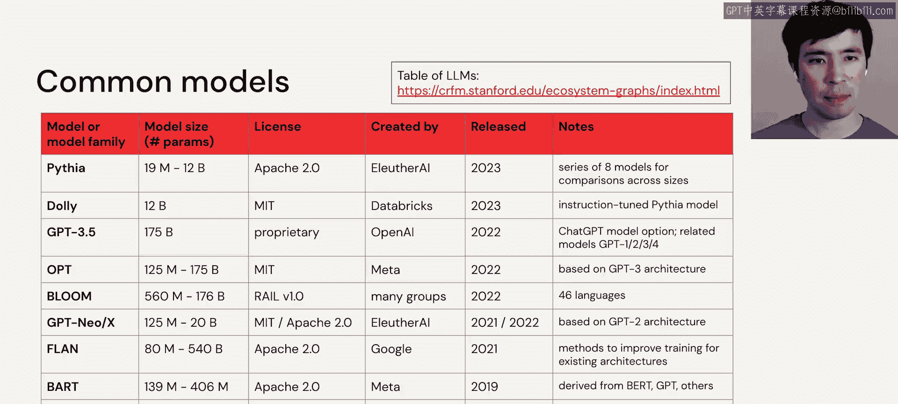

# 13：模型选择 🧠

在本节课中，我们将学习如何为特定任务选择合适的语言模型。我们将探讨筛选模型的关键因素，并介绍一些知名的模型系列，帮助你做出明智的决策。

回顾我们之前提到的摘要生成应用。首先需要明确的是，像摘要、翻译这类宽泛的任务，内部也存在细节差异。例如，在摘要任务中，你可能会遇到两种选择：**抽取式摘要**（从原文中选择代表性的片段）和**生成式摘要**（生成全新的文本）。

明确了任务细节后，如何在众多模型中搜索呢？以Hugging Face平台为例，上面有超过17万个模型。如果按“摘要”任务筛选，可能得到约400个结果。接下来该怎么办？或许可以按流行度排序，但我们首先应该考虑的是需求。

有许多潜在的需求和筛选技术。我们先看一些简单的筛选方法。

以下是几种基础的筛选维度：

*   **任务、许可证、语言**：在界面左上角，可以根据任务、许可证（如商业许可）和语言等硬性约束进行筛选，这非常直接有效。
*   **模型大小**：虽然界面可能不直接支持，但你可以通过查看文件大小或参数数量来估算模型规模。这对于控制硬件成本、延迟等需求很重要。
*   **流行度与更新**：在界面右侧，可以按流行度和最近更新排序。流行度反映了社区的认可，而更新则很重要，因为过旧的模型可能无法与最新的库兼容。

接下来，我们探讨一些更微妙但同样重要的模型选择方法。

以下是更深入的考量因素：

*   **模型变体**：知名模型（如T5）通常会发布不同尺寸的版本（基础版、小版、大版）。建议从最小的版本开始原型开发，以快速启动并控制成本，后续可以升级到更强大的版本。同时，寻找针对你的任务或相似数据集进行过**微调**的模型变体，它们通常表现更好。
*   **示例与数据集**：不仅要搜索模型，还要搜索相关的使用示例和数据集。好的示例不仅能指导你调整参数，还能让你无需深入了解模型架构，就能判断它是否适合你的任务。
*   **模型定位与数据**：这个模型是通用的“多面手”，还是针对特定任务微调的专家？了解其预训练和微调所用的数据集至关重要。通常，与你的任务匹配的微调模型会更小或性能更佳。
*   **定义指标与测试**：最终，模型选择关乎你的数据和用户。需要定义关键绩效指标和评估标准，并在你的数据和用户上进行测试。

以上是一些通用的模型选择技巧。选择模型的另一部分，是认识那些知名且优秀的模型。

这里有一个简短的列表，它只是众多模型或模型家族中的一小部分。在右上角有一个更大型的语言模型表格，也值得查阅。

我不会逐一讲解整个列表，但想指出几点：首先，很多所谓的“模型”实际上是**模型家族**，其参数规模可能从数百万到数百亿不等，并且许多都有更具体的微调版本。例如，第一行的Pythia可视为一个基础模型家族，通常不作为开箱即用的最终模型，而是作为基础用于微调出像第二行Dolly这样的指令跟随模型。

还需注意，这些模型的规模差异很大。一些知名模型（如GPT-3.5）的参数数量可能反而不如某些不太知名的大型模型。对于大语言模型，**规模确实重要**，更大的模型通常能力更强，能处理更多任务类型，但这并非全部。例如，GPT家族投入了大量精力在**基于人类反馈的强化学习**等技术上，这些对齐技术旨在更好地满足用户需求。

当然，**模型架构**、**预训练数据集**和**微调方法**也极为重要，它们会导致模型之间的巨大差异。话虽如此，许多基础模型实际上是相互关联的，共享或选自一系列共同的技术或预训练数据集。

本节课中，我们一起学习了筛选模型的各种技巧，并认识了一些常见的模型名称。在下一个视频中，我们将转向探讨常见的自然语言处理任务。