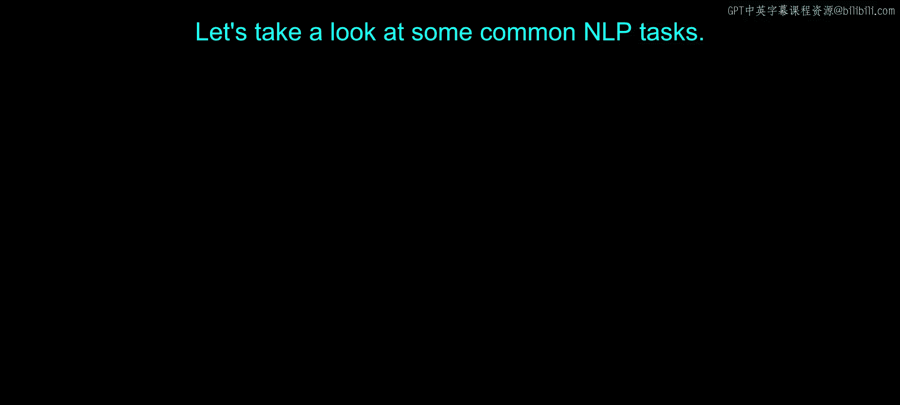
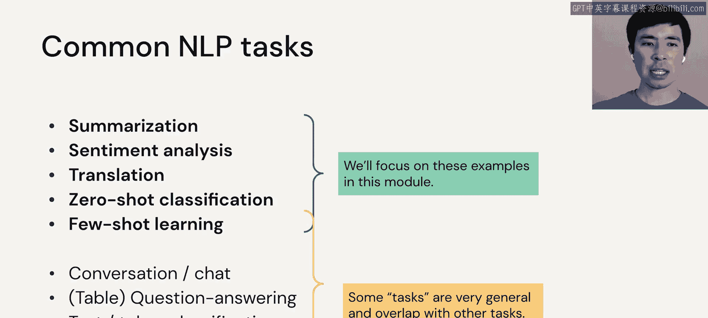
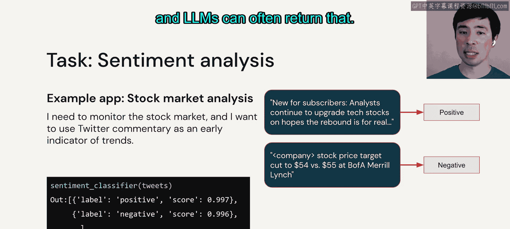
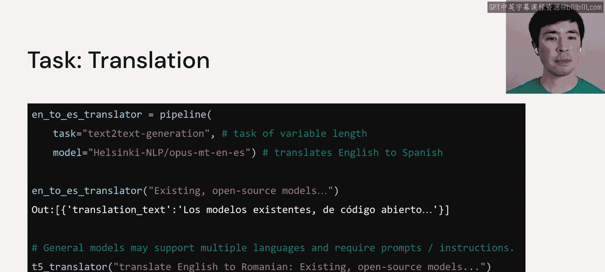
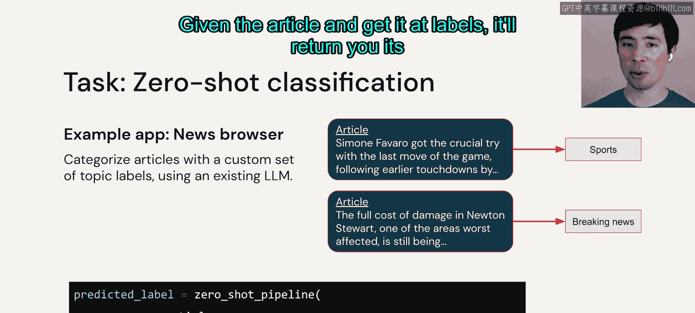
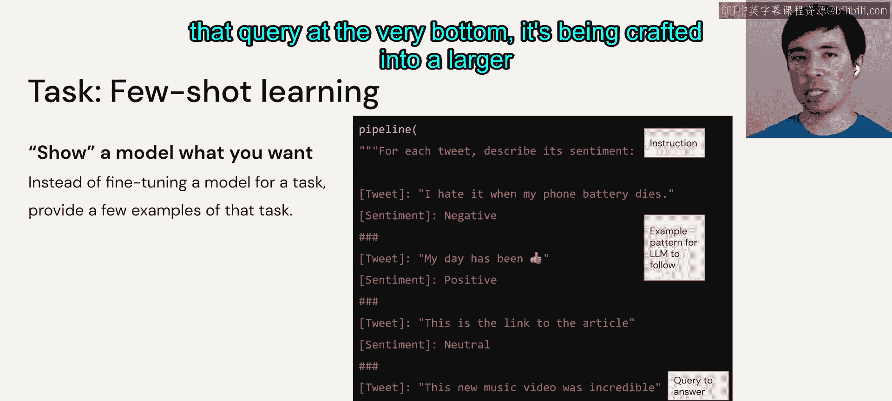
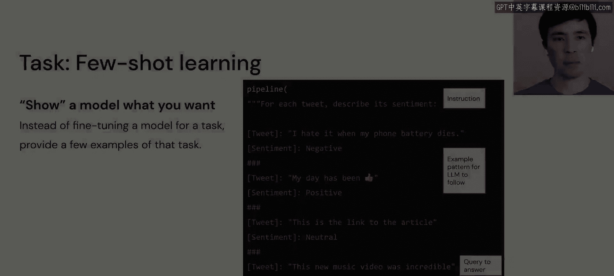

# 14：NLP 任务

在本节课中，我们将要学习一些常见的自然语言处理任务。我们将重点介绍其中几个关键任务，并了解大语言模型如何应用于这些场景。

## 概述

自然语言处理涵盖多种任务。本节将介绍情感分析、翻译、零样本分类和小样本学习等核心任务。理解这些任务有助于我们更好地利用大语言模型解决实际问题。

## 常见NLP任务简介

以下是一些常见的NLP任务列表。本模块不会讨论所有任务，我们将重点讨论加粗的部分。需要指出的是，某些“任务”的定义非常宽泛，并且彼此之间存在重叠。但这些术语在相关文献和模型中心中经常出现，因此了解它们非常重要。

一个很好的例子是最底部的“文本生成”，它几乎可以涵盖任何其他任务。我们将要使用的一些摘要模型实际上就被标记为文本生成模型，因为它们能执行包括文本生成在内的多种操作。

## 情感分析 😊

上一节我们介绍了摘要任务，本节中我们来看看情感分析。

情感分析的一个应用示例是：监控股市并希望利用推特评论作为趋势的早期指标。给定一条推文，判断它对所讨论的股票是积极、消极还是中性的。

在左下角可以看到，除了“积极”或“消极”这样的标签外，模型可能还会返回一个置信度分数，大语言模型通常可以做到这一点。

## 翻译 🌐

接下来要提到的任务是翻译。顾名思义，它就是将文本从一种语言转换为另一种语言，但有几点值得指出。

有些大语言模型被微调用于从一种特定语言翻译到另一种特定语言。例如，左上角的模型专门用于从英语翻译到西班牙语。

另外请注意，有时你可以将NLP“任务”指定为更通用的任务，比如“文本到文本生成”，这正是我们在这个模型中做的。左下角的T5翻译模型就是一个相当通用的模型。由于它的通用性，它可以执行翻译之外的多种任务。实际上，我们给它一个指令（“将英语翻译成罗马尼亚语”），然后提供用户输入。

## 零样本分类 🏷️

我们要看的下一个任务是零样本分类。

一个很好的例子是：我有一个新闻浏览器，给定新闻文章，我想将其分类为体育、突发新闻、政治等类别。现在，我不想每次更改类别时都重新训练一个新模型，而是希望使用现有模型。与经典机器学习不同，大语言模型允许你这样做。大语言模型已经掌握了语言知识，因此当你添加或更改标签时，它已经知道这些标签的含义，从而有可能无需重新训练就能进行分类。

在左下角，你可以看到一个流程如何实现这一点：给定文章和标签列表，它将返回其预测结果。

## 小样本学习 📚

下一个非常有用且通用的任务是**小样本学习**，我几乎称其为一种技术而非任务。

在这个例子中，你通过示例向模型展示你想要它做什么。因此，我们不是为特定任务微调模型，而是提供几个执行该任务的示例。如果大语言模型足够强大，通常可以即时“学会”你想要它做什么。

在右侧可以看到，我们正在进行情感分析，但使用的模型并非专为情感分析设计。我们的指令是：“对于每条推文，判断其情感”。我们给出一些示例（这是一条推文，这是它的情感），再给几个，然后是一个查询（一条新推文），要求给出其情感。

这是一种在以下情况使用的技术：没有针对你任务的微调模型可用，并且你没有足够的标注训练数据来训练或微调一个模型，但你可以写出几个示例。这需要使用文本生成模型，这些模型必须足够通用才能理解和遵循这些指令。这是一种非常强大的技术。

我们开始看到，用户输入（可能是最底部的查询）正在被精心设计成一个更大的提示。因此，我们将在下一个视频中仔细看看提示。

## 总结

本节课中我们一起学习了几种关键的NLP任务：情感分析用于判断文本情感倾向，翻译实现语言转换，零样本分类允许模型对未见过的类别进行分类，而小样本学习则通过少量示例引导模型执行新任务。理解这些任务及其应用方式，是有效利用大语言模型的基础。在接下来的课程中，我们将深入探讨“提示”这一核心概念。