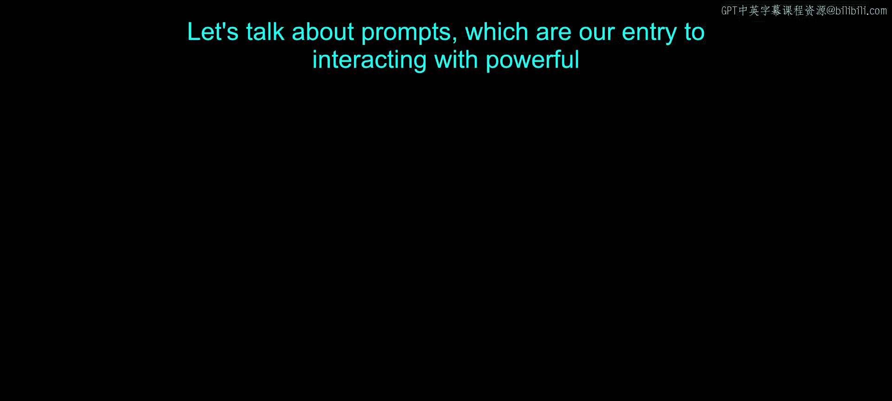
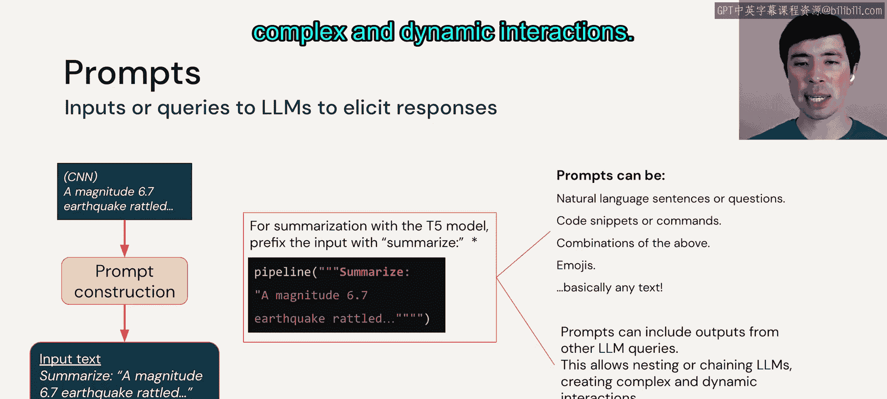
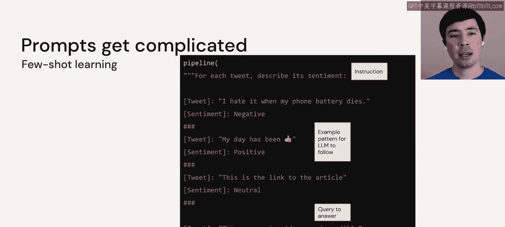
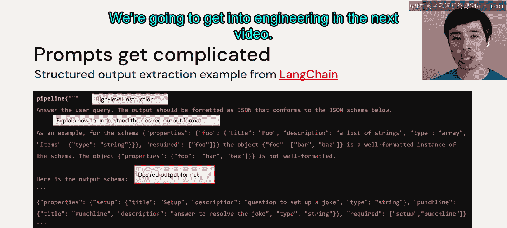

# 15：提示词

在本节课中，我们将要学习与强大语言模型交互的核心技巧——提示词。提示词是引导模型产生期望输出的关键输入，理解其原理和应用是有效使用大语言模型的基础。

## 🧠 什么是提示词？

提示词可以被视为向大语言模型提出的输入或查询，目的是引出特定的回应。这里的重点是“引出”，因为你实际上是在尝试从这个“黑盒”模型中诱导出正确的行为。

## 🔄 指令遵循模型 vs. 基础模型

上一节我们介绍了提示词的基本概念，本节中我们来看看两种不同类型的模型如何与提示词互动。

为了解释什么是提示词，我们先比较一下左侧的基础模型和指令遵循模型。

基础模型在非常通用的文本生成任务上进行预训练。例如，给定蓝色文本，预测序列中的下一个词元，再下一个，或者填充序列中缺失的词元。

而指令遵循模型则经过调优，能够遵循几乎任意的指令或提示。因此，它虽然仍然很通用，但在某种程度上更为具体。

以下是几个例子：
*   “给我三个饼干口味的创意。”——大语言模型会返回一个编号列表。
*   “写一个关于某物的短篇故事。”——它会返回一个短篇故事。

当然，这些都是简单的例子，但提示词工程实际上可以变得非常严肃，并且我们已经看到了一些例子。

## 💡 提示词的构成与形式

提示词的形式非常灵活。更普遍地说，这些提示词可以是自然语言句子或问题、代码、上述内容的组合、表情符号，几乎任何文本形式。它们还可以包含来自其他大语言模型查询的输出，这非常强大，因为它允许嵌套或链式调用大语言模型，从而形成复杂且动态的交互。

我们将在课程后面更多地讨论这一点。

## 📚 提示词工程示例：小样本学习

我们看到了一个更复杂的例子——小样本学习。在这个例子中，一个提示词包含了一条指令和多个示例，这些示例旨在“教导”大语言模型我们期望它在实际查询中做什么。

## 🏗️ 提示词工程示例：结构化输出提取

提示词工程甚至可以更进一步。LangChain为我生成了这个结构化输出提取的例子。它包含多个部分：顶部是非常高层次的指令（例如，“回答用户查询，并符合以下格式”），一个解释如何理解期望输出格式的示例，该输出模式的规范说明，以及最后的指令“给我讲个笑话”。

现在，这个提示词本身不是一个笑话，尽管它看起来有点复杂。这对于某些模型确实有效，并且它能输出一个结构化格式，然后可以将其输入到下游的数据管道中。这只是提示词和提示词工程功能强大的一个很好的例子。

我们将在下一个视频中深入探讨提示词工程。

## 📝 总结

本节课中我们一起学习了提示词的核心概念。我们了解到提示词是引导大语言模型的关键输入，可以是自然语言、代码等多种形式。我们比较了基础模型与指令遵循模型在处理提示词上的区别，并通过小样本学习和结构化输出提取的例子，看到了精心设计的提示词如何能引导模型完成复杂、特定的任务。掌握提示词是有效利用大语言模型能力的第一步。