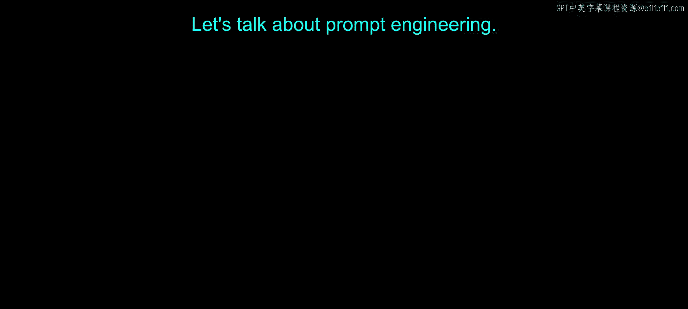
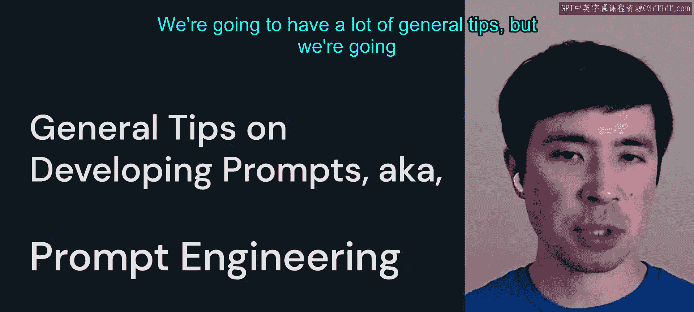
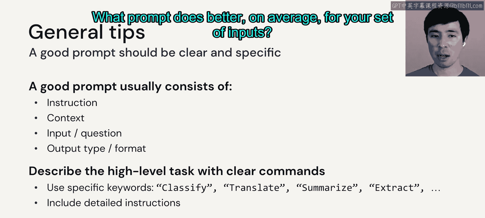
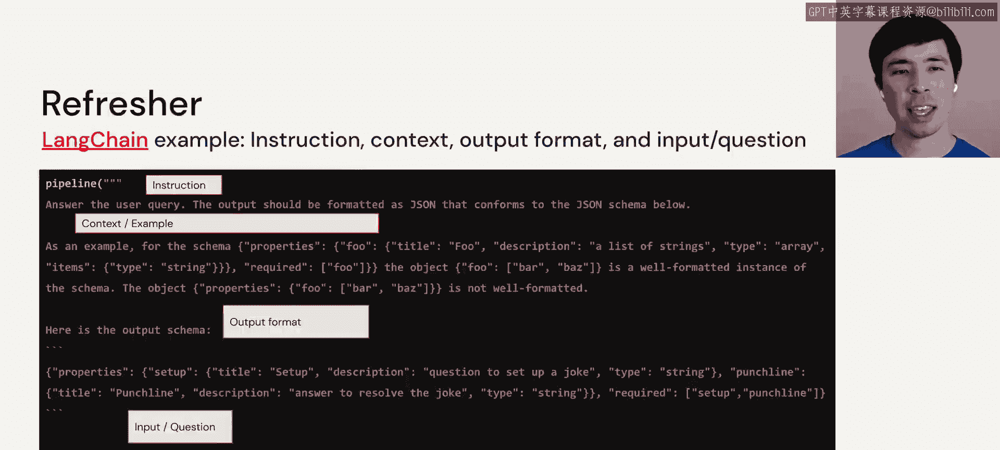
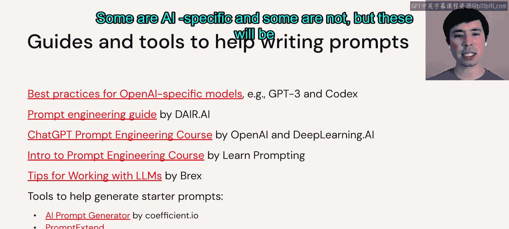
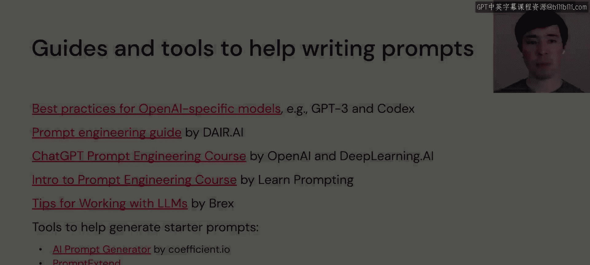

# 16：提示工程 🎯

在本节课中，我们将要学习提示工程的核心概念与实用技巧。提示工程是一门通过精心设计输入文本来引导大语言模型生成期望输出的技术。我们将探讨如何构建清晰、有效的提示，并了解一些高级技巧与潜在风险。

## 概述

提示工程是引导大语言模型完成特定任务的关键。一个好的提示需要清晰、具体，并包含必要的指令、上下文和输出格式要求。需要注意的是，提示工程是**模型特定**的，针对不同模型或不同用例，可能需要不同的提示策略，因此迭代开发至关重要。

## 构建有效提示的通用技巧

上一节我们介绍了提示工程的重要性，本节中我们来看看如何构建一个有效的提示。就像要求人类完成任务一样，对LLM的指令也需要清晰和具体。

一个优秀的提示通常包含以下几个部分：
*   **指令**：明确的任务描述。
*   **上下文或背景信息**：帮助模型理解任务的相关信息。
*   **输入或问题**：需要模型处理的具体内容。
*   **输出类型或格式**：对模型输出结果的明确要求。

你应该使用清晰的关键词（如“分类”、“翻译”等）或包含详细指令来描述高级任务。最后，既然是“工程”，就需要采用数据驱动的方法，针对不同的输入样本测试提示的多种变体，以找到平均效果最佳的提示。

## 提示组件示例回顾

以下是我们在上一视频中看到的LangChain示例，它清晰地展示了提示的各个组成部分：
*   **清晰的指令**：`You are a comedian.`
*   **上下文/示例**：`Here is an example of a joke: ...`
*   **输出格式规范**：`The joke should be exactly two sentences long.`
*   **用户查询输入**：`Tell me a joke.`

## 提升模型思考质量的技巧

除了构建清晰的提示，我们还可以使用一些技巧来帮助模型进行更深入的“思考”，从而获得更好的答案。

以下是几种有效的技巧：
1.  **要求模型不虚构内容**：你可以明确告诉模型“不要编造信息”，这有助于减少“幻觉”现象。
2.  **要求模型不假设或探测敏感信息**：指示模型避免对未提供的信息做出假设。
3.  **要求模型逐步推理**：使用**思维链**技巧，例如要求模型“逐步解释如何解决这个问题”或“分步思考”，这通常能显著提升复杂任务的解决效果。

## 提示格式与安全考量

提示的格式同样重要。使用分隔符（如`###`、`"""`）来区分指令、上下文和用户输入，有助于模型更好地解析你的意图。同时，要求模型返回结构化输出（如JSON、列表）并提供正确示例，能确保输出的一致性。

在用户交互应用中，用户输入可能被包裹在一个更大的系统提示中。这引出了**提示攻击**的概念，即通过操纵输入来利用LLM的漏洞。

以下是几种常见的提示攻击类型及其防御思路：
*   **提示注入**：用户试图让LLM忽略系统指令，转而执行用户输入的恶意指令。防御方法包括在提示末尾重复指令、用随机字符串或标签包裹用户输入，以帮助模型区分。
*   **提示泄露**：诱导模型泄露其系统提示中的敏感信息（如内部指令、代码名）。
*   **越狱**：通过重新措辞绕过模型的内容安全策略或审查规则。

与任何计算机安全问题一样，这是一场应用开发者与攻击者之间的持续攻防。右侧的越狱示例如今已因模型更新而失效，这提醒我们在自己的应用中也需要考虑此类安全更新。

如果其他方法都失败，可以考虑更换模型或限制用户输入的长度。

## 提示工程资源

以下是一些有助于编写提示的指南和工具，有些是AI专用的，有些则通用，它们将是你在后续实验中宝贵的资源：
*   OpenAI 提示工程指南
*   PromptingGuide.ai
*   LearnPrompting.org
*   LangChain 提示模板
*   Semantic Kernel 提示模板

## 总结

本节课中我们一起学习了提示工程的核心要点。我们了解到，构建有效的提示需要清晰、具体，并包含指令、上下文、输入和输出格式。我们探讨了通过要求模型逐步推理（思维链）来提升答案质量，并认识了提示格式的重要性以及提示注入、泄露、越狱等安全风险及其缓解策略。记住，提示工程是一个需要根据具体模型和任务进行迭代和实验的过程。