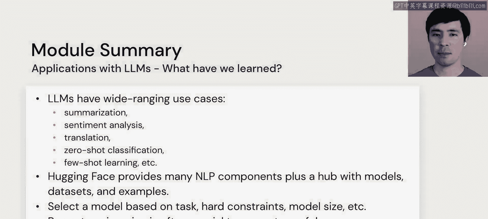

# 17：总结

在本节课中，我们将回顾模块一“LLM应用”的核心内容，总结关于使用大语言模型构建简单应用的关键知识点。

上一节我们探讨了提示工程的各种技巧，现在让我们对整个模块的学习内容进行总结。

以下是本模块的核心要点总结：

*   **广泛的应用场景**：大语言模型拥有广泛的应用场景。我们详细讨论了其中几类任务，并将在后续编码实践中进一步接触它们。
*   **Hugging Face 工具集**：Hugging Face 提供了许多自然语言处理组件，以及一个包含可下载模型、数据集和示例的中心枢纽。这些是能够快速入门的强大工具。
*   **模型选择策略**：为了选择合适的模型，需要考虑你的具体任务、硬性约束（如延迟、成本）、软性约束（如准确性）、模型大小等因素。我们提供了一些建议，但最终需要你根据自身应用需求来决定什么是最重要的。
*   **提示工程的重要性**：提示工程对于从这些强大模型中生成有用的响应至关重要。存在许多技术和技巧，它部分是一门艺术，部分是一项工程。

本节课中，我们一起学习了大型语言模型在简单应用中的基础。我们了解了其广泛的应用潜力，认识了 Hugging Face 这一重要的工具与资源平台，探讨了如何根据任务与约束条件选择模型，并强调了通过精心设计提示词来引导模型生成理想结果的关键性。这些基础知识为我们后续进行实际编码和开发更复杂的应用奠定了坚实的基础。