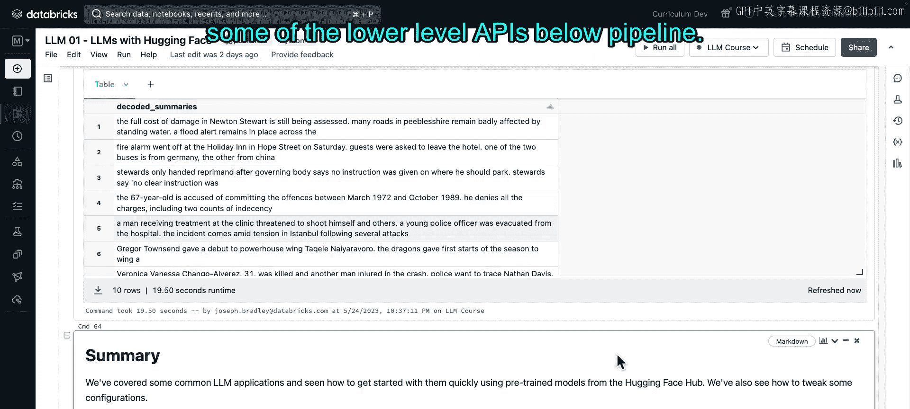

# 18：使用LLM构建应用

在本节课中，我们将快速了解大语言模型的几种主流应用。我们将重点使用开箱即用的开源模型，并借助Hugging Face Hub及其托管的模型来实现。我们还会进行一些简单的提示工程。最后，我们将更详细地探讨Hugging Face API，学习如何配置这些模型管道。

首先，我将安装一个翻译模型所需的库，并运行课堂设置代码。这部分视频我会快速略过。让我们开始了解常见的LLM应用，目标是快速上手。但请注意过程中使用的数据集、模型和API，它们对你未来会很有用。

首先，导入`datasets`和`transformers`库，它们是本节的核心工具。

## 1.1：文本摘要 📝

上一节我们介绍了LLM的概览，本节中我们来看看第一个具体应用：文本摘要。摘要任务有两种形式：抽取式和生成式。我们将在这里进行后者，即生成式摘要。

每次介绍一个任务时，我们都会提供一些背景阅读材料，以及关于数据和模型的信息。

对于本节，我们将使用XSum数据集，它提供了一组BBC文章及其摘要。我们将使用的模型是T5的一个变体，具体来说是拥有6000万参数的小型版本。T5是谷歌推出的一个模型，支持多种任务，如摘要、翻译等，我们将在本笔记本中用它来完成两个任务。

现在加载XSum数据集。我们指定了一个缓存目录，因为我们已经为你预下载了一些数据和模型，并尽可能告诉Hugging Face使用这些预下载的信息。

当我们打印出从`datasets`加载的内容时，它通常是一个包含多个数据集的`DatasetDict`。这里包括训练集、验证集和测试集。我们只使用其中一小部分数据，即`document`和`summary`列，也就是文章和所谓的“真实摘要”。但请记住，在这个任务以及许多其他LLM应用中，“真实”是非常主观的。

我们可以显示一个数据样本，包括文档和摘要。

接下来加载我们的管道。一般来说，当我们加载一个Hugging Face管道时，会指定一个任务，这有助于告诉Hugging Face如何处理你要加载的模型。你可以指定可选的推理参数，例如希望生成的摘要长度，是否截断长文章等。同样，我们已经预下载了模型。

我们可以传入单篇文章或一批文章。传入单篇文章时，你可以看到输出的摘要。它可能不是最漂亮的摘要，但如果你将其与文章比较，会发现它在表达关键信息方面做得不错。

你可能还会看到关于使用生成配置文件的警告，这是Hugging Face的新建议。我们在笔记本中通过像这样指定配置来保持简单，但当你向生产环境迈进时，请考虑生成文件并遵循此URL获取更多信息。在生产中，你可能最终会使用更低级别的API，我们稍后会介绍。

将其应用于一批文章。我们在10篇文章的样本上运行它，并将结果与原始的“真实”摘要进行比较。你可以稍后并排比较这些结果，以了解模型的效果。

## 1.2：情感分析 😊😐😠

我们的下一个任务是情感分析。情感分析是一项文本分类任务，用于评估一段文本是积极的、消极的还是其他标签。

对于数据，我们将使用一组诗歌片段。它带有标签：消极、积极、无影响或混合。我们将使用的模型是BERT的微调版本。BERT是一个著名的基座模型，但我们使用的微调版本是一个非常特定的版本，实际上是在这个诗歌数据集上微调的。我承认，使用在这个数据集上微调的模型本质上是在“作弊”，但它清晰地展示了，如果你找到一个在类似任务上微调过的模型，会非常有益。

加载我们的数据集。可以看到它包括来自诗歌的小片段和标签，标签是数字0到3。稍后，我们会将这些数字转换为文本标签，以便更好地与我们的预测和真实标签进行比较。

加载情感分类器管道。任务将是文本分类，这是一个更通用的任务，但你可以看到它适用于这里，我们希望将文本分类为0、1、2或3标签。然后我们可以在诗歌片段上调用它。

这里我们将其与真实数据合并，将标签从数字转换为文本标签并显示它们。当然，你可以看到在这个数据上微调的模型表现得非常好。稍后，你可以尝试使用同一个模型，但输入你自己写的诗句，这会很有趣。

## 1.3：翻译 🌐

我们的下一个任务是翻译。翻译模型可能为特定的语言对设计，也可能支持两种以上的语言，我们将看看这两种情况。

对于数据，我们只是使用一些硬编码的句子，但我会指出Hugging Face上有翻译数据集。

我们将看的模型首先是，一个非常特定的英语到西班牙语模型，然后又是我们最喜欢的T5小型模型。除了我们刚才谈到的摘要，T5也适用于翻译。

首先，我们加载一个翻译管道，使用那个英语到西班牙语模型，然后我们给它一个英语句子，输出西班牙语。像这样的微调模型如果符合你的任务会非常有用，因为它们非常具体，通常表现得很好。

对于T5，回想一下T5是一个更通用的模型，这里我们说任务是通用的文本到文本生成。它还不知道我们想做翻译，因此当我们调用它时，需要告诉它我们想做什么，例如，翻译英语到法语，输出法语；或者英语到罗马尼亚语，输出罗马尼亚语。

## 1.4：零样本分类 🎯

我们的下一个任务是零样本分类，有时也称为零样本学习。

这里的想法，正如讲座中回顾的，是取一段文本，将其分类到几个类别或标签之一，但我们从未明确训练模型来预测这些特定类别。

这里有一些背景阅读材料。对于数据，我们只是从XSum数据集中挑选了几篇文章。模型是ALBERT基座模型的微调版本，它被专门微调以在零样本分类等任务上有用。

我们可以将其作为零样本分类任务加载，获取模型。然后为了调用这个模型，我们将其包装在这个`categorize_article`函数中。这意味着我们不必每次都重写候选标签，这些标签将文章分类为政治、金融等。然后我们漂亮地打印结果。

让我们在这篇关于体育的文章上调用它。零样本管道确实预测最有可能的标签是体育，并且置信度很高。

然后我们传入这篇关于水灾和风暴损害的文章，这里管道认为它是突发新闻。我相信这是最适用的标签，但请注意，这个标签比其他的更通用一些，并且模型在这里的置信度没有那么高。

## 1.5：少样本学习 ✨

我们的最后一个任务是少样本学习。回想一下，这是你给模型指令、几个查询-响应的示例来说明如何遵循指令，然后是一个新的查询。

这里有一些很好的背景阅读材料。我们在这里并不看特定的任务本身，实际上我们将进行情感分析，然后是一些其他示例任务。因为少样本学习更像是一种技术而非任务，它适用于其他任务。

对于数据，我们只是手动编码了一些示例。我们将使用的模型是GPT-Neo 1.3B。我开始加载它，因为它需要一点时间，它是本笔记本中使用的最大模型。原因是少样本学习通常需要更大、更强大的模型，因为它是一种非常通用的指令遵循任务。

我们将为Hugging Face指定的任务是通用的文本生成。对于大多数这些任务，我们将说只生成10个新标记。这个GPT-Neo模型只是它的13亿参数版本，由Eleuther AI创建。如果你认真对待少样本学习，当然可以考虑他们升级的模型GPT-NeoX，或者其他更通用、更大、更强大的指令遵循或文本生成模型。但为了这个演示和笔记本，我们保持相当小的规模。

在加载时，我将解释我们接下来要做什么。在下面的提示中，我们希望用特殊标记`###`分隔示例。我们将使用相同的标记来鼓励LLM在回答查询后结束其输出。因此，我们将其指定为序列结束标记。

在这个管道加载后，我们将提取其分词器，然后编码这三个`#`符号。我们提取ID，那就是我们的序列结束标记ID。每当我们调用这个少样本管道时，我们给它我们的提示，然后我们还指定使用这个作为序列结束标记ID。

我们从一个没有分隔符的简单示例开始，但你稍后会看到我们的假设。模型加载完成了，但在小实例上花了一点时间。然后我们可以用它来调用。

一个非常简单的提示。请注意，在这个提示中，我们给出了指令，但没有给出任何示例。关键点在于，没有任何示例的答案是糟糕的。这不是情感，而是一个随机的陈述。

如果我们添加一个示例会发生什么？这里我们给出一个推文示例，并说情感是中性的。模型返回了“中性”。这不正确，“音乐视频太棒了”应该是积极的，但模型似乎可能更好地理解了我们的意图。

接下来，我们将为每种情感（消极、积极、中性）各给一个示例，然后是我们的查询。确实，现在模型可能理解我们了，它说情感是积极的，这是正确的。这是一个精心挑选的例子，但它很好地展示了，当你给模型更多示例时，它更有可能理解你。这是提示工程的一个很好的例子。

只是为了好玩，让我们展示更多例子。这里我们要求饮料搭配，我们的查询是“我应该喝什么配司康饼？”。这个模型在饮料变体上实际上做得不是很好。它说你该喝可乐配司康饼，也许对某些人来说是的，但这不是刻板印象中的答案。

这是一个少样本管道，询问“给出一个描述某人感觉的词，这里是‘困惑’。建议一个描述，但不要使用原词”。这次它实际上做得很好：“感觉有点不对劲，不确定你在哪里”。有时它给出好答案，有时给出坏答案。

我们将展示的最后一个管道是“根据标题生成书籍摘要”。这些实际上是取自维基百科的标题和描述。查询是关于书籍《蓝火星》。模型当然不知道《蓝火星》是什么，但它会尝试生成一个最多50个标记长的描述。如果你看描述，它实际上相当合理。

这只是刚刚开始接触提示工程，真正聚焦于少样本学习技术。这里链接了一些资源，当然幻灯片中也有。

## 1.6：Hugging Face API详解 ⚙️

接下来，我们将深入了解Hugging Face API。我们首先想谈谈推理中的搜索和采样，然后是分词器和模型的加载器，即比管道更低级的API。

我们将使用之前提到的XSum样本数据集，包含文章和摘要。

我们在幻灯片中稍微提到了推理搜索和采样，现在让我们更详细地讨论一下。你可能会看到像`num_beams`、`do_sample`等参数被指定，这些是推理配置。

LLM通过预测或生成下一个标记，再下一个，依此类推来工作。目标是生成整体高概率的序列，但它在生成时有点“短视”，不知道整个序列的概率。因此，你可以将其视为在这个巨大空间中进行的一种有点短视的搜索。

要进行这种搜索，基本上有两种主要方法：搜索或采样。

基本搜索是贪婪搜索，这是默认设置，选择下一个最可能的单个标记。束搜索扩展了这一点，通过搜索几条序列路径使其不那么贪婪，这通过`num_beams`参数指定。

采样使我们更具随机性，我们说给定到目前为止生成的标记，我们对下一个标记有一个概率分布，那么为什么不从中采样呢？是的。

Top-K和Top-P采样是将采样限制在最可能标记的技术。极端情况下，这当然就回到了贪婪搜索。但Top-K说将其限制在K个最可能的标记，Top-P说将其限制在最可能的标记，直到概率质量P（介于0和1之间）。

你可以通过`do_sample`参数在搜索和采样之间切换。我强烈推荐查看这篇博客文章，其中有更多关于搜索和采样的信息。

让我们通过摘要任务来运行几个使用示例。请注意，即使我们改变参数，并非所有答案都会不同，这没关系，在某些情况下是预期的。

首先是贪婪搜索。接下来是束搜索，我们有10个束，实际上得到了相同的答案，但请注意它确实花了更长时间，在某些情况下我们可能会得到更好的答案，换句话说，一个更可能的序列。

或者，我们可以设置`do_sample=True`来进行采样。这里我们实际上得到了一个略有不同的答案。很难说哪个更好。这是采样，所以它更具随机性，如果我们再次运行它，实际上会看到一个不同的答案。

这里我们进行采样，但我们说进行Top-K采样，也就是说，每次选择下一个标记时，限制在前10个最可能的标记内，然后也进行Top-P采样。这些都是有用的参数，我认为当你为任务选择它们时，请记住这是任务和数据特定的，因此你可能需要进行一些调整和工程来确定什么是最好的。

好的，这涵盖了推理的主要方法。下一节讨论分词器和模型的加载器。我们已经大量使用了管道，现在我们将转向模型和分词器，其理念是这些是更低级别的抽象，允许对更广泛的管道进行更多控制。

我们将遵循这个模式：给定输入文章，对它们进行分词，将模型应用于分词后的数据，并将摘要解码为人类可读的文本。

我们将从使用这些`Auto`类开始。这些基本上是给定一个预训练模型名称，然后“做正确的事情”，将它们加载到正确的分词器和模型子类中。

这里我们使用上面的T5小型模型。使用`AutoTokenizer`，调用`from_pretrained`，给它模型名称，当然我们已经为你下载了它。模型本身也是如此，只是这次我们使用这个用于序列到序列语言模型的`AutoModelForSeq2SeqLM`。

加载它。现在，我们有了独立的分词器和模型，而不是管道。这是一个通用的分词器和模型。因此，由于我们没有告诉Hugging Face这是一个摘要管道，我们需要知道T5实际上需要一个前缀`summarize:`，所以我们将把它作为提示添加到每篇文章的开头。

让我们这样做。你可以看到它被添加到了每篇文章的开头，现在我们可以对这些文章进行分词，指定潜在的配置，例如我们希望处理的最大文章长度，如果文章太长则截断，如果太短则填充，以及使用PyTorch张量。

这里，正如我们在幻灯片中提到的，`input_ids`是文章本身。`attention_mask`告诉模型，对于这篇文章，忽略文章的后半部分，因为它只是用零填充的。对于这篇文章，我们实际上可能截断了它，因为我们使用了整个编码后的文章。就我们的目的而言，你不需要对注意力掩码了解得更多。

然后我们调用`model.generate`，传入`input_ids`、`attention_mask`和一些推理参数。`num_beams`，我们进行简单的束搜索，然后我们想要一个长度在0到40个标记之间的摘要。

我们可以打印出来，这些当然仍然是编码后的，所以在下一行我们将忽略编码，因为我们无法阅读它。下一行我们将使用分词器进行批量解码，并且我们说跳过特殊标记，这样它就不会打印出像序列结束标记这样的特殊标记。我们显示这些，它们又是摘要。所以你可以看到，通过将管道分解为独立的分词器和模型，我们如何能够为推理和分词等指定更多参数。我们还可以插入自己的自定义预处理或后处理逻辑。

上面我们使用了`Auto`类，我想提一下，对于特定的模型架构，Hugging Face提供了针对这些架构的分词器和模型，例如这里的T5。

这与我们刚才用`Auto`模型看到的工作流程相同，只是我们使用了这些架构特定的类。`Auto`模型为我们处理了这一点，但这只是为了展示你可以进一步将这些分解为更低级别的API。

我不会讨论所有配置，因为我相信我保持了它们相同。但请注意，有时像这样的模型架构类可能提供超出`Auto`类所能提供的配置，这是你可能在API中走得更低，并利用其中一些较低级别类的一个原因。

这里又是摘要。

## 总结 📚

本节课中我们一起学习了多种常见的LLM应用，包括如何快速上手、如何调整推理配置，以及如何使用管道之下的一些较低级别API。我们涵盖了文本摘要、情感分析、翻译、零样本分类和少样本学习等任务，并深入探讨了Hugging Face的推理参数（如搜索与采样）以及如何直接操作分词器和模型。这些知识为你进一步探索和构建自己的LLM应用奠定了基础。