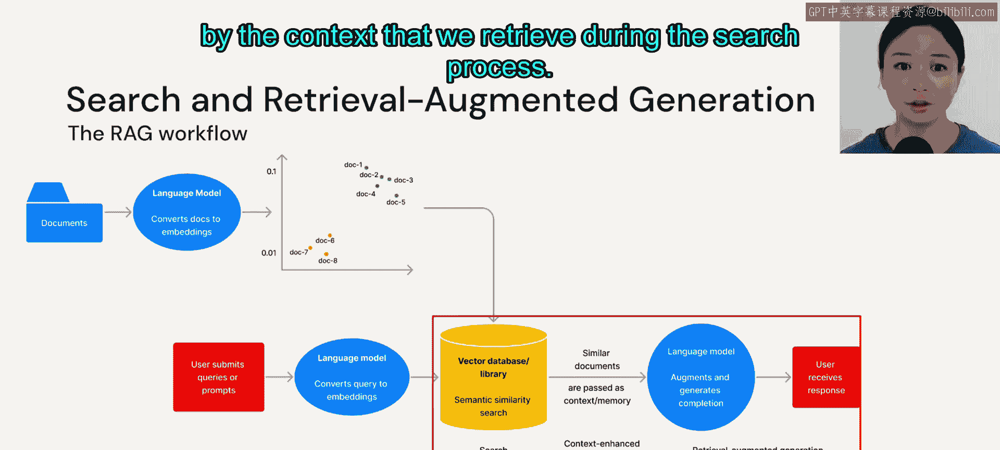

# 20： 模块概览

在本节课中，我们将学习如何利用嵌入向量、向量数据库和搜索技术来构建问答系统。Ote 提到，大语言模型是推理引擎，其目标是处理信息并将其作为有意义的输出返回给用户。

上一节我们介绍了大语言模型作为推理引擎的基本概念，本节中我们来看看如何具体应用这些技术。

## 模块学习目标

在本模块结束时，你将能够理解不同的向量搜索策略以及如何评估搜索结果。你还将理解何时应使用向量数据库，何时应使用向量库或向量插件。我们将通过讨论使用这些解决方案时的最佳实践以及如何提升搜索和检索性能来结束本模块。

## 语言模型获取知识的两种方式

语言模型学习知识主要有两种途径。

第一种是我们在自然语言处理领域多年来常见的方式：从头开始训练模型或对现有模型进行微调。这意味着我们在训练过程中更新模型的权重。我们将在后续模块中更详细地讨论微调。

第二种方式相对较新，与提示工程紧密相关，即**将知识作为模型输入传递**。在本模块中，我将交替使用“知识”和“上下文”这两个术语，它们在这里含义相同。我们将通过提示词传入上下文，要求语言模型在输入中结合这些上下文。

因此，本模块将涵盖：我们如何找到相关的知识，以及如何在实际的问答系统中结合嵌入向量和向量数据库。

## 为何要向语言模型传递上下文？

首先，我们需要理解为何要向语言模型传递上下文。如前所述，微调是模型学习知识的另一种方式，通常更适用于专门的任务。这好比你在为两周后的考试学习，可能会忘记一些细节，但总体上对知识有了更好的内化。

另一方面，向模型传递上下文就像开卷考试。它能帮助你更精确，因为你可以随时参考手头的事实。

然而，其缺点是存在上下文长度限制。以 OpenAI 的 GPT-3.5 模型为例，它最多允许 4000 个令牌，大约相当于五页文本。考虑到大多数文档（例如员工手册）很容易超过五页，这个长度并不算长。因此，一个常见的解决方案是传入文档摘要，或者将文档分割成块，这也是我们将在本模块后面讨论的策略。

Anthropic 最新的 Claude 模型可以容纳多达 10 万个令牌的上下文。截至 2023 年 5 月中旬，该功能处于预览阶段。虽然能够传入更长的上下文，但随之而来的是更高的 API 调用成本和更长的模型处理时间。

许多研究人员认为，仅增加上下文长度并不能帮助模型在不同会话间保留信息。并且，与人脑不同，模型会平等对待上下文中的每一条信息。因此，我们可能需要新的模型架构来解决上下文处理问题。

## 向量搜索与向量数据库的重要性

你在入门课程中见过这张幻灯片。我们讨论向量搜索的根本原因在于，我们需要先将上下文或知识转换为嵌入向量，然后才能进行任何相似性搜索。

我们也看到向量数据库日益流行。如果说 2021 是图数据库之年，那么 2023 年很可能就是向量数据库之年。这是为什么呢？

因为向量数据库不仅对文本用例有用，对其他类型的非结构化数据同样有用，包括图像数据和音频数据。我们将这些图像或音频文件转换为嵌入向量，存储在向量数据库中，并可为各种任务检索它们。在这张幻灯片中，你可以看到任务范围非常广泛，从物体检测、产品搜索、翻译、问答到音乐转录，甚至识别机器故障。

以下是向量数据库的几个用例示例：

*   **构建知识库问答系统与查找重复项**：通过向量搜索计算向量间的相似度，这对于构建基于知识的问答系统和查找重复项非常有帮助。
*   **构建推荐引擎**：业界使用向量搜索和向量数据库构建推荐引擎。例如，Spotify 发布的一篇博客文章就介绍了他们如何利用向量数据库，基于用户查询为播客节目构建推荐引擎。
*   **异常检测与安全威胁发现**：我们也可以使用向量数据库或广义的向量搜索来发现异常和检测安全威胁。

## 问答系统的工作流程

既然我们已经了解了向量搜索和向量数据库为何有用，接下来让我们看看如何实际实现一个问答系统的工作流程。

一个基于知识的问答系统通常包含两个组件：**搜索**和**检索**。但首先，问答系统假设你有一个可以使用的知识库，即下图中红色框内的部分。

因此，我们首先需要将文档知识库转换为嵌入向量，然后将这些嵌入向量通过向量库或向量数据库存储到一个向量索引中。**向量索引**是一种便于向量搜索过程的数据结构，我们稍后会详细讨论。

我们还将讨论向量库和向量数据库之间的区别。目前，你可以将所有向量存储解决方案视为一个**向量存储**。

将所有这些文档作为嵌入向量存储在数据库或库中之后，下一步就是允许用户提交查询。

用户输入的任何自然语言查询也必须通过语言模型转换为嵌入向量。

之后，我们现在可以搜索包含文档嵌入向量的向量索引，并返回与用户查询相关的文本。这个确定哪些文档与用户查询相关或相似的步骤，就是工作流程中的**搜索**组件。

最后，在检索到所有相关文档后，我们可以将这些文档称为上下文或知识。然后，我们将在一个提示词中将此上下文传递给语言模型。这意味着我们的语言模型现在将收到一个由上下文增强的查询，并最终生成一个结合了上下文的文本输出。

因此，整个工作流程被称为**搜索与检索增强生成**工作流程，因为语言模型生成的输出由我们在搜索过程中检索到的上下文所增强。

## 总结

本节课中，我们一起学习了构建基于大语言模型的问答系统的基本原理。我们探讨了语言模型获取知识的两种方式，重点分析了通过传递上下文来增强模型能力的优势与限制。我们还介绍了向量搜索和向量数据库的核心概念及其广泛应用场景。最后，我们详细拆解了搜索与检索增强生成工作流程的各个步骤，为后续深入技术细节奠定了基础。