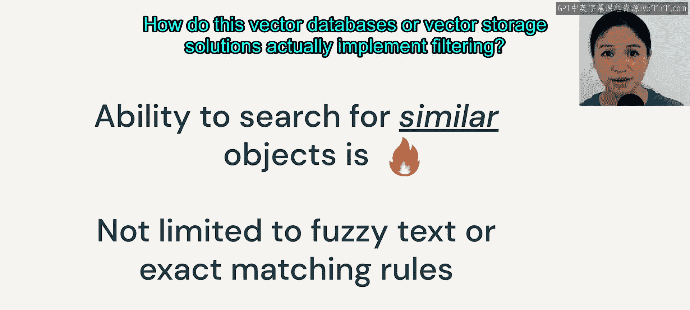

# 21：向量搜索如何工作 🔍

在本节课中，我们将要学习向量搜索的核心工作原理。我们将探讨向量搜索的两种主要策略，理解如何衡量向量之间的相似性，并深入了解两种流行的向量索引算法：Faiss和HNSW。最后，我们会简要介绍向量数据库如何实现过滤功能。

---

我们刚刚讨论了搜索和检索增强生成的高层工作流程，现在让我们来谈谈向量搜索。

在向量搜索中，主要有两种策略：**精确搜索**和**近似搜索**。

顾名思义，精确搜索意味着你使用一种暴力方法来寻找最近邻。这种方法几乎没有误差空间，这正是传统的K近邻算法所做的。

而近似最近邻搜索，你找到的是不那么精确的最近邻，但你在速度上获得了优势。以下是一些常见的索引算法，我们可以称它们为索引算法，因为这些算法的输出是一种称为**向量索引**的数据结构。正如我们在前面部分提到的，向量索引帮助你保存所有必要的信息，以进行高效的向量搜索。

在这些算法中，我们可以看到它们要么基于树的方法，要么基于聚类或哈希。我们将介绍其中两种：**Faiss**和**HNSW**，它们是向量存储库实现的最流行的两种算法。

但首先，让我们谈谈我们如何实际确定两个向量是否相似？

答案是使用**距离**或**相似性度量**，这对你们很多人来说可能不是一个陌生的概念。对于距离度量，我们常见的有L1曼哈顿距离或L2欧几里得距离。欧几里得距离通常是更受欢迎的选择。

因此，你可以看出，当距离度量值越高时，向量的相似性就越低。

另一方面，我们也可以使用**余弦相似度**来衡量向量之间的相似性。当相似性度量值最高时，意味着你的向量更相似。

同样值得指出的是，当你在归一化的嵌入向量上使用L2距离或余弦相似度时，它们会产生功能上等效的向量排序距离。如果你对此感兴趣，可以在网上搜索数学证明。

稠密嵌入向量通常占用大量空间，减少内存使用的一个常见方法是使用**乘积量化**来压缩向量，缩写为PQ。

这个花哨的方法PQ，本质上只是减少了字节数，而量化指的是我们如何使用一个更小的向量集合来表示向量。

非常粗略地说，量化意味着你可以将一个数字向下舍入或向上舍入。但在最近邻搜索的背景下，我们从原始的大向量开始，然后将这个大向量分割成子向量段，每个子向量被独立量化，然后映射到最近的质心。

假设第一个子向量最接近第一个质心，即质心1，那么我们将用值1替换向量值。现在你可以开始看到我们如何实际减少字节数：我们存储一个整数值，而不是存储许多浮点数。

---

我们现在将更深入地讨论向量索引算法。**Faiss**代表Facebook AI相似性搜索。

它是一种聚类算法，计算查询向量与所有其他点之间的欧几里得距离。正如你可以想象的，随着向量越来越多，计算时间只会增加。

为了优化搜索过程，Faiss利用了所谓的**Voronoi单元**。它的作用是，不是计算存储中每个向量与查询向量之间的距离，而是首先计算查询向量与质心之间的距离。

一旦它识别出与查询向量最接近的质心，它就会找到存在于同一个Voronoi单元中的所有其他与查询向量相似的向量。这对于稠密向量效果很好，但对于稀疏向量效果不佳。

---

另一种常见的实现算法是**HNSW**，它代表分层可导航小世界。它也使用欧几里得距离作为度量，但它不是基于聚类，而是基于邻近图的方法。

这里可能有很多细节，但我们将专注于构成HNSW的主要结构组件。

第一个是我们称之为**链表**或**跳表**的结构。在左侧图像中，你会看到当我们从第0层移动到第3层时，我们跳过了越来越多的中间节点或顶点。我们通过从左到右遍历来寻找最近邻，如果我们超过了目标，我们将向下移动到前一层。

但是，如果有太多的节点需要我们构建很多层呢？答案是引入**层次结构**。让我们看看右上角的图像：我们从预定义的入口点开始，然后遍历图以找到局部最小值，即向量实际上最接近查询向量的位置。

---

我们刚刚介绍了向量搜索策略，我想强调的是，搜索相似向量的能力实际上并非易事，因为它极大地扩展了我们可能的应用场景。我们不再局限于编写受精确匹配约束的代码。事实上，当我们进行精确匹配时，我们使用的是过滤语句，而众所周知，SQL过滤语句通常不够灵活。

所以，这就是我们接下来要讨论的内容：这些向量数据库或向量存储解决方案如何实际实现过滤？

---

本节课中我们一起学习了向量搜索的基本原理，包括精确与近似搜索策略、相似性度量方法（如欧几里得距离和余弦相似度），以及两种关键的索引算法Faiss和HNSW的工作原理。我们还了解到向量压缩技术和向量数据库过滤功能的重要性，为后续理解检索增强生成打下了基础。