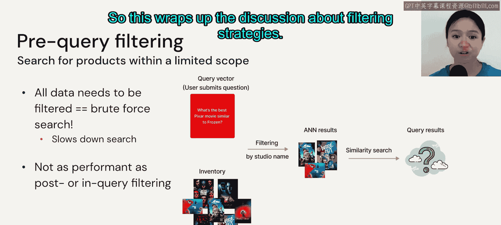
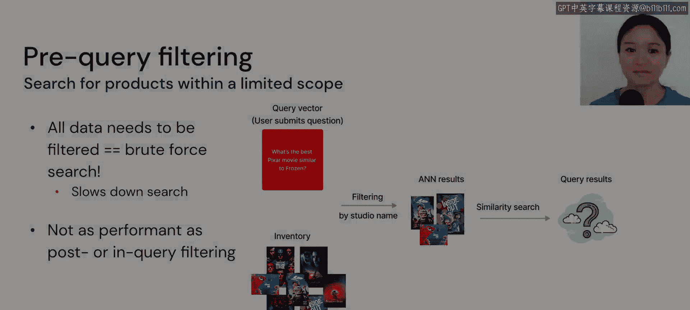

# 22：向量数据库中的过滤策略 🔍

在本节课中，我们将要学习向量数据库中一个至关重要的功能：过滤。我们将探讨三种主要的过滤策略，理解它们的工作原理、各自的优缺点以及适用场景。

上一节我们介绍了向量搜索的基本概念，本节中我们来看看如何结合元数据过滤来优化搜索结果。

## 概述

在向量数据库中进行搜索时，我们常常需要根据特定条件（如品牌、价格、类别）来缩小结果范围。这个过程被称为过滤。实现高效的过滤颇具挑战，不同的向量数据库采用了不同的策略。理解这些策略有助于我们根据应用需求选择合适的方法。

## 过滤策略详解

过滤策略主要分为三类：查询后过滤、查询中过滤和查询前过滤。一些向量数据库也基于这些类别实现了专有的过滤算法。

### 查询后过滤

查询后过滤是指在完成向量相似性搜索、找到最邻近的K个结果后，再根据元数据条件进行筛选。

以下是其工作流程：
1.  执行向量搜索，获取与查询向量最相似的Top-K个结果。
2.  对这K个结果应用元数据过滤器（例如，`studio == "Pixar"`）。
3.  返回满足过滤条件的最终结果。

这种方法的优点是能够充分利用近似最近邻搜索的速度。然而，其缺点是返回的结果数量高度不可预测，甚至可能没有任何结果满足过滤条件。

### 查询中过滤

查询中过滤是一种同时进行向量相似性计算和元数据过滤的算法。

以下是其核心特点：
*   系统需要同时加载向量数据和用于过滤的标量数据（元数据）。
*   在搜索时，同时计算向量相似度和匹配元数据条件。

这种方法对系统内存要求较高，因为它需要同时处理两种数据类型。当应用大量过滤器时，可能会遇到内存不足的问题。但它非常适合基于行的数据存储格式，因为这种格式需要一次性读入整行数据的所有列。

### 查询前过滤

查询前过滤是指在执行向量搜索之前，先根据元数据条件限定一个待搜索的数据子集。

以下是其工作方式：
1.  应用过滤器，确定一个候选数据集（例如，所有 `brand == "Nike"` 的商品）。
2.  仅在这个缩小的数据集内进行向量相似性搜索。

这种方法的缺点是无法利用近似最近邻搜索的速度优势，因为过滤后的数据可能不再支持高效的索引结构，从而需要以暴力计算的方式搜索。因此，其性能通常不如前两种方法。

## 总结

本节课中我们一起学习了向量数据库中的三种过滤策略。**查询后过滤**速度最快但结果不可控；**查询中过滤**能同时保证相关性和准确性，但对资源要求高；**查询前过滤**逻辑简单但可能牺牲搜索性能。理解这些策略的权衡，对于设计高效、精准的检索系统至关重要。

下一节，我们将更深入地探讨向量存储的相关内容。