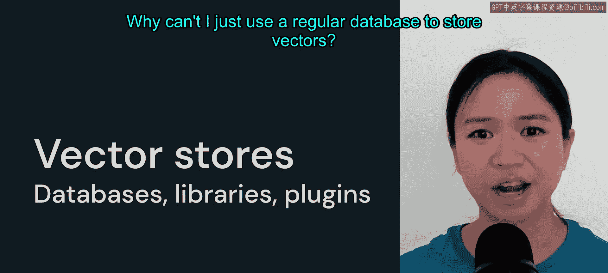
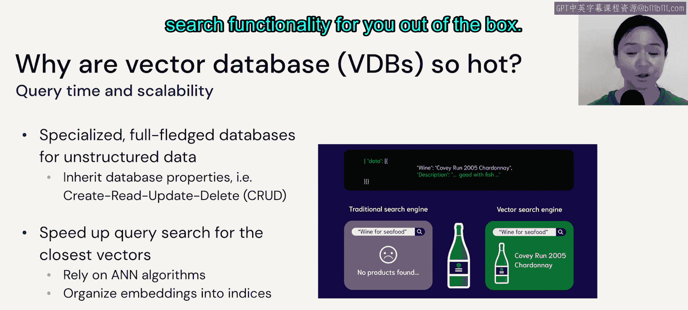
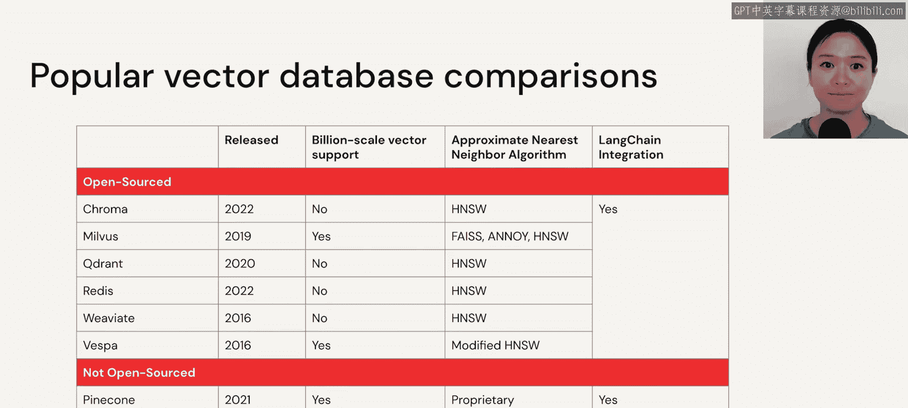

# 23：向量存储库 🗄️

在本节课中，我们将要学习如何与向量进行交互，核心是理解向量存储库的概念、类型及其应用场景。我们将探讨向量数据库、向量库和插件之间的区别，并帮助你根据实际需求做出合适的选择。

---

上一节我们介绍了向量索引的基本概念，本节中我们来看看如何存储和高效检索这些向量。

我们进入更实际的层面：如何与这些向量交互。答案是使用向量存储库。宽泛地说，当我谈论向量存储库时，它可以包括向量数据库、向量库，以及构建在现有常规数据库之上的插件。

但为什么需要关心向量存储库？为什么不能直接用常规数据库来存储向量？

---

向量存储库与常规数据库的差异并不太大。具体来说，向量数据库实际上就像一个常规数据库，它继承了完整的数据库特性，例如 **CRUD**（创建、读取、更新和删除）。

但向量数据库专门用于将非结构化数据存储为向量。事实上，向量存储库的差异化能力在于提供“搜索即服务”。你无需自己实现搜索算法，向量存储库为你提供了开箱即用的搜索功能。

---

那么向量库或插件呢？我们先谈谈向量库。

向量库确实会为你创建向量索引。正如我们在前几节提到的，向量索引是一种数据结构，能帮助你进行高效的向量搜索。

因此，如果你不想集成一个新的数据库系统，使用一个能为你创建这些向量索引的向量库是完全可行的。

一个向量索引通常包含三个不同的组成部分：
1.  一个可选的预处理步骤，通常由用户自己实现，你可能需要对嵌入进行归一化或降低嵌入维度。
2.  主要步骤涉及实际的索引算法，例如我们讨论过的 **FAISS** 和 **HNSW**。
3.  最后一个可选的后处理步骤，你可能希望进一步量化或哈希化你的向量，以优化搜索速度。

对于小型静态数据集，像 **FAISS** 这样的向量库通常就足够了。

所有向量库都不具备数据库属性。这意味着你不能期望向量库具备向量数据库的属性，例如支持 **CRUD**、数据复制、或将数据存储到磁盘。你可能需要等待完整的数据导入完成后才能查询。这也意味着，每次你对数据进行更改时，向量索引都必须从头开始完全重建。

因此，是使用向量数据库还是向量库，实际上取决于你的数据变更频率，以及你是否需要向量数据库所附带的全功能数据库属性。

另一方面，也存在一些现有的关系数据库或搜索系统，它们提供向量搜索插件。这些插件通常支持的度量标准或 **ANN**（近似最近邻）算法选择较少，但即使在接下来的几个月里，我们看到这类插件的向量搜索支持大幅增加，我也不会感到惊讶。

---

现在，让我们更深入地讨论一下向量数据库的选择。

首先请记住，无论你是否使用向量数据库，都不会影响底层 **ANN** 算法的速度。这个决定主要基于三个因素：
1.  你的数据量有多大？通常，只有当你有数百万或数十亿条记录时，才会看到使用向量数据库的必要性。
2.  你实际需要的查询时间（即服务延迟）有多快？
3.  正如前面提到的，你是否真的需要全功能的数据库属性？

如果你的数据大部分是静态的，并且不期望频繁更新数据，那么不使用向量数据库通常是一个不错的起点。在这种情况下，你通常可以先从使用向量库开始。

但是，如果你的数据变化很快，先离线计算嵌入，然后将其存储在向量数据库中供后续按需查询，这种方式可能成本更低。这样你也可以避免使用在线模型来动态计算嵌入。

当然，毫不意外，在架构中添加向量数据库的缺点意味着你需要为一项额外的服务付费，并且你还需要学习、集成和维护另一个系统。

如果你有兴趣探索向量数据库，我提供了一些流行选择之间的初步比较。请注意，这里的信息可能会随着时间的推移而演变。

---

最后，我们以一些最佳实践来结束本节。

本节课中我们一起学习了向量存储库的核心概念。我们区分了向量数据库、向量库和插件，并分析了根据数据量、更新频率和功能需求来选择合适工具的决策框架。理解这些是构建高效大语言模型应用的重要一步。