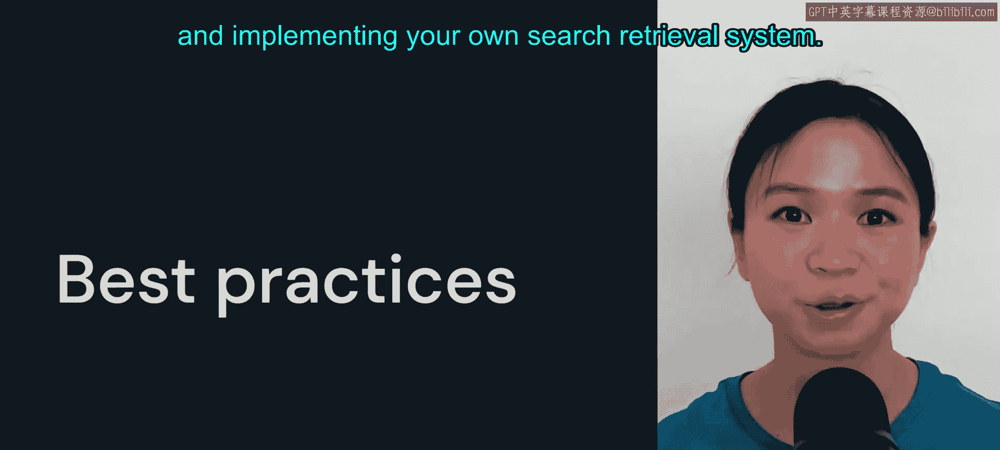
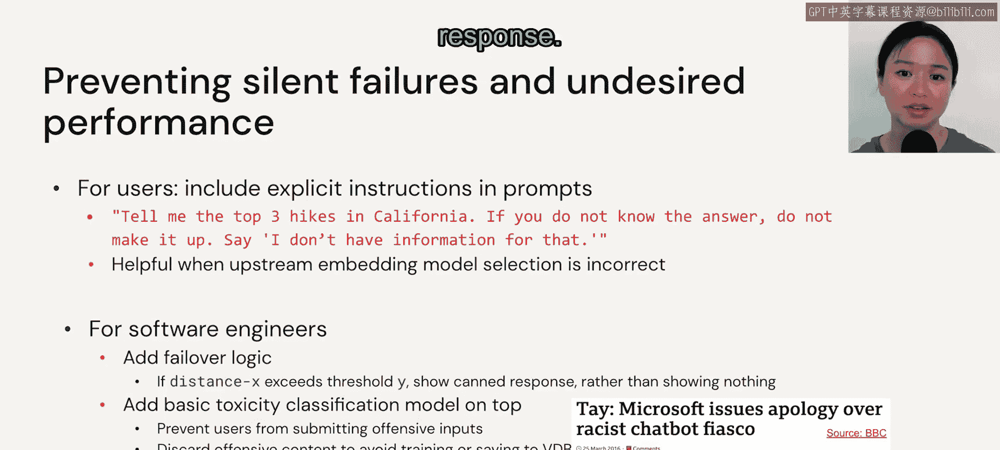

# 24：最佳实践

在本节课程中，我们将总结本模块，并围绕使用向量数据库和实现自己的搜索检索系统，介绍一些最佳实践。我们将探讨何时需要使用向量数据库，以及如何通过选择嵌入模型和优化文档存储策略来提升检索性能。

## 是否总是需要向量数据库？🤔

这是最核心的问题：你是否总是需要使用向量数据库？许多用户可能一直将数据（尤其是非结构化数据）存储在常规数据库中，并且效果良好。如果你属于这种情况，不必急于将向量数据库纳入你的架构。

在LLM的语境下，是否需要向量数据库（无论是专门的向量数据库、库，还是在关系型数据库之上的插件），归根结底取决于：**你是否需要进行上下文增强？** 向量数据库通过知识扩展了LLM的能力。你可以提供相关的向量查找，从而扩展上下文。这有助于事实回忆，也能缓解我们将在模块5深入探讨的“幻觉”问题。

然而，有些用例可能不需要上下文增强来辅助事实回忆，例如：
*   **摘要**
*   **文本分类**（包括情感分析）
*   **翻译**

对于这些用例，不使用向量数据库通常是安全的。

## 如何提升检索性能？🚀

为了使用户获得更好的响应，可以从两个高层策略入手：一是**嵌入模型的选择**，二是**文档的存储方式**。

### 关于嵌入模型的建议

以下是关于嵌入模型选择的两个要点。

**第一，明智地选择你的嵌入模型。** 一个可以自问的代理问题是：你当前的嵌入模型是否在与你数据相似的数据上训练过？如果答案是肯定的，那么你可以继续使用该模型。如果答案是否定的，你有两个选择：
1.  寻找并使用另一个预训练的嵌入模型。
2.  基于你的数据集训练自己的嵌入模型，或对现有嵌入模型进行微调。

后者在NLP领域已有多年历史，是一种非常成熟的方法。在ChatGPT或聊天机器人热潮之前，我们经常讨论像FastText和Word2Vec这样的词嵌入。

**第二，确保你的嵌入空间能够覆盖你的所有数据，包括用户查询。** 例如，如果你的数据是关于电影的，而用户查询医学问题，那么搜索检索系统的性能肯定会很差。因此，务必确保向量数据库中的文档包含与查询相关的信息。类似地，如果你希望文档和查询处于相同的嵌入空间（这对于返回相关结果至关重要），请使用相似的模型来为它们建立索引。

### 关于文档存储策略的建议

在讨论文档存储策略之前，需要说明一点：如何最佳地存储文档尚无明确定论，但我会分享一些供你参考的观点。

在文档存储方面，我们有两种选择：
1.  **将整个文档作为一个整体存储。**
2.  **将单个文档分块存储。** 这意味着我们将一个文档分割成多个块。每个块可以是一个段落、一个章节，或者任何你自定义的单元。这意味着一个文档可以产生多个向量。

你的分块策略可能决定了返回的块与查询本身的相关性。但你还需要考虑，在模型的令牌限制内，你实际上能容纳多少上下文或块？你是否需要将此输出传递给下一个LLM？（将输出传递给另一个LLM是本模块未涉及的内容，我们将在模块三讨论。）

举例来说，如果你有4个文档，总计2000个令牌，你可以选择将每个文档均匀分割成大约500个令牌的块。但要知道，分块策略高度依赖于具体用例。在机器学习中，我们常说模型开发通常是一个迭代过程，你绝对也应该以同样的方式对待分块策略：尝试不同的大小和方法。

你的文档有多长？是单句还是多句？如果一个块只包含一个句子，那么你的嵌入将只关注该特定句子的具体含义。但如果你的块包含多个段落，那么你的嵌入将捕获文本的更广泛主题。你可以按标题、章节或段落进行分割。

你还应考虑用户行为。你能预测用户查询的长度吗？如果查询较长，那么查询嵌入与返回的块更好对齐的几率就更高；但如果查询较短，则往往更精确，此时使用较短的块可能更有意义。

正如我提到的，分块的最佳实践尚无明确定论，但你可以自行阅读一些关于此主题的现有资源。

## 如何添加防护措施？🛡️

假设我选择了错误的嵌入模型，并且分块策略不佳，我们能否添加一些防护措施来防止静默失败或性能不佳？

**对于用户而言**，正如我们在模块1中讨论的，在提示词中包含明确的指令会很有帮助。例如，你可以告诉模型如果不知道答案就不要编造。这有助于你了解模型的局限性，而不是依赖不可靠的输出。

**对于软件工程师**，可以考虑以下几点：
1.  **添加后备逻辑**：例如，如果距离超过某个阈值，你可能需要显示一个通用的响应列表，而不是什么都不显示。回到耐克鞋的例子，如果没有返回耐克鞋，你或许可以显示一个用户可能购买的最受欢迎鞋款的通用列表。
2.  **处理毒性内容**：你可以在上层添加一个基本的毒性分类模型，以防止用户提交攻击性输入。2016年，微软发布了一个名为Tay的聊天机器人，由于用户开始提交种族主义言论，它最终变成了一个非常种族主义的聊天机器人。通过在上层设置一些防护模型，有助于防止聊天机器人的行为偏离你的预期。
3.  **丢弃攻击性内容**：你也可以选择丢弃所有攻击性内容，以避免在这些内容上进行重新训练或微调。
4.  **配置超时**：最后，你还应考虑配置你的向量数据库，使其在查询耗时过长时超时。这可能表明没有找到相似的向量。

## 总结 📝

本节课我们一起学习了使用向量数据库和构建检索系统的最佳实践。我们探讨了决定是否使用向量数据库的关键因素（上下文增强需求），并学习了通过谨慎选择嵌入模型和优化文档分块策略来提升检索性能的方法。最后，我们还了解了如何为用户和工程师添加防护措施，以应对模型选择或策略不当的情况，确保系统更稳健可靠。