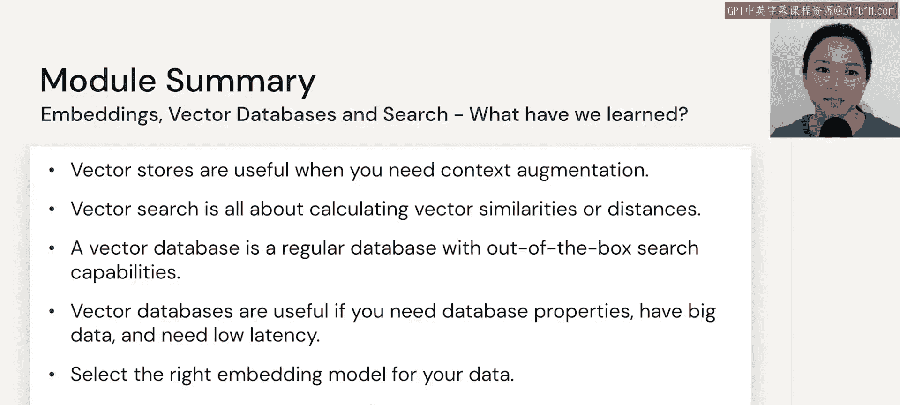

# 25：总结

在本节课中，我们将对模块二的核心内容进行回顾与总结。我们将梳理关于嵌入向量、向量搜索以及向量数据库的关键概念，并明确它们的适用场景。

在之前的章节中，我们深入探讨了嵌入向量、向量搜索以及向量数据库。现在，让我们快速回顾一下核心要点。

向量存储方案可以包含多种形式。

以下是几种主要的向量存储方案：
*   **向量数据库**：专门为存储和检索向量数据而设计的数据库。
*   **向量库**：提供向量操作功能的软件库。
*   **关系数据库上的搜索插件**：在传统关系型数据库基础上增加向量搜索能力的扩展工具。

向量存储并非适用于所有文本处理场景。它们仅在需要进行上下文增强时才有用，并非所有文本用例都需要此功能。

上一节我们介绍了向量存储的形式，本节中我们来看看向量搜索的本质。

向量搜索的核心是计算向量之间的相似度与距离。这通常通过特定的数学公式来衡量。

以下是衡量向量相似度的常见方法：
*   **余弦相似度**：`similarity = cos(θ) = (A·B) / (||A|| ||B||)`，衡量两个向量方向上的差异。
*   **欧几里得距离**：`distance = √(Σ(A_i - B_i)²)`，衡量两个向量在空间中的直线距离。
*   **点积**：`similarity = A·B = Σ(A_i * B_i)`，在向量已归一化时，其效果与余弦相似度等价。

接下来，我们探讨何时需要考虑使用专门的向量数据库。

如果你在犹豫是否需要为向量使用数据库，可以这样理解：向量数据库本质上是一个具备强大向量搜索能力的常规数据库。

在以下情况下，使用向量数据库是合适的选择：
*   你需要数据库的典型属性（如持久化、事务支持）。
*   你处理的是大规模数据。
*   你对服务延迟有非常严格的要求。

最后，要构建一个高效的知识库检索系统，有几个关键因素不容忽视。

一个优秀的基于知识的搜索检索系统需要精心设计。

以下是构建高效检索系统的关键步骤：
*   **选择合适的嵌入模型**：根据你的数据类型（如文本、代码、图像）选择最合适的模型来生成向量表示。
*   **迭代文档分割策略**：文档如何被切分或分块会极大影响检索效果，通常需要多次实验和调整。

至此，本模块的理论讲解部分就结束了。接下来，我们将一起查看一些相关的实践代码。

本节课中我们一起学习了向量存储的多种形式、向量搜索的基本原理，以及向量数据库的适用场景。我们还总结了构建知识检索系统的关键步骤，包括选择嵌入模型和优化文档分割策略。掌握这些概念是有效利用大语言模型进行上下文增强的基础。