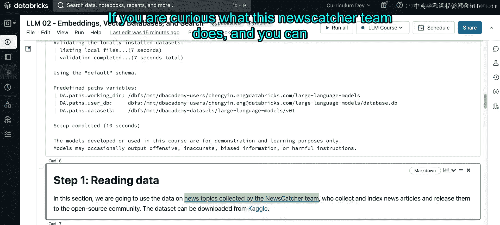
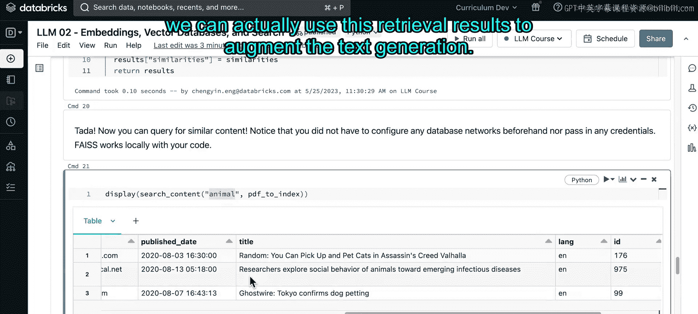

# 26：Notebook 演示第一部分 🧠


在本节课程中，我们将学习如何将文本转换为嵌入向量，将这些向量存储到数据库中，并在此基础上进行搜索。我们将探索两种不同的向量存储解决方案：**Faiss**（一个向量库）和**Chroma DB**（一个开源向量数据库）。

## 概述

上一节我们介绍了搜索与检索的工作流程。现在，我们将深入一个具体的代码示例。本笔记本将演示如何利用Faiss库，将新闻数据集转换为向量，建立索引，并执行相似性搜索。

## 数据准备



首先，我们来看看将要使用的数据。这是一个名为“news”的数据集，由newsketer团队收集。数据集包含8000多行，每一行代表一篇新闻文章，记录了新闻主题、来源、发布日期、标题、语言以及每篇文章的唯一ID。


```python
# 示例：读取数据集
df = spark.read.parquet(DA.paths.datasets)
print(f"数据集行数: {df.count()}")
```

以下是数据集的列表示例：
*   **topic**: 新闻主题
*   **source**: 新闻来源
*   **published_date**: 发布日期
*   **title**: 新闻标题
*   **language**: 语言
*   **id**: 文章唯一ID（后续将作为向量ID使用）

## 认识Faiss

Faiss是一个用于高效相似性搜索和密集向量聚类的库。它执行的是**近似最近邻搜索**。与暴力搜索相比，近似最近邻搜索能在召回率、延迟、吞吐量和查找时间之间取得更好的平衡。

Faiss的工作流程主要分为两部分：
1.  **索引构建**：将文档通过编码器转换为嵌入向量，并存储在Faiss的向量索引中。
2.  **查询搜索**：将用户查询同样转换为向量，并应用搜索算法返回最相关的结果。

Faiss将索引存储在内存中，因此它非常轻量且易于使用，无需复杂的数据库配置。

## 代码实现步骤

### 第一步：安装依赖与设置环境

运行笔记本中的初始设置单元，安装必要的库并配置环境变量。这个过程可能需要一些时间。

### 第二步：加载与准备数据

我们使用`sentence-transformers`库来生成文本嵌入。这是一个用于生成最先进句子、文本嵌入的Python框架。为了加速演示，我们只使用数据集的前1000行。

以下函数将输入文本转换为`sentence-transformers`接受的`InputExample`数据结构。

```python
from sentence_transformers import InputExample

# 创建InputExample列表
train_examples = [InputExample(texts=[text]) for text in texts_list]
```

### 第三步：将文本向量化

这是核心步骤，我们调用编码器模型将所有文本转换为嵌入向量。

```python
from sentence_transformers import SentenceTransformer

# 加载模型并编码
model = SentenceTransformer('all-MiniLM-L6-v2', cache_folder='./cache')
document_embeddings = model.encode(train_examples, convert_to_numpy=True)
```

编码后，我们得到1000个向量，每个向量的维度是384。

### 第四步：构建Faiss索引

这是主要工作发生的地方。我们将向量传递给Faiss进行索引。

首先，收集所有新闻文章的ID作为向量ID。

```python
vector_ids = df.index.values.astype('int64')
```

接着，对嵌入向量进行归一化处理。归一化到单位长度后，向量间的点积就等于余弦相似度，这有利于后续的相似性计算。

然后，我们创建Faiss索引。这里使用了`IndexFlatIP`索引类型。
*   `IP`代表**内积**。该索引旨在最大化查询向量与检索项之间的内积。
*   `Flat`表示没有使用向量压缩，存储大小与原数据集相同。它常作为评估其他压缩索引算法的基线。

```python
import faiss

dimension = document_embeddings.shape[1]
index = faiss.IndexFlatIP(dimension) # 创建内积索引
```

但是，直接使用`IndexFlatIP`无法直接添加我们自定义的ID。因此，我们需要使用`IndexIDMap`来建立向量与其ID之间的映射。这样，即使删除某些向量，ID也不会错乱。

```python
index = faiss.IndexIDMap(index) # 包装索引以支持ID映射
index.add_with_ids(document_embeddings, vector_ids) # 添加向量及对应ID
```

至此，我们完成了将数据转换为向量并存入Faiss索引的整个流程。

### 第五步：执行搜索

现在，我们可以对索引进行搜索。注意，查询文本需要经过与文档相同的预处理步骤（编码和归一化），以确保它们在同一个嵌入空间中。

以下函数实现了搜索Top-K最近邻的功能。

```python
def search(query_text, top_k=5):
    # 编码查询文本
    query_embedding = model.encode([query_text], convert_to_numpy=True)
    # 在索引中搜索
    distances, indices = index.search(query_embedding, top_k)
    return distances, indices
```

让我们尝试搜索与“动物”相关的新闻。

```python
query = “animals”
distances, indices = search(query)
# 根据返回的索引ID，从原数据集中查找对应的新闻标题
results = df.iloc[indices[0]]
print(results[['title', 'topic']])
```

执行后，我们成功检索到了与猫、动物传染病、宠物狗等相关的新文章。这证明我们的向量搜索系统工作正常。

## 总结

本节课中，我们一起学习了如何使用Faiss库构建一个基础的文本向量搜索系统。我们完成了从**数据准备**、**文本向量化**、**构建Faiss索引**到**执行相似性搜索**的全过程。目前，我们仅实现了检索相关上下文的功能。



在下一部分，我们将更进一步，结合Chroma DB和大语言模型，探索如何利用检索到的结果来增强文本生成，实现检索增强生成。