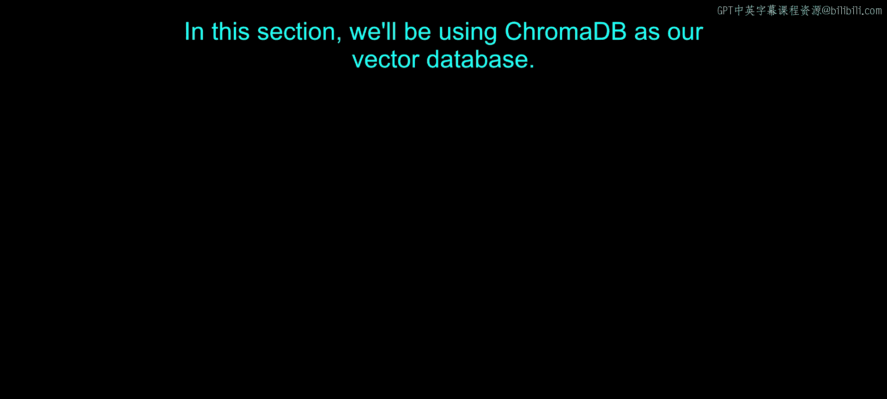
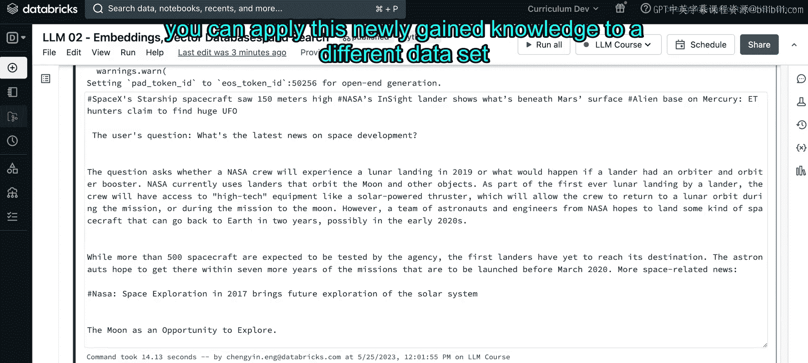

# 27：Notebook 演示第二部分



## 概述
在本节中，我们将学习如何使用 Chroma DB 作为向量数据库，来构建一个检索增强生成系统。我们将涵盖从数据加载、向量化存储到查询和结合大语言模型生成答案的完整流程。

---

### 设置 Chroma DB 客户端
首先，我们需要初始化 Chroma DB 客户端。默认情况下，客户端以非持久化模式运行，这意味着所有数据都是临时的，便于快速原型开发。

```python
import chromadb
client = chromadb.Client()
```

如果你希望数据持久化，以便后续重用，可以在初始化时指定一个存储目录。

```python
client = chromadb.PersistentClient(path="./chroma_db_data")
```

通过传递 `path` 参数，数据将在会话结束时自动保存，并在下次启动时自动加载。

### 理解集合
上一节我们介绍了客户端设置，本节中我们来看看 Chroma DB 的核心概念：集合。集合类似于一个向量索引，用于存储一组文档及其嵌入向量和元数据。

在下一个单元格中，我们将定义一个集合。由于我们的数据集是关于新闻文章的，因此将其命名为 `my_news`。

```python
collection_name = "my_news"
```

请注意，Chroma DB 在内部将集合名称用于 URL，因此命名需遵循 URL 的通用规则。详细信息可查阅官方文档。

以下是创建集合的步骤。如果同名的集合已存在，我们会先删除它，然后创建一个新的。

```python
if collection_name in [col.name for col in client.list_collections()]:
    client.delete_collection(name=collection_name)

collection = client.create_collection(name=collection_name)
```

在 `create_collection` 方法中，你还可以传入可选参数，例如自定义距离度量方法。

### 向集合添加数据
现在我们已经创建了集合，接下来需要向其中添加数据。首先，让我们回顾一下数据集的结构。

以下是数据预览：
```python
# 假设 df 是我们的新闻数据 DataFrame
print(df.head())
```
数据包含标题、语言、主题和发布日期等字段。

以下是将文档添加到集合的方法。Chroma DB 的一个优点是它能自动处理文本存储、分词和嵌入向量生成。

```python
documents = df[‘text’].tolist() # 假设 ‘text’ 列包含新闻内容
metadatas = [{"topic": topic} for topic in df[‘topic’].tolist()] # 将主题作为元数据
ids = [f"id{i}" for i in range(len(documents))] # 为每篇文章生成唯一ID

collection.add(
    documents=documents,
    metadatas=metadatas,
    ids=ids
)
```

如果你想使用自己的嵌入模型，而不是 Chroma DB 的默认模型，可以通过 `embeddings` 参数传入自定义的嵌入向量。

我们添加元数据的原因在于，后续可以基于这些元数据对查询结果进行过滤。

运行此单元格，将数据集中的所有文档正式添加到集合中。

### 查询相关文档
数据添加完成后，我们现在可以针对感兴趣的主题查询相关文档了。

例如，如果我们想查找关于“太空”的文章，可以执行以下查询：

```python
query_text = "space"
n_results = 10

results = collection.query(
    query_texts=[query_text],
    n_results=n_results
)
```

查询结果将返回最相关的文档ID、文档内容、元数据以及相似度距离分数。从结果中，我们可以看到关于NASA、火星生命探索等主题的文章，且主题元数据集中在“科技”和“科学”类别，这符合预期。

### 利用数据库特性：过滤
我们之前提到，过滤功能并非所有向量库都支持，但它是向量数据库的一个重要特性。Chroma DB 支持在查询时添加过滤条件。

例如，我们可以在查询“太空”时，只返回主题为“科学”的文章：

```python
results = collection.query(
    query_texts=[query_text],
    n_results=n_results,
    where={"topic": "science"} # 添加过滤条件
)
```

运行后，你将看到所有结果都来自“科学”主题，这证明了过滤功能的有效性。

### 利用数据库特性：CRUD操作
向量数据库另一个优势是支持完整的CRUD操作。以下是一些示例。

**删除操作**：我们可以根据ID从集合中删除特定文档。
```python
collection.delete(ids=[“id0”])
```

**更新操作**：我们可以更新特定文档的元数据。
```python
collection.update(
    ids=[“id2”],
    metadatas=[{“topic”: “technology”}] # 将主题从“科学”改为“科技”
)
```

运行后，可以验证ID为“id2”的文档元数据已成功更新。

### 结合大语言模型生成答案
最后，我们将把检索到的上下文信息输入给一个大语言模型，让它生成基于这些信息的答案。这里我们使用开源的 GPT-2 模型。

首先，加载文本生成管道：
```python
from transformers import pipeline
generator = pipeline(‘text-generation’, model=‘gpt2’)
```

接下来，构建提示模板。提示工程是一门艺术，没有固定答案，鼓励大家多尝试。

```python
context = “\n”.join([doc for doc in results[‘documents’][0]]) # 将检索到的文档作为上下文
question = “What is the latest news on space development?”

prompt_template = f”””基于以下上下文信息回答问题。
上下文：{context}
问题：{question}
答案：”””

generated_text = generator(prompt_template, max_length=200)[0][‘generated_text’]
print(generated_text)
```

模型将根据我们提供的关于太空发展的新闻上下文，生成一个连贯的答案。系统会打印出提供的上下文、用户问题以及模型生成的新回答。



### 总结
恭喜！在本节课中，我们一起完成了第一个检索增强生成系统的实现。我们学习了如何设置 Chroma DB 向量数据库、创建集合、添加和查询数据，并利用其过滤和CRUD功能。最后，我们将检索到的上下文与大语言模型结合，生成了基于知识的答案。整个过程最耗时的部分可能是设计有效的提示词，这需要不断的实验和优化。现在，你可以尝试将这套方法应用到其他数据集上。