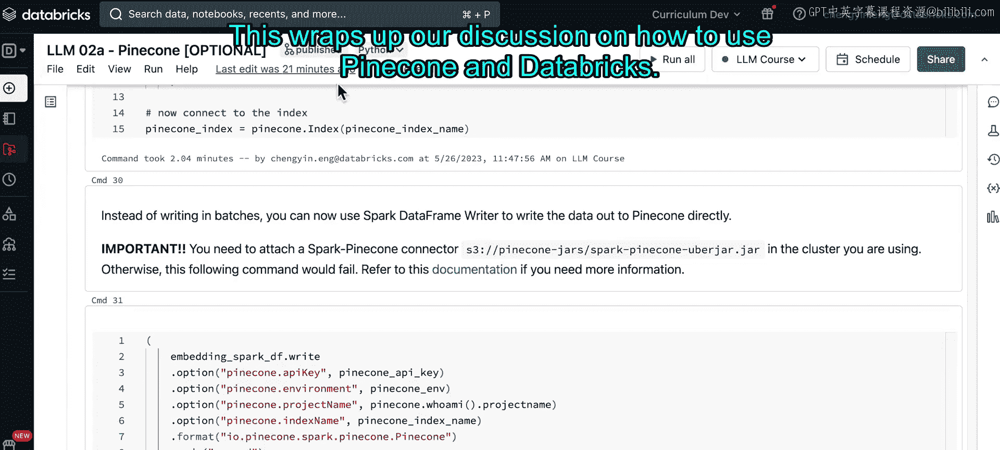

# 28：Notebook Demo - 使用Pinecone向量数据库 🗄️

在本节课程中，我们将学习如何使用一个名为Pinecone的云端向量数据库。我们将通过两种不同的方法，将新闻文章数据转换为向量并存储到Pinecone中，然后进行相似性搜索查询。


---

## 概述

Pinecone是一个基于云的向量数据库解决方案，它提供了简单且可扩展的相似性搜索功能。在本教程中，我们将演示如何设置Pinecone，生成文本嵌入向量，并将数据写入Pinecone索引，最后执行查询以检索相关信息。

---

## 环境准备

在开始之前，请确保安装以下依赖项：

1.  **Pinecone客户端库**：`pinecone-client`
2.  **Spark连接器JAR文件**：需要将此文件附加到您的Databricks集群上。

如果您需要更详细的指导，请参考[相关文档](链接)。您可以暂停视频，花时间完成这些设置。

如果环境已就绪，您可以安装Pinecone客户端并运行课堂设置脚本。同样，您可以暂停视频，待课堂环境准备完成后继续。

---

## 设置Pinecone免费账户

课堂设置脚本运行完毕后，我们现在可以设置Pinecone免费账户。

1.  访问Pinecone[主页](链接)。
2.  点击右上角注册一个免费账户。
3.  进入控制台后，导航到“API Keys”部分。
4.  复制两个值：**环境值**和**API密钥**。
5.  将这两个值填入下面标记为“Fill in”的单元格中。

就我而言，我将从Databricks的Secret Scope中获取我的Pinecone凭证。

然后，使用以下代码初始化Pinecone客户端：

```python
import pinecone
pinecone.init(api_key="YOUR_API_KEY", environment="YOUR_ENVIRONMENT")
```

---

## 读取数据

接下来，我们将读入本笔记本将使用的数据框。这些数据与课程中关于新闻文章的讲座中使用的数据相同。

---

## 生成嵌入向量并写入Pinecone

对于Pinecone，我们需要先生成嵌入向量，然后才能将其保存到Pinecone索引中。我们将介绍两种方法。

### 方法一：使用Pandas数据框

第一种方法是使用Pandas数据框。这种方法适用于应用单节点嵌入模型，然后分批将数据写入Pinecone。这个过程也可以称为“Upsert”。

我们将使用数据框的一个子集，以加快笔记本的执行速度。

如果您之前使用过Pinecone，需要先删除现有的索引，然后才能创建新的Pinecone索引，因为Pinecone免费层只允许一个索引。

与课程和书本中一样，我们将使用`sentence-transformers`库。我会将其缓存到一个文件夹。

下面的CMD 18包含了删除已存在索引的命令。

接下来，我们终于可以创建Pinecone索引了。在创建步骤中，我们将指定：
*   **索引名称**：使用上面指定的名称。
*   **嵌入维度**：从模型本身获取。
*   **相似性度量**（可选）：这里我们坚持使用余弦相似度。

```python
index_name = "news-articles"
dimension = model.get_sentence_embedding_dimension()
pinecone.create_index(name=index_name, dimension=dimension, metric="cosine")
```

然后，我们可以建立与Pinecone索引的连接。这一步可能需要长达三分钟，所以如果您看到此命令运行时间较长，请不要担心，您没有被卡住。

---

### 写入数据到Pinecone索引

现在让我们看看下一个单元格。一旦索引创建完成，我们就可以将数据写入Pinecone索引。

由于我们使用的是Pandas数据框，我们将循环遍历数据框中的记录批次。您会发现这个工作流程与讲座笔记本中的没有太大不同：

1.  首先为每篇新闻文章创建一个ID列表。
2.  提供每篇新闻文章的元数据。
3.  为我们拥有的文章生成嵌入向量。
4.  最后将它们插入到Pinecone索引中。

您会看到Pinecone索引中总共有1000个向量，因为我们只向Pinecone提供了1000条记录。

---

### 查询索引

现在所有向量都可用，我们可以直接查询索引。您会看到我写了一个关于“fish”的查询。查询过程也遵循相同的步骤：查询首先被转换为向量，然后可以提交给Pinecone以检索任何相关的上下文。这里我们只查看前三个最近的邻居。

确实，我们看到了与“fish”相关的结果被返回，例如关于大规模鱼类死亡、鲨鱼和蚯蚓的新闻。这可能表明，在我们拥有的所有一千篇文章中，毕竟没有那么多关于鱼的新闻文章。

---

## 方法二：使用Spark数据框与Pandas UDF

第二种方法是坚持使用Spark数据框，但使用Pandas UDF来处理数据框，将文本转换为向量，最后使用Spark直接将其写入Pinecone。

Pandas UDF是一种向量化UDF，允许您一次对一批数据应用函数。如果您有兴趣阅读更多关于Pandas UDF的信息，我邀请您查看我在这个Markdown单元格中链接的[文档](链接)。

通常，这是一种非常高效的使用Spark的方式，因为您能够在Pandas UDF中保留您的Pandas语法，同时允许Spark将函数分布到整个数据框。

例如，在这个单元格中，我们使用了一个Pandas UDF，我们加载一个模型，然后对于发送到Spark的每一批数据，它将把文本转换为嵌入向量。

在下面的单元格中，我们将把我们的Pandas UDF函数传递给Spark数据框。正如您在这里看到的，这是我们定义的Pandas UDF函数，然后我们还提供了需要转换的列名，接着我们将此列重命名为“vector”。

我们另外构造了两个Pinecone期望的列，即`namespace`和`metadata`。在`namespace`列中，我们将放入我们使用的转换器类型；在`metadata`中，我们将提供主题信息。

现在数据框已准备就绪，我们可以检查结果。我们看到有四个不同的列：ID、嵌入向量、namespace列和最后的metadata列。

---

### 重新创建索引并写入数据

现在我们将重复之前在方法一中做过的步骤：删除现有索引并重新创建索引。如果您还记得，这一步可能需要长达三分钟。

成功连接到Pinecone索引后，我们现在可以继续将数据写入Pinecone索引。这里我们使用Spark数据框写入器方法。您可以看到，我们不再分批观察数据，而是传入整个Spark数据框。

您还需要提供连接Pinecone的凭证，所以请继续运行该单元格。

另外请注意，这对您来说非常重要：您实际上需要有一个Spark Pinecone连接器。如果您的集群上没有准备好，那么这个单元格将会失败。

---

## 总结



本节课中，我们一起学习了如何使用Pinecone向量数据库。我们介绍了两种将数据嵌入并存储到Pinecone的方法：一种是使用Pandas数据框进行分批处理，另一种是利用Spark数据框结合Pandas UDF进行分布式处理。两种方法最终都实现了将文本转换为向量并存入索引，以及通过向量相似性进行查询检索的核心功能。这为我们构建基于大语言模型的语义搜索应用提供了重要的数据存储和检索基础。