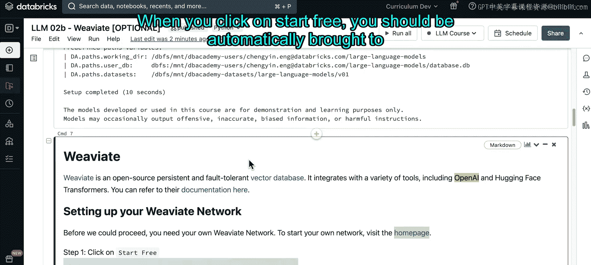
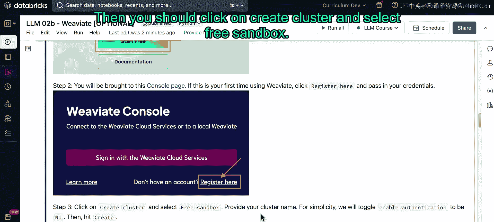
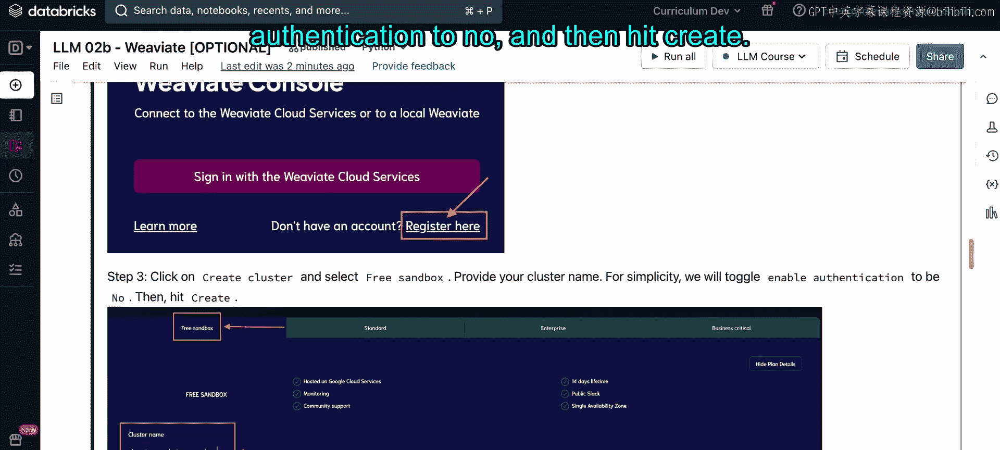
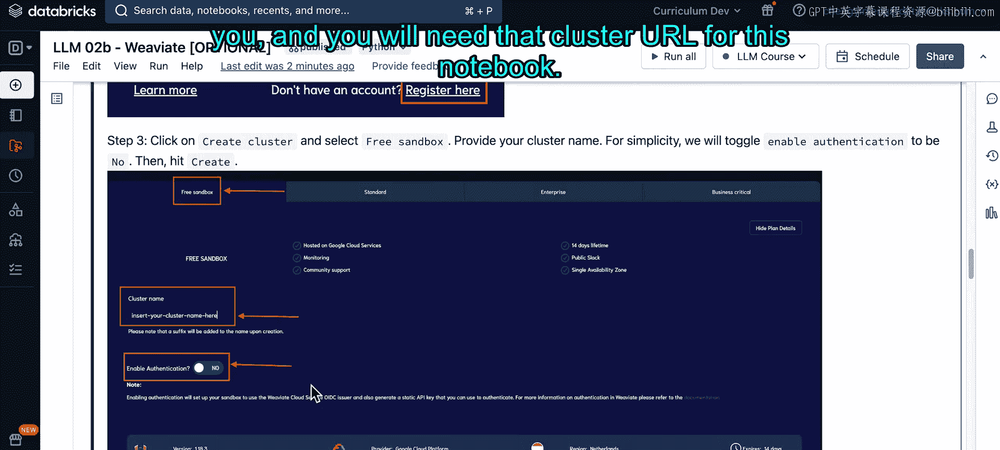
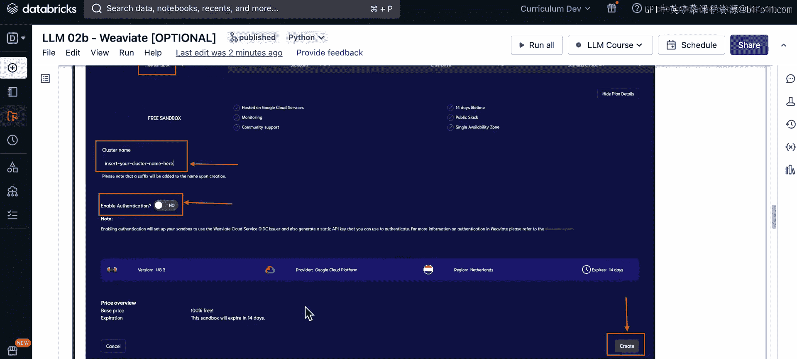
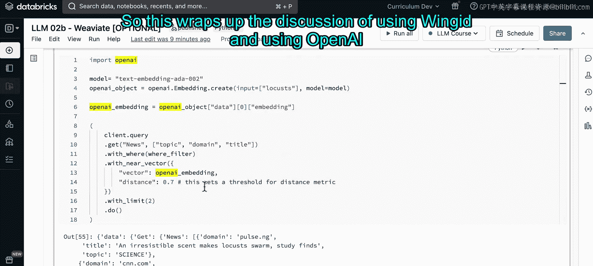

# 29：Notebook 演示 Weaviate 🧠

在本节课程中，我们将学习如何使用开源的向量数据库 Weaviate。我们将完成从环境配置、数据写入到向量查询的完整流程，并了解如何结合 OpenAI 的嵌入模型进行语义搜索。

---

## 概述

我们将使用 Weaviate 作为开源向量数据库。Weaviate 也提供由公司托管的商业版本。它提供了许多自定义选项，例如是否采用产品量化技术。

为了让本笔记本能够端到端运行，你需要安装 Weaviate 及其 Spark 连接器的 JAR 文件。

## 环境设置

以下是设置环境的步骤。

首先，运行 `pip install` 语句来安装必要的 Python 包，并运行课堂设置脚本。

同时，请记得安装 Spark 连接器的 JAR 文件，并将其上传到你的 Databricks 集群。

你可以暂停视频，在准备就绪后继续。

现在，课堂设置脚本已经运行完毕。

我们可以开始设置 Weaviate 网络。

首先，你需要访问 Weaviate 官网。

然后点击“免费开始”。点击后，你应会被自动引导至控制台页面。

如果你之前没有使用过 Weaviate，可以点击“在此注册”。

接着，点击“创建集群”并选择“免费沙盒”。

为你自己的集群命名。为简化操作，请将“启用身份验证”选项切换为“否”。

然后点击“创建”。点击创建后，Weaviate 会自动为你实例化一个集群 URL，你将在本笔记本中用到这个 URL。

## 配置 API 密钥

在本笔记本中，我们还将使用 OpenAI 的嵌入模型。

因此，你需要一个 OpenAI 的令牌。如果你之前没有使用过 OpenAI，请按照笔记本中的步骤创建一个账户并生成一个 OpenAI API 密钥。

OpenAI 没有免费选项，但会提供 5 美元的免费额度。一旦用尽这 5 美元额度，系统会要求你添加付款方式，之后将按令牌使用量收费。

请务必保管好你的 OpenAI API 密钥，因为如果他人获得此密钥，他们也能将使用费用记到你的账户上。

请花几分钟时间设置好 Weaviate 和 OpenAI，然后将各自的 API 密钥和网络 URL 填写到下方标记为“填写”的单元格中。

我将直接从我的 Databricks 学堂获取我的 OpenAI API 密钥和 Weaviate 网络 URL。

然后，我可以通过在附加头部参数中指定我的 OpenAI API 密钥来实例化我的 Weaviate 客户端。

## 定义数据模式

在本笔记本中，我们将使用与讲座笔记本中相同的数据集。

这是一个由新闻团队收集的新闻主题数据集，我们将把它存储到 Weaviate 数据库中。

为此，我们首先需要定义一个模式。在 Weaviate 中，这意味着我们将提供更多关于要保存到向量索引中的数据的信息。

默认情况下，Weaviate 要求类名首字母大写，这就是我们将“news”首字母大写的原因。

在类对象本身，我们将传入类名、数据集的描述、我们实际要摄取或保存到向量索引的列，以及我们在索引算法中要使用的文本向量化模型。

请运行此单元格。如果之前创建过“News”类，我们将删除它并重新创建。

如果你好奇模式的实际样子，可以运行此单元格，然后查看我们的类对象内部具体是什么。

不出所料，我们在这里看到了 `text2vec-openai` 模型，即 `ada` 模型，作为我们的向量化器。因为我们在上面的类对象中指定了它。

## 写入数据到 Weaviate

然后，我们最终可以将数据写入 Weaviate。

你可以看到，这里我们实际使用了 Spark 连接器的 JAR 文件。因此，如果你没有下载该文件并上传到你的 Databricks 集群，此单元格肯定会失败。你还需要有效的 Weaviate 网络 URL 和有效的 OpenAI API 密钥。

你可能已经在 Weaviate 文档中看到，Weaviate 网络会在 14 天后过期。因此，如果你在 14 天后重新访问此笔记本，需要指定并创建一个新的 Weaviate 网络。

## 验证数据写入

要检查数据是否确实已写入，你有两种方法。

第一种是将此 URL 复制粘贴到你的浏览器中，然后将其中的部分替换为你自己的 Weaviate 集群 URL。

或者，你可以运行以下单元格，然后检查结果是否非空。

在这里，我确实看到了每篇新闻文章的各种不同主题。

因此，我可以验证我的数据已成功写入 Weaviate。

## 执行查询搜索

工作流程的下一个组成部分是实际执行查询搜索。

在我的查询搜索中，我可以首先可选地指定一个 `where` 过滤器，传入过滤语句。

这里，我只对主题等于“科学”的任何文章感兴趣。

我还将传入一个关于“蝗虫”的查询。

你将看到，我们在这里使用 `nearText` API 来返回与“蝗虫”相关信息最接近的两个最近邻。

或者，你也可以选择以嵌入向量的形式提供查询。

这就是我们将在下一个单元格中要做的。因此，我们将使用 `nearVector` 而不是 `nearText`。

在这种情况下，我们将使用完全相同的模型，即 OpenAI 的 `ada` 模型。然后，我不是直接将“蝗虫”文本传入查询，而是首先将我的“蝗虫”文本转换为嵌入向量，然后将“蝗虫”的嵌入向量直接传入查询。

因此，你将看到，我这里的 `nearVector` 包含了“蝗虫”的嵌入向量。

我也可以选择指定距离度量。

如果你看到错误，请重新运行。因为可能是与 OpenAI 的连接出现了问题。

在这里，你将看到我们得到了完全相同的结果。这并不奇怪，因为我们使用的是 OpenAI 提供的完全相同的嵌入模型。

我们只是在提供查询的方式上有所不同。因此，在这个单元格中，我们提供的是向量；而在上面的单元格中，我们提供的是“蝗虫”文本，它在底层也使用了相同的文本向量化器，因为这是我们在上面的类对象中指定的。

## 总结

本节课我们一起完成了使用 Weaviate 和 OpenAI 的初步实践。我们学习了如何设置环境、定义数据模式、将数据写入向量数据库，以及执行基于文本和向量的语义搜索查询。这为构建更复杂的基于大语言模型的应用程序奠定了基础。