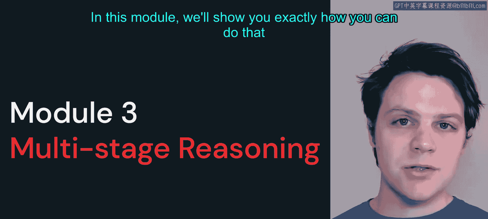
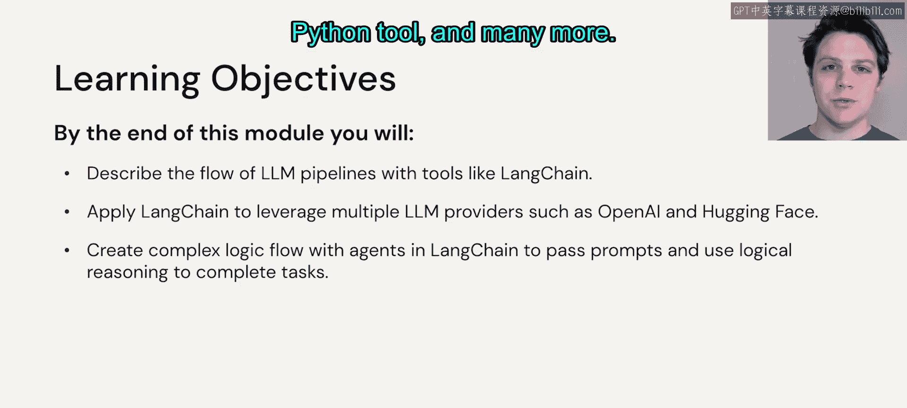
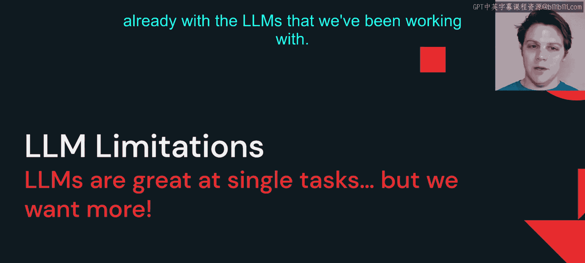
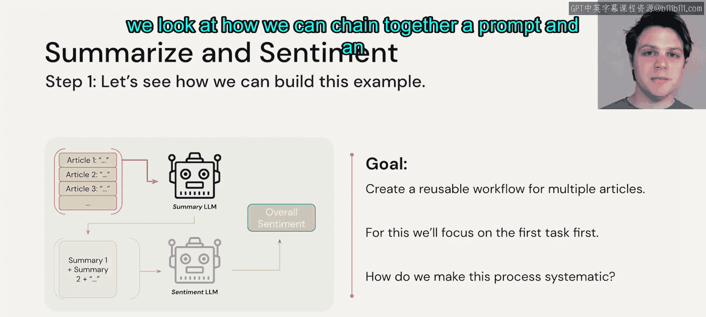

# 31：多阶段推理模块概述 🧠

在本模块中，我们将学习如何将之前介绍的大语言模型（LLM）与向量数据库等技术结合起来，构建更强大、更复杂的应用程序。我们将使用 LangChain 等工具来创建模块化的 LLM 工作流。

## 回顾与引入

在前两个模块中，我们学习了如何从 Hugging Face 等平台下载大语言模型来解决各种 NLP 任务，以及如何将数据转换为向量格式并使用向量数据库进行相似性搜索。

你可能会想，如何将这两个功能结合起来，从而真正增强我作为开发者所能构建的应用程序？在本模块中，我们将向你展示如何利用现有的各种工具来实现这一目标。

## 模块学习目标

在本模块结束时，你将能够：

*   描述使用 LangChain 等工具的 LLM 管道流程。
*   使用 LangChain 构建涉及来自不同提供商（包括 OpenAI 和 Hugging Face）的 LLM 的管道。
*   使用智能体（Agents）构建复杂的逻辑流程模式，这些智能体将 LLM 作为中央大脑，并利用不同的工具来解决给定的任务。这些工具可能是网络搜索、Python 编程环境等。

## 现有 LLM 的局限性

在开始之前，请思考一下我们目前使用过的 LLM 存在的一些局限性。

回想我们在模块 1 中所见，LLM 在解决传统 NLP 任务方面表现出色。例如，给它一个摘要任务，它能出色完成；要求它翻译文本，它几乎能完美执行；零样本分类任务，根据模型的训练情况，它也能处理得很好。LLM 在这些方面非常强大。

然而，我们考虑的大多数工作流程并不仅仅是这种简单的输入-输出响应。通常，在构建应用程序时，LLM 只是我们设计的端到端应用程序整个工作流程中的一个组成部分。

因此，我们需要思考如何将 LLM 与代码的其他部分无缝连接起来，并且如果需要更换或添加一个 LLM，不会破坏整个端到端系统。我们当前讨论的多阶段推理模块的目标，就是向你展示如何构建这些工具，使其模块化，以便你可以取出一个 LLM 并放入另一个不同的模型。

## 案例分析：摘要与情感分析

让我们考虑一个例子：我们想要总结一篇文章并获取其情感倾向，这并不是一个奇怪或荒谬的任务。

如果我们思考如何仅用一个 LLM 来处理这个问题，我们可以给它一堆不同的文章，要求它进行总结，然后获取情感倾向。这对于一个模型一次性处理来说任务相当繁重。

一个更好的策略可能是每次处理一篇文章，将其输入一个用于摘要的 LLM，然后将该摘要的输出再输入一个用于情感分析的 LLM。

从概念上讲，我们拥有完成此任务所需的所有工具，但如何以编程方式实际实现呢？

如果考虑让一个 LLM 完成所有这些任务的问题，我们会遇到各种麻烦：需要一个非常庞大的 LLM 才能同时进行摘要和情感分析，这是一项相当复杂的任务；我们还需要担心，如果在提示词中一次性输入所有文章，很快就会超出 LLM 设计的输入序列长度限制。

因此，我们需要做的是将每篇文章分开，逐一处理。收集摘要 LLM 的输出，并将这些摘要作为我们将要创建的情感分析 LLM 的输入。这样，这个框架就变成了一个可重用的工具，我们可以不断输入新文章，它就能逐步生成这个应用程序的不同步骤。

## 聚焦首个任务

所以，让我们专注于第一个任务：我们不会将所有文章作为一个巨大的提示词输入，而是逐一输入。我们需要确保有一种系统化的方法来抽象出每篇文章，以便我们可以将它们作为变量输入。

这正是我们将在下一个视频中探讨的内容，届时我们将研究如何将提示词和 LLM 链接在一起。

## 总结

本节课我们一起学习了多阶段推理模块的概述。我们认识到，虽然单个 LLM 能力强大，但在构建复杂应用时，需要将其模块化并与其他组件（如其他 LLM 或工具）串联起来。通过引入链式（Chain）和智能体（Agent）等概念，我们可以构建更灵活、更强大的工作流，以克服单一模型的局限性，例如处理长文本和复杂多步任务。下一节，我们将开始学习如何具体实现这种链式结构。